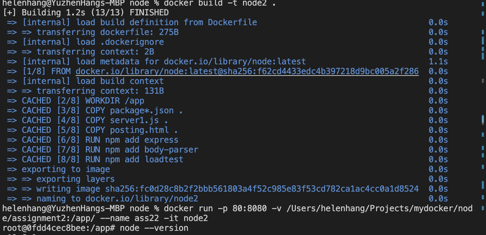
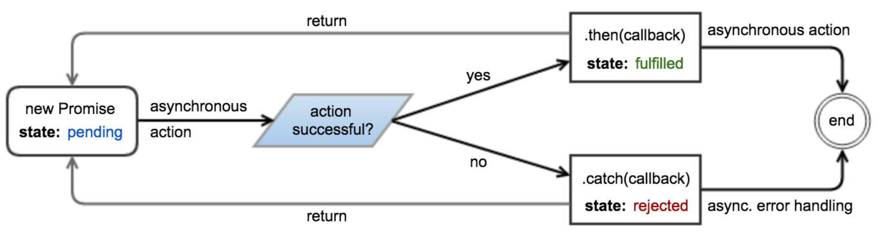

# 353 Lab
## Lab Feb 2
execute javascript
javascript V8 engine
Executing JS Code

`npm install -g loadtest`
`node app.js`
`loadtest -n -c --rps --URL`

```shell
docker -exec -it node1_hash /bin/bash
npx loadtest -n 10 -c 1 -m POST -T 'application/x-www-form-urlencoded'' --data '{"'filename":"test", "data": "test"}' http://localhosthost:8080/save
# -n 是说同时启动几个client
#不是npm，而是npx
#-c concurrency 同时hit几个server，sametime
#如果-n 10 -c 10,所以同时发动100个request

docker attack node1
```


node1
```docker
FROM node:latest
EXPOSE 8080
WORKDIR /app
COPY package*.json .
COPY server1.js .
COPY posting.html .

RUN npm add express
RUN npm add body-parser
RUN npm add loadtest
CMD ["/bin/bash"]
```
但是还是说找不到server1.js，找不到express
我运行了node --version
返回：v19.6.0
npm --version
9.4.0
说明node已经安装了,npm也已经安装了
但是express还没有

实现node2
```docker
FROM node:latest
EXPOSE 8080
WORKDIR /app
COPY package*.json .
COPY server1.js .
COPY posting.html .

RUN npm add express
RUN npm add body-parser
RUN npm add loadtest
CMD ["/bin/bash"]
```
  

并没有执行npm add express
只是缓存起来了
网上搜了，说是因为我启动的时候，用到了docker run -v /xxxx:/xxxx，所以copy和其他的都copy到其他的地方去了
所以我在启动的时候，去掉了 -v的mount选项，就好了。妈的，浪费那么多时间！


在创建Dockerfile的时候，RUN和CMD都是很重要的命令。它们各自的作用分别如下：

RUN
RUN命令是创建Docker镜像（image）的步骤，RUN命令对Docker容器（ container）造成的改变是会被反映到创建的Docker镜像上的。一个Dockerfile中可以有许多个RUN命令。

CMD
CMD命令是当Docker镜像被启动后Docker容器将会默认执行的命令。一个Dockerfile中只能有一个CMD命令。通过执行docker run $image $other_command启动镜像可以重载CMD命令。

### Lab Feb 9
lesson note: 2023.02.05

1. Callbacks(JS Chp.29)
2. Promises(JS Chp.42)
3. Timeouts and Intervals (JS Chp. 30)
4. Recursion
5. Fetch
6. Middleware(NJS Chp. 3)
7. Router(NJS Chp. 3)
8. MySql
   
#### Callback
Callback: some function have not known. Callbacks offer a way to extend the functionality of a function (or method) without changing its code. This approach is often used in modules (libraries / plugins), the code of which is not supposed to be changed.
#### A Promise
A Promise object represents an operation which has produced or will eventually produce a value. Promises provide a robust way to wrap the (possibly pending) result of asynchronous work, mitigating the problem of deeply nested callbacks (known as "callback hell").

A promise can be in one of three states:
* pending — The underlying operation has not yet completed, and the promise is pending fulfillment.
* fulfilled — The operation has finished, and the promise is fulfilled with a value. This is analogous to returning a value from a synchronous function.
* rejected — An error has occurred during the operation, and the promise is rejected with a reason. This is analogous to throwing an error in a synchronous function.
懂了，是一个call back里面，用的是异步调用，不是同步
  
```js
const promise = new Promise((resolve, reject) => { // Perform some work (possibly asynchronous)
// ...
if (/* Work has successfully finished and produced "value" */) { resolve(value);
} else {
// Something went wrong because of "reason"
// The reason is traditionally an Error object, although // this is not required or enforced.
let reason = new Error(message);
reject(reason);
        // Throwing an error also rejects the promise.
throw reason; }
});
promise.then(value => {
// Work has completed successfully,
// promise has been fulfilled with "value"
}).catch(reason => {
// Something went wrong,
// promise has been rejected with "reason"
});
```

The then and catch methods can be used to attach fulfillment and rejection callbacks:
GoalKicker.com – JavaScript® Notes for Professionals 263

#### fetch

● fetch(resource)
● fetch(resource,options)
● Fetch returns a promise
fetch support promises
Ajax is an asyn invoke in html

#### middleware
One or more **functions** which will be **called** **before** the **callback**. Essentially a chaining of multiple callback functions. Useful for more specific handling for example authorization or error handling.

**nodemon** 
nodemon is short for node monitor
● Nodemon -> a useful npm package
是一个能实时修改node server的package
在package.json中，加一个 start:dev ???
```js
//这是用middleware
const app = express();
function mw1(req, res, next) {
  console.log('mw1');
  next();
}
function myFunction1(req, res, next) {
  res.send('<h1> Hello Ralph 2 </h1>');
   
}
app.get('/', mw1, myFunction1);

// 第二种 middleware
app.use(mw1);
function mw1(req, res, next) {
  console.log('mw1');
  next();
}
function myFunction1(req, res, next) {
  console.log('myFunction1');
  res.send('<h1> Hello Ralph 2 </h1>');
   
}
app.get('/',  myFunction1);

```
第二种middleware是对所有的invoker，第一种是只对请求“/”才实时的middleware
#### Router


### Lab Feb 16
TODO
1. mysql console
2. node
3. webpage
  
docker comtainer exec -it db1 bash

mysql -u root -padmin
* show databases
show databases;
* create database
create database testdb;
use testdb;
* create table
create table people (id int unsigned NOT NULL auto_increment, firstName varchar(100) NOT NULL, lastName varchar(100) NOT NULL, primary key(id));
* alter table
alter table people add email varchar(255) NOT NULL;
* insert data to table
insert into people (firstName, lastName, email) values ('Helen', 'Hang','helenhang1114@gmail.com');
* select
select * from people;

docker attach nodeapp
cd info folder
node init -y
npm install express body-parser mysql --save

start your app: node app.js

dcoker attach nodeapp

curl -d '{"fname":"Sandra"}' -H "Content-Type:application/json" -X POST http://0.0.0:3000/addemployee

#### Lab Mar 2
Objectives

1. Install React
2. Build componets
3. Learn about data passing using props(short for **properties**)
4. 

### React JS
- it's component-based

##### Create a React App

1. Create a directory for your projects
2. `npx create-react-app my-app`
3. cd to folder and run: `npm start`
4. open the newly created project in your code editor e.g. VS code and inspect the content
5. modify your codes according to your specific project/app
6. installl the react devtools for chrome and firfox

##### Sample Project: tic-tac-toe game
https://reactjs.org/tutorial/tutorial..html

components present in the project are:
1. Game component
2. Board component
3. Square component

componet types
function component types?
react components are class
react componets are sub-class
state hooks?
create statment constructors
src folder?

Game component
  - Board component
    - sdquare component


