### Executing JS Code
Looking into the V8 engine
* Program
* Call Stack
* Node API
* Callback Queue
* Event Loop

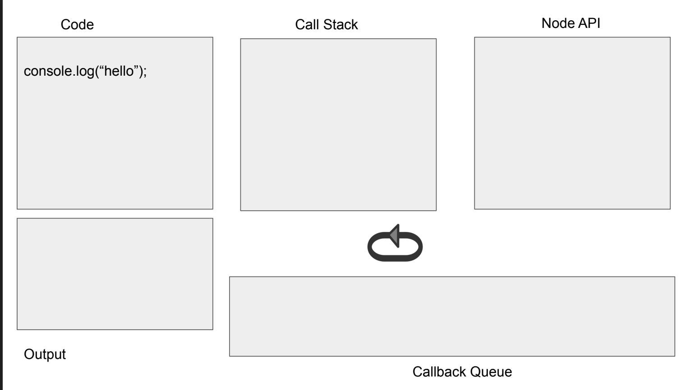  
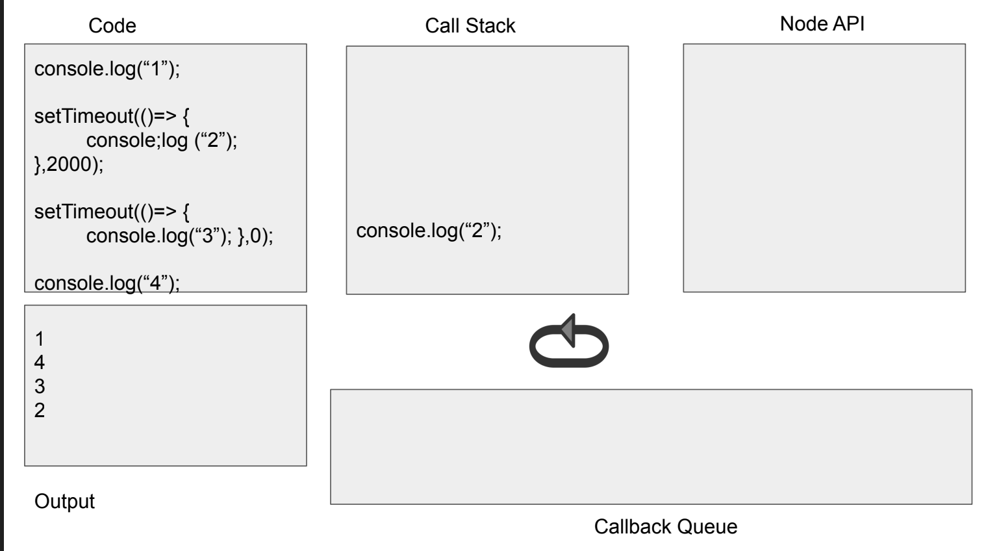  

### JS HTTP Requests
JS & HTTP Requests
* Why?
	- Performance
	- User Experience

* XMLHttpRequest
	- AJAX
      -  Basic Concept
      -  yes is is all about asynchronous calls

* JS Libraries

#### XMLHttpRequest
* For simplicity the “old” onstatechange pattern will be used
http.onreadystatechange = function() {//Call a function when the state changes.

* The “newer” addEventListener pattern will be presented later
	- Links for event listener
	- https://developer.mozilla.org/en-US/docs/Web/API/XMLHttpRequest/load_event
	- Yes, there is a “newer” way -> fetch
We will discuss this later
```html
<!DOCTYPE html>
<html>
<body>
<p id="demo">Fetch ralph.txt and place it here </p>
<script>
fetch ("ralph.txt") .then(x => x.text()).then(y => document.getElementById("demo").innerHTML = y);
</script> </body> </html>
```
#### Basic Design
1. Creating request object

2. Setting parameters of request object & submitting it

3. Synchronous or asynchronous handling of response

Example -> make aysn. call to node post

Node Code
```js
app.post('/sayHello', (req,res) => {
var name = req.body.name;
var answer = "hello " + name;
res.send(answer);
});

function sayHello()
{
var http = new XMLHttpRequest();
var url = '/sayHello';
var params = 'name=' + document.getElementById("input").value;

http.open('POST', url, true);

http.setRequestHeader('Content-type','application/x-www-form-urlencoded');

http.onreadystatechange = function(){
	if(http.readyState == 4 && http.status == 200){
	document.getElementById("answer").value = http.responseText;
}
};

http.send(params);
};
```

* request.readyState
* https://developer.mozilla.org/en-US/docs/Web/API/XMLHttpRequest/readyState

	- 0 -> unsent
	- 1 -> opened
	- 2 -> headers_received
	- 3 -> loading
	- 4 -> done
1. Ajax：readyState（状态值）和status（状态码）的区别
readyState，是指运行Ajax所经历过的几种状态，无论访问是否成功都将响应的步骤，可以理解成为Ajax运行步骤，使用“ajax.readyState”获得。
status，是指无论Ajax访问是否成功，由http协议根据所提交的信息，服务器所返回的http头信息代码，使用“ajax.status”获得。

总体理解：可以简单的理解为state代表一个整体的状态。而status是这个大的state下面具体的小的状态。

2. 什么是readyState
readyState是XMLHttpRequest对象的一个属性，用来标识当前XMLHttpRequest对象处于什么状态。
readyState总共有5个状态值，分别为0~4，每个值代表了不同的含义。
```
0：初始化，XMLHttpRequest对象还没有完成初始化
1：载入，XMLHttpRequest对象开始发送请求
2：载入完成，XMLHttpRequest对象的请求发送完成
3：解析，XMLHttpRequest对象开始读取服务器的响应
4：完成，XMLHttpRequest对象读取服务器响应结束
```
3. 什么是status
status是XMLHttpRequest对象的一个属性，表示响应的http状态码
在http1.1协议下，http状态码总共可分为5大类  

```
1xx：信息响应类，表示接收到请求并且继续处理
2xx：处理成功响应类，表示动作被成功接收、理解和接受
3xx：重定向响应类，为了完成指定的动作，必须接受进一步处理
4xx：客户端错误，客户请求包含语法错误或者是不能正确执行
5xx：服务端错误，服务器不能正确执行一个正确的请求
 
100——客户必须继续发出请求
101——客户要求服务器根据请求转换HTTP协议版本
200——交易成功
201——提示知道新文件的URL
202——接受和处理、但处理未完成
203——返回信息不确定或不完整
204——请求收到，但返回信息为空
205——服务器完成了请求，用户代理必须复位当前已经浏览过的文件
206——服务器已经完成了部分用户的GET请求
300——请求的资源可在多处得到
301——删除请求数据
302——在其他地址发现了请求数据
303——建议客户访问其他URL或访问方式
304——客户端已经执行了GET，但文件未变化
305——请求的资源必须从服务器指定的地址得到
306——前一版本HTTP中使用的代码，现行版本中不再使用
307——申明请求的资源临时性删除
400——错误请求，如语法错误
401——请求授权失败
402——保留有效ChargeTo头响应
403——请求不允许
404——没有发现文件、查询或URl
405——用户在Request-Line字段定义的方法不允许
406——根据用户发送的Accept拖，请求资源不可访问
407——类似401，用户必须首先在代理服务器上得到授权
408——客户端没有在用户指定的饿时间内完成请求
409——对当前资源状态，请求不能完成
410——服务器上不再有此资源且无进一步的参考地址
411——服务器拒绝用户定义的Content-Length属性请求
412——一个或多个请求头字段在当前请求中错误
413——请求的资源大于服务器允许的大小
414——请求的资源URL长于服务器允许的长度
415——请求资源不支持请求项目格式
416——请求中包含Range请求头字段，在当前请求资源范围内没有range指示值，请求也不包含If-Range请求头字段
417——服务器不满足请求Expect头字段指定的期望值，如果是代理服务器，可能是下一级服务器不能满足请求
500——服务器产生内部错误
501——服务器不支持请求的函数
502——服务器暂时不可用，有时是为了防止发生系统过载
503——服务器过载或暂停维修
504——关口过载，服务器使用另一个关口或服务来响应用户，等待时间设定值较长
505——服务器不支持或拒绝支请求头中指定的HTTP版本
```

#### JSON
* JavaScriptObjectNotation
* JSON.parse
  - String -> Object
* JSON.stringify
  -  Object -> String
  -  
#### HTTP - Part 1
* **Communication**
    
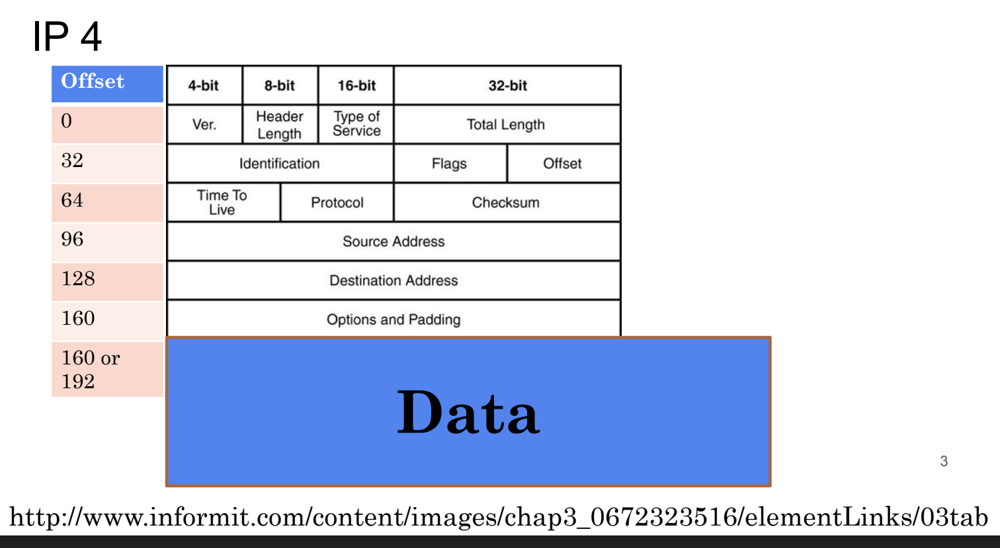  
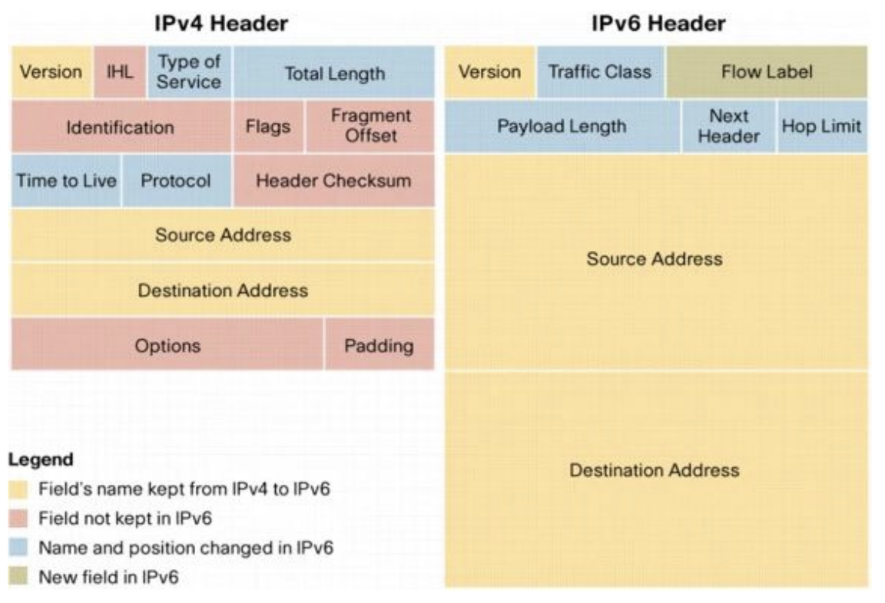  

* **TCP & UDP**
* **Transmission Control Protocol**
	- TCP
	- Core Protocol
	- Provide reliable, ordered communication
	- Used as the basic protocol for many applications e.g. WWW

* **User Datagram Protocol**
	- UDP
	- Fast, compact but no guarantees

* **UDP**
  * One way communication
  * No guaranteed delivery
  * Often used for VoIP, DNS, etc

* **TCP Connection**
	- TCP is the most common protocol
	- Web runs on TCP
	- Guaranteed delivery
	- Two-way communication
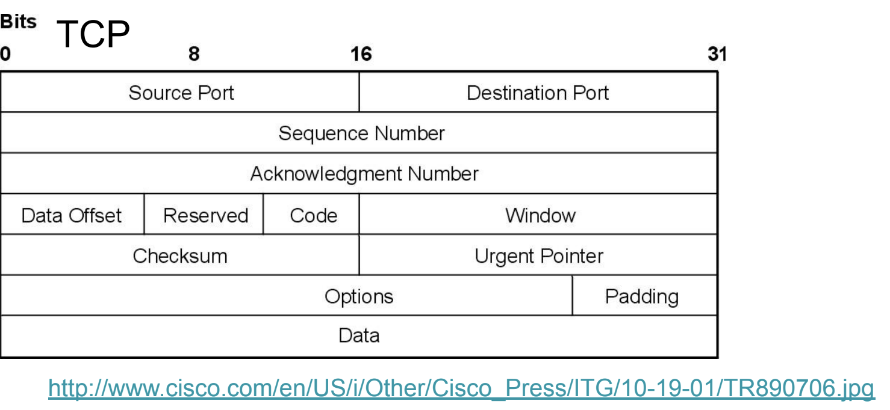  

* **TCP/IP COMMUNICATION**

* Every machine has to have a unique IP address
	* WWW.USASK.CA
* Every machine has to use a port
* Some Ports have special meanings
	* E.g. 80
* **Domain Name System**
  * IP address are not sufficient
  	- Hard to remember
 	- IP addresses of servers can change
  * Naming system for computers
	- Hosts file (old way)
	- Using DNS servers (new way)
  * Each domain name can be translated into IP
	- nslookup – translation tool
	- www.cs.usask.ca -> .......
How does DNS work ?
  * Each computer knows IP of at least one DNS server
  * If your DNS server does not know the requested name it polls another DNS server
* **HTTP – HYPERTEXT TRANSFER PROTOCOL**
  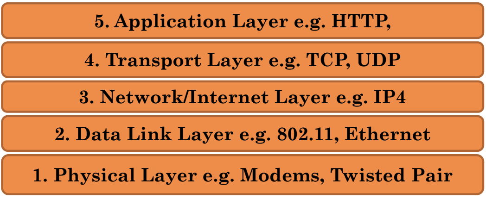  
* HTTP VERSIONS
  * HTTP 0.9 – supports only GET
  * HTTP/1.0 (1996)
  * HTTP/1.1 (1997)
  * HTTP/2 ( 2015)
  * HTTP/3 (2022)
	- QUIC
	- 
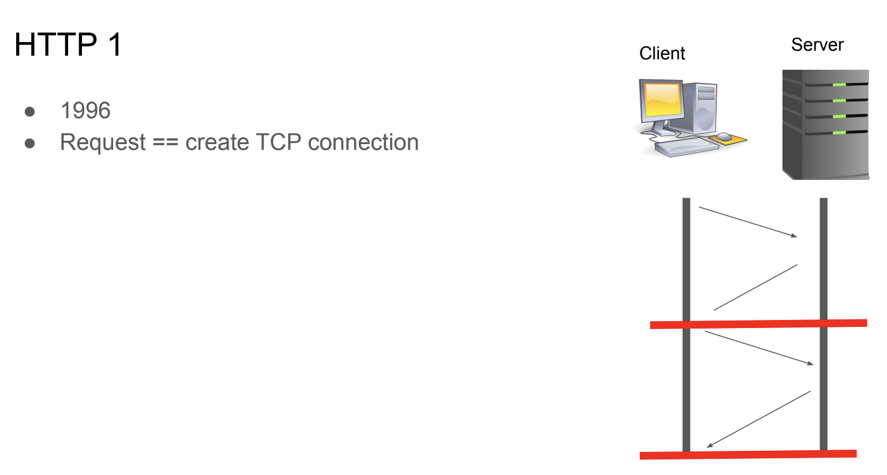  
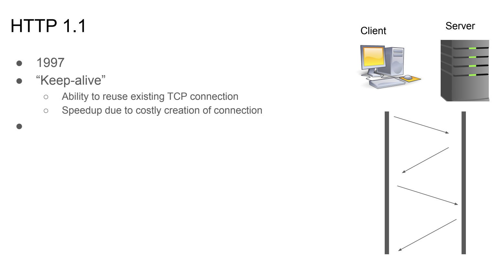  
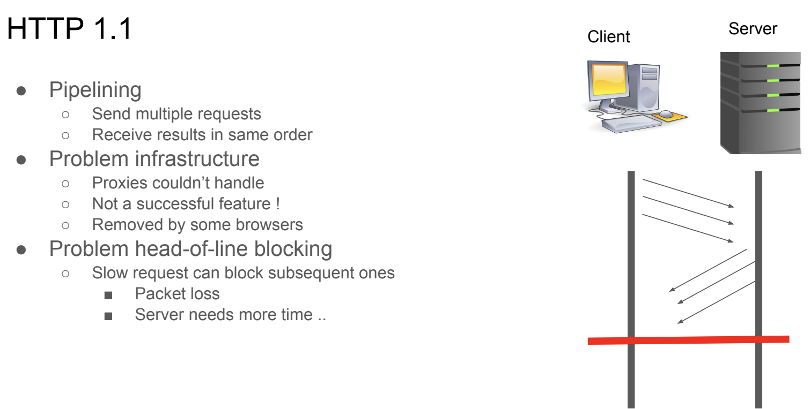  

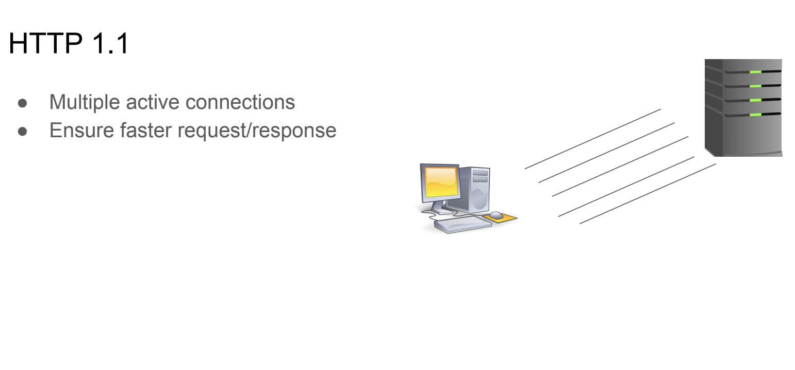  

  

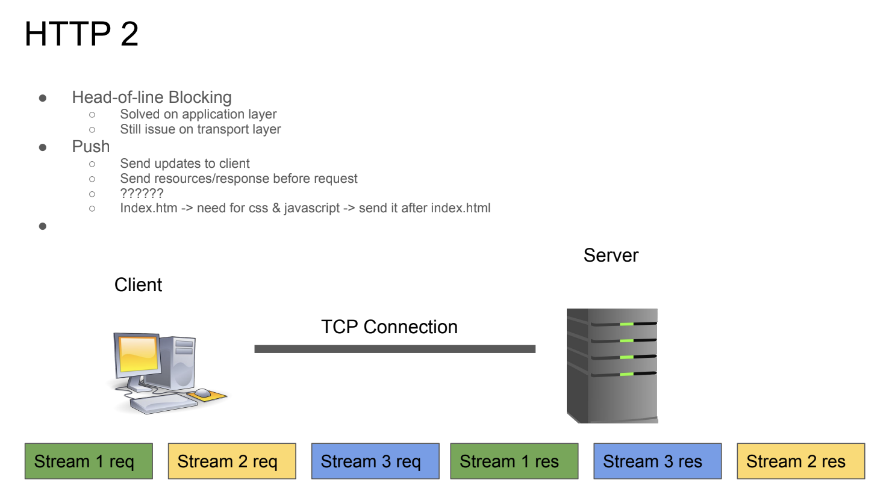  

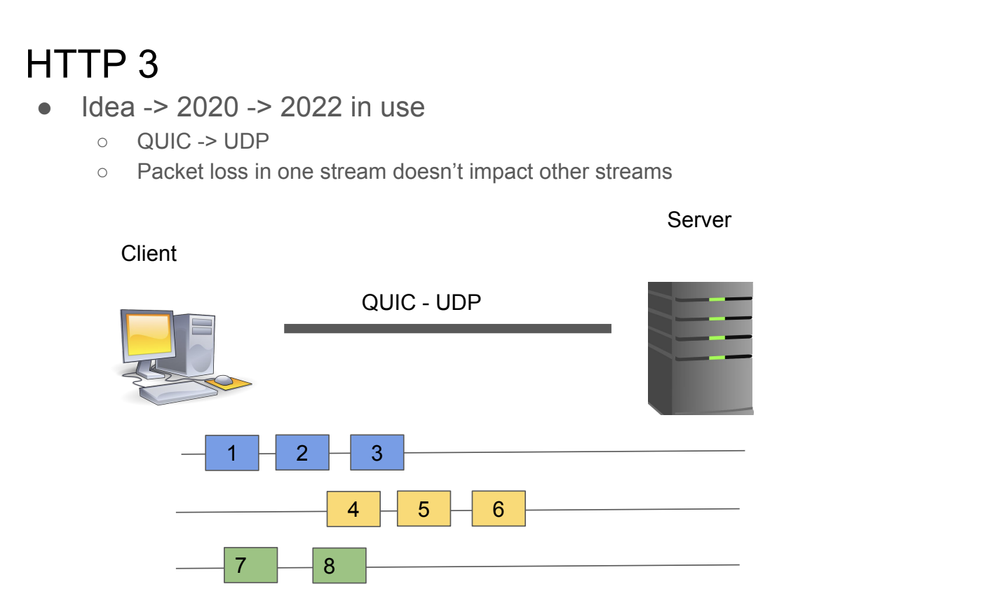 

* **HTTP 3**

* Target
	- Mobile, data intensive interactions
		- Allows switching networks e.g. 5G, 3G, 4G
* Connection ID
	- Enables connection across networks
	- Different network but use same ID
* **HTTP COMMANDS**
1. HEAD
* Asks for the response identical to the one that would correspond to a GET request, but without the response body. This is useful for retrieving meta-information written in response headers, without having to transport the entire content.
2. GET
* Requests a representation of the specified resource. By far the most common method used on the Web today. Should not be used for operations that cause side-effects (using it for actions in web applications is a common misuse). See 'safe methods' below.
3. POST
* Submits data to be processed (e.g. from an HTML form) to the
identified resource. The data is included in the body of the request. This may result in the creation of a new resource or the updates of existing resources or both.
4. PUT
* Uploads a representation of the specified resource.
5. DELETE
* Deletes the specified resource.
OTHERS
6. TRACE
* Echoes back the received request, so that a client can see
what intermediate servers are adding or changing in the
request.
7. OPTIONS
* Returns the HTTP methods that the server supports. This
can be used to check the functionality of a web server.
8. CONNECT
* Converts the request connection to a transparent TCP/IP
tunnel, usually to facilitate SSL-encrypted communication
(HTTPS) through an unencrypted HTTP proxy  

Idempotent & Safe
● Idempotent -> don’t change response
● Safe -> can be cached

Example
```js
GET /echo HTTP/1.1
Host: reqbin.com
Accept: */*
```
```js
GET /echo HTTP/1.1
Host: reqbin.com
Accept: text/html
```
```js
GET /echo/get/json HTTP/1.1
Host: reqbin.com
Accept: application/json
```
```html
GET /tutorials/other/top-20-mysql-best-practices/ HTTP/1.1
Host: code.tutsplus.com
User-Agent: Mozilla/5.0 (Windows; U; Windows NT 6.1; en-US; rv:1.9.1.5)
Gecko/20091102 Firefox/3.5.5 (.NET CLR 3.5.30729)
Accept: text/html,application/xhtml+xml,application/xml;q=0.9,*/*;q=0.8
Accept-Language: en-us,en;q=0.5
Accept-Encoding: gzip,deflate
Accept-Charset: ISO-8859-1,utf-8;q=0.7,*;q=0.7
Keep-Alive: 300
Connection: keep-alive
Cookie: PHPSESSID=r2t5uvjq435r4q7ib3vtdjq120
```
```
HTTP/1.x 200 OK
Transfer-Encoding: chunked
Date: Sat, 28 Nov 2009 04:36:25 GMT
Server: LiteSpeed
Connection: close
X-Powered-By: W3 Total Cache/0.8
Expires: Sat, 28 Nov 2009 05:36:25 GMT
Etag: "pub1259380237;gz"
Cache-Control: max-age=3600, public
Content-Type: text/html; charset=UTF-8
Last-Modified: Sat, 28 Nov 2009 03:50:37 GMT
Content-Encoding: gzip
Vary: Accept-Encoding, Cookie, User-Agent
```
**HTTP STATUS CODES**
* 1xx informal
* 2xx client request success
* 3xx redirection
* 4xx client request incomplete
* 5xx server errors
  
**HTTP HEADERS**
* General
	-  Not related to client, server or HTTP
* Request
	- Preferred document formats and server parameters
* Response
	- Information
* Entity
	- Information about the data being sent between client and server
  
# lecture Feb 1
```javascript
Const express = require (‘express’)
	Load the express package
//1:
app.get('/hello', (req, resp, next) => { 
    console.log(req.originalUrl); 
    resp.send('hello'); 
});
```
```js
//2:
Function myFunction1(req, res, next){
Res.send(“”)
}
App.get(‘/’, myfunction1)
```
```js
3:
Function mw1(req,res, next){
	Console.log(‘mw1’)
	Next()
}
Function myFunction1(req, res, next){
    Res.send(“”)
}
App.get(‘/’, mw1, myfunction1)

//需要next，这样才能继续取下一个参数
```
```javascript
//4.
App.use(mw1);
App.use(mw2);

Function mw1(req,res, next){
	Console.log(‘mw1’)
	Next();
}
Function mw2(req,res, next){
	Console.log(‘mw1’)
	Next()
}

Function myFunction1(req, res, next){
Res.send(“”)
}
App.get(‘/’, myfunction1)
```
```js
//5:
App.use(mw1);
App.use(mw2);

Function mw1(req,res, next){
	Console.log(‘mw1’);
	Next();
}
Function mw2(req,res, next){
	Console.log(‘mw1’)
    Next();
}
Function mw3(req,res, next){
	Console.log(‘mw1’);
    Next();
}
Function errFunction(err, req,res, next){
	If(err){
		Res.send(“<h1> Error:” + err.message + “</h1>”);
    }	
    Next()
}
Function myFunction1(req, res, next){
    Res.send(“”)
}
App.get(‘/’, mw3, myfunction1)

//相当于讲reqest 改变了，中间添加了很多东西by mw1,mw2, mw3，然后

App.use(errFunction);
```

```javascript
const express = require('express');
let router = express.Router();
module.exports = router;
router.use((req, res, next) => {
    console.log(req.url, Date.now());
    next();
});

router.route('/scifi')
.get((req, res, next) => { res.send('<h1> SCIFI</h1>'); }
.post((req, res, next) => { });

router.route('/scifi/:bookid')
.get((req, res, next) => { res.send(`<h1> SCIFI ${req.params bookid} </h1>`);})
.put((req, res, next) => {});
```

  
  


## Lecute Feb 3
database
https
mysql:
	- docker
	- 8.0. ??
	- 5.7 synchnozier , 
    	- not allow sql database to access the file system

docker-compose.yml
```yml
version: '3'
services:
mysql1:
image: mysql:5.7
container_name: db1
environment:
MYSQL_ROOT_PASSWORD: admin
```

2 servers
- node server
- database
- 怎么互相访问啊？

Commands

Docker:

’docker-compose up -d‘
docker-compose down
docker exec -it container bash
MySQL:
mysql -uroot -padmin

more docker-compose.yml
mysql package
install npm mysql
use it in code

```yml
node1:
mysql1:
image: mysql:5.7
container_name: db1
environment:
MYSQL_ROOT_PASSWORD: admin
```
docker-compose up -d
docker exec -it db1 bash
	- bash 运行在db1的container里面
	- 运行： mysql -uroot -padmin

```sql
CREATE DATABASE mydb;
USE mydb;
CREATE TABLE mytable (
id
username email PRIMARY KEY
);
```
relational database 
###Lecture Feb 6

测试一个server
```shell
docker -exec -it node1_hash
npx loadtest -n 10 -c 1 -m POST -T 'application/x-www-form-urlencoded'' --data '{"'filename":"test", "data": "test"}' http://localhosthost:8080/save
# -n 是说同时启动几个client
#不是npm，而是npx
#-c concurrency 同时hit几个server，sametime
#如果-n 10 -c 10,所以同时发动100个request

docker attack node1
```
next assignment is about fetch + mysql

### MYSQL & Node(1)
```js
var mysql = requir('mysql');
var commection = mysql.createConnection({
	host : 'mysql1',
	user: ''root,
	password: 'admin'
});
connection.connect();
```
运行2个container？怎么互相访问？不是放在同一个container里面？

Add SQL statements
```js
connection.query('', function(
	error, results, fields){
		if(error) throw error;
		console.log('The solution is: ', results);
	});

```
How to define your database
1. MySQL comman
   1. use the command tool and define table
2. Write SQL init in your node code
   ```js
   app.get('init', ()=>{
	connetion.query('Create database posts', function(error,results){
		if(error) console.log(error);
	}

	)
   })
   connection.query('', function(
	error, results, fields){
		if(error) throw error;
		console.log('The solution is: ', results);
	});
	
   ```
   ```js
   app.get('init', (req,res)=>{
	connetion.query('Create database posts', function(error,results){
		if(error) console.log(error);
	}

	)
   })
    app.post('/greeting', (req,res)=>{
	connetion.query('Create database posts', function(error,results){
		if(error) console.log(error);
	}

	)
   })
   ```

   Lecture Feb 8

docker-compose
```yml
version: '3.9'
services:
mysql1:
image: mysql:5.7
container_name: db1
volumes:
- /Users/ralph/classes/353/dbfiles:/var/lib/mysql
environment:
MYSQL_ROOT_PASSWORD: admin
node1:
build: .
container_name: nodejs1
ports:
- "80:8080"
volumes:
- /Users/ralph/classes/353:/usr/src/app
depends_on:
mysql1:
condition: service_started
stdin_open: true
tty: true
```
里面有一个depency，node 会等mysql启动以后，才启动node

### SQL
● CRUD
● Create
● Read
● Update
● Delete
Create

#### Create Database
```sql
 CREATE DATABASE mydb;
 Create Table
 CREATE TABLE mytable
 (
 id int unsigned NOT NULL auto_increment,
 username varchar(100) NOT NULL,
 email varchar(100) NOT NULL,
 PRIMARY KEY (id)
 );
 Create Entry (add new row)
 INSERT INTO mytable ( username, email ) VALUES ( "myuser", "myuser@example.com" );
```
 #### Update
```sql
 Update Row in table
 UPDATE mytable SET username="myuser" WHERE id=8;
 Update Table (try to avoid)
 	ALTER TABLE table_name ADD column_name datatype;
 	ALTER TABLE table_name DROP COLUMN column_name;
 	ALTER TABLE table_name MODIFY COLUMN column_name datatype;
 ```
 #### Read
```sql
SELECT * FROM mytable;
	 SELECT column1, column2, ... FROM table_name;
 SELECT * FROM mytable WHERE username = "myuser";
	 SELECT column1, column2, ... FROM table_name WHERE condition;
```
#### Delete
```sql
DELETE FROM mytable WHERE id=8
```
### How to develop Node/SQL code

* Start with mysql
* Design table
* Design queries
* Write SQL table & queries
* Copy into Node code

**Insert & Select**
` INSERT INTO posts ( topic, data ) VALUES ( "JS variables ", "use keyword var" );`
` select * from posts;`

**Integrate into node code**
* Use app.get(“/init” ....)
	- setup database
* Use app.post(“/addPost”, .....)
	- Insert data into table
* Use app.get(“/getPosts”,
	- To read posts

**Define Webpage (single page pattern)**

* Define input fields, button(s) & area for posts
* Use xmlttprequest or fetch (assgnment 3 requires fetch)
```html
<!DOCTYPE html>
<html>
<head>
<script>

function send() {
	fetch('/addPost', {
		method: 'POST',
		body: new URLSearchParams({
			topic: document.getElementById("data").value,
			data: document.getElementById("topic").value
			}).toString(),
		headers: {
		"Content-type": "application/x-www-form-urlencoded"
	}})
	.then(response => response.json())
	.then(data => console.log(data))
	.catch(error => console.error(error))
}
function read() {
	fetch('/getPosts', {method: 'GET'})
	.then(response => response.json())
	.then(data => {document.getElementById("Output")innerHTML =JSON.stringify(data)})
	.catch(error => console.error(error))
}
</script>
</head>
<body>
<input type="text" id="topic"><br><br>
<input type="text" id="data"><br><br>
<button onclick="send()">add post</button><br><br>
<button onclick="read()">read posts</button><br><br>
<div id="Output"></div>
</body>
</html>
```

### Lecture Feb 10
### Docker-Compose health check
healthcheck:
test: ... # Command to check health.
interval: 5s # Interval between health checks.
timeout: 5s # Timeout for each health checking.
retries: 20 # How many times retries.
start_period: 10s # Estimated time to boot.

```yml
version: '3.9'
services:
mysql1:
.....
healthcheck:
test: ["CMD", "mysqladmin" ,"ping", "-h", "localhost", "-uroot", "-padmin"]
timeout: 20s
retries: 10
node1:
....
depends_on:
mysql1:
condition: service_healthy
stdin_open: true
tty: true
```
在msql的container里面，做一个ping来做一个health的check
在node1的container里面做一个condition，serveice_healthy
```yml
healthcheck:
test: "curl -f localhost:8080"
interval: 5s
timeout: 5s
retries: 20
```
每20s做一个check，比如mysql能不能运行
这是干啥呢


