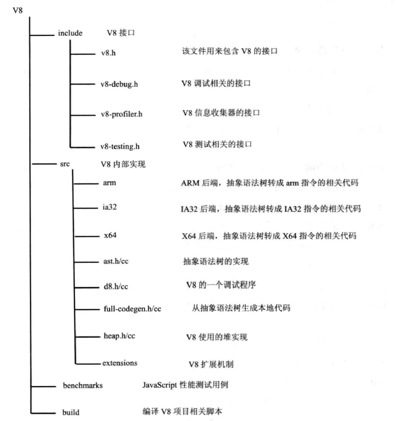
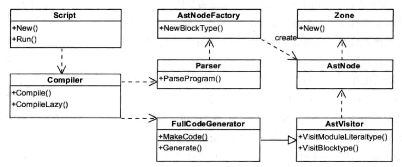
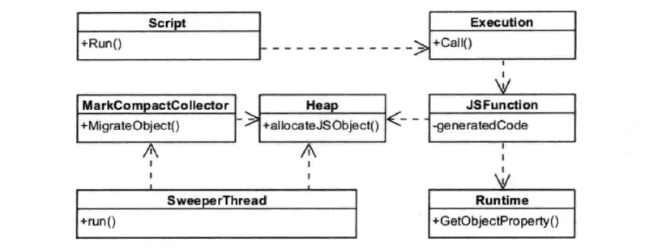
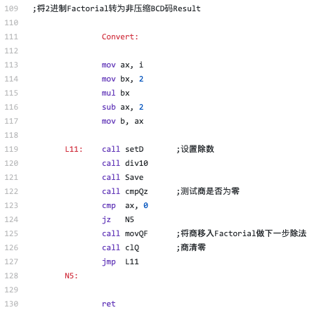
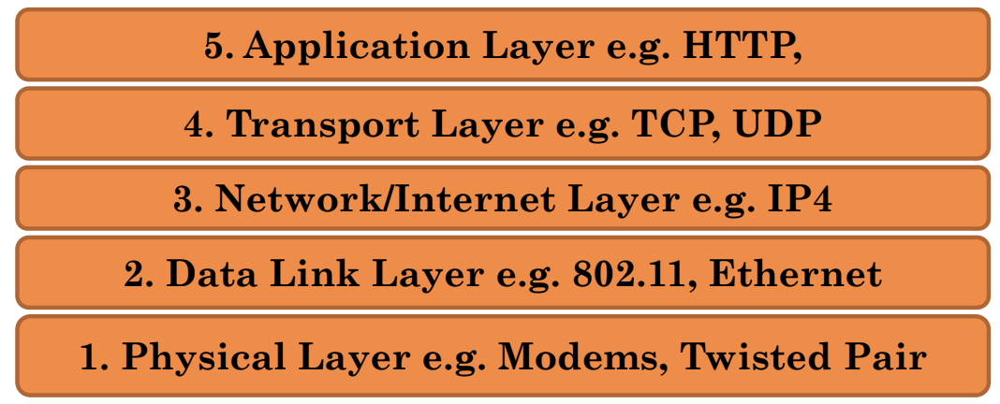

Grade:
Assignments : 20%. 5 assignments, no extenstions
Project = 30%: 6th week , time=1 month, submission=code + presentation slides+video
Final = 50% : 3 hours : short answer


Material:
Development Environment -> Docker & Docker-compose
Servers, HTTP, Node.js
Javascript
Client-Server Interaction
Client-Side HTML, CSS, DOM
SQL DB
NoSQL DB
Frameworks-react
Cloud Platform
Servers


Javascript very slow, then python is slow
Why?
Javascript non-block
Explain docker

#### Python3 pip
pip 是 Python 包管理工具，该工具提供了对 Python 包的查找、下载、安装、卸载的功能。
软件包也可以在 https://pypi.org/ 中找到。
目前最新的 Python 版本已经预装了 pip。
注意：Python 2.7.9 + 或 Python 3.4+ 以上版本都自带 pip 工具。
如果没有安装可以参考：Python pip 安装与使用。
查看是否已经安装 pip 可以使用以下命令：
`pip --version`
下载安装包使用以下命令：
`pip install some-package-name`
例如我们安装 numpy 包：
`pip install numpy`

安装 Pipenv
Pipenv 是 Python 项目的依赖管理器。如果您熟悉 Node.js 的 npm 或 Ruby 的 bundler，那么它们在思路上与这些工具类似。尽管 pip 可以安装 Python 包， 但仍推荐使用 Pipenv，因为它是一种更高级的工具，可简化依赖关系管理的常见使用情况。
使用 pip 来安装 Pipenv：
`$ pip install --user pipenv`

使用安装好的包
现在安装了 Requests，您可以创建一个简单的 main.py 文件来使用它：
```py
import requests
response = requests.get('https://httpbin.org/ip')
print('Your IP is {0}'.format(response.json()['origin']))
```
然后您就可以使用 pipenv run 运行这段脚本：
`$ pipenv run python main.py`
您应该获取到类似的输出：
Your IP is 8.8.8.8
使用 `$ pipenv run` 可确保您的安装包可用于您的脚本。我们还可以生成一个新的 shell， 确保所有命令都可以使用 `$ pipenv shell` 访问已安装的包。

### Nodejs
Node.js是什么？
JavaScript 诞生于 1995 年，几乎是和互联网同时出现；Node.js 诞生于 2009 年，比 JavaScript 晚了 15 年左右。

在 Node.js 之前，JavaScript 只能运行在浏览器中，作为网页脚本使用，为网页添加一些特效，或者和服务器进行通信。有了 Node.js 以后，JavaScript 就可以脱离浏览器，像其它编程语言一样直接在计算机上使用，想干什么就干什么，再也不受浏览器的限制了。

Node.js 不是一门新的编程语言，也不是一个 JavaScript 框架，它是一套 JavaScript 运行环境，用来支持 JavaScript 代码的执行。用编程术语来讲，Node.js 是一个 JavaScript 运行时（Runtime）。

#### Npm是什么
npm（“Node 包管理器”）
NPM 使用介绍
NPM是随同NodeJS一起安装的包管理工具，能解决NodeJS代码部署上的很多问题，常见的使用场景有以下几种：
•	允许用户从NPM服务器下载别人编写的第三方包到本地使用。
•	允许用户从NPM服务器下载并安装别人编写的命令行程序到本地使用。
•	允许用户将自己编写的包或命令行程序上传到NPM服务器供别人使用。
由于新版的nodejs已经集成了npm，所以之前npm也一并安装好了。同样可以通过输入 "npm -v" 来测试是否成功安装。命令如下，出现版本提示表示安装成功:
```shell
$ npm -v
2.3.0
```
https://www.runoob.com/nodejs/nodejs-npm.html


### Executing JS Code
Looking into the V8 engine
* Program
* Call Stack
* Node API
* Callback Queue
* Event Loop

https://zhuanlan.zhihu.com/p/27628685
  
  
V8引擎编译本地代码时使用的主要类如下所示：

Script：表示JavaScript代码，即包含源代码，又包含编译之后生成的本地代码，即是编译入口，又是运行入口；
Compiler：编译器类，辅组Script类来编译生成代码，调用解释器(Parser)来生成AST和全代码生成器，将AST转变为本地代码；
AstNode：抽象语法树节点类，是其他所有节点的基类，包含非常多的子类，后面会针对不同的子类生成不同的本地代码；
AstVisitor：抽象语法树的访问者类，主要用来遍历异构的抽象语法树；
FullCodeGenerator：AstVisitor类的子类，通过遍历AST来为JavaScript生成本地可执行代码。

JavaScript代码编译的过程大致为：Script类调用Compiler类的Compile函数为其生成本地代码。Compile函数先使用Parser类生成AST，再使用FullCodeGenerator类来生成本地代码。本地代码与具体的硬件平台密切相关，FullCodeGenerator使用多个后端来生成与平台相匹配的本地汇编代码。由于FullCodeGenerator通过遍历AST来为每个节点生成相应的汇编代码，缺失了全局视图，节点之间的优化也就无从谈起。

在执行编译之前，V8会构建众多全局对象并加载一些内置的库（如math库），来构建一个运行环境。而且在JavaScript源代码中，并非所有的函数都被编译生成本地代码，而是延迟编译，在调用时才会编译。

由于V8缺少了生成中间代码这一环节，缺少了必要的优化，为了提升性能，V8会在生成本地代码后，使用数据分析器(profiler)采集一些信息，然后根据这些数据将本地代码进行优化，生成更高效的本地代码，这是一个逐步改进的过程。同时，当发现优化后代码的性能还不如未优化的代码，V8将退回原来的代码，也就是优化回滚。下面介绍一下运行阶段，该阶段使用的主要类如下所示：
Script：表示JavaScript代码，即包含源代码，又包含编译之后生成的本地代码，即是编译入口，又是运行入口；
Execution：运行代码的辅组类，包含一些重要函数，如Call函数，它辅组进入和执行Script代码；
JSFunction：需要执行的JavaScript函数表示类；
Runtime：运行这些本地代码的辅组类，主要提供运行时所需的辅组函数，如：属性访问、类型转换、编译、算术、位操作、比较、正则表达式等；
Heap：运行本地代码需要使用的内存堆类；
MarkCompactCollector：垃圾回收机制的主要实现类，用来标记、清除和整理等基本的垃圾回收过程；
SweeperThread：负责垃圾回收的线程。

  


先根据需要编译和生成这些本地代码，也就是使用编译阶段那些类和操作。在V8中，函数是一个基本单位，当某个JavaScript函数被调用时，V8会查找该函数是否已经生成本地代码，如果已经生成，则直接调用该函数。否则，V8引擎会生成属于该函数的本地代码。这就节约了时间，减少了处理那些使用不到的代码的时间。其次，执行编译后的代码为JavaScript构建JS对象，这需要Runtime类来辅组创建对象，并需要从Heap类分配内存。再次，借助Runtime类中的辅组函数来完成一些功能，如属性访问等。最后，将不用的空间进行标记清除和垃圾回收。

https://blog.fundebug.com/2019/07/16/how-does-v8-work/
最近，JavaScript生态系统又多了2个非常硬核的项目。

大神Fabrice Bellard发布了一个新的JS引擎QuickJS，可以将JavaScript源码转换为C语言代码，然后再使用系统编译器(gcc或者clang)生成可执行文件。

Facebook为React Native开发了新的JS引擎Hermes，用于优化安卓端的性能。它可以在构建APP的时候将JavaScript源码编译为Bytecode，从而减少APK大小、减少内存使用，提高APP启动速度。

作为JavaScript程序员，只有极少数人有机会和能力去实现一个JS引擎，但是理解JS引擎还是很有必要的。本文将介绍一下V8引擎的原理，希望可以给大家一些帮助。

#### JavaScript引擎
我们写的JavaScript代码直接交给浏览器或者Node执行时，底层的CPU是不认识的，也没法执行。CPU只认识自己的指令集，指令集对应的是汇编代码。写汇编代码是一件很痛苦的事情，比如，我们要计算N阶乘的话，只需要7行的递归函数：
```js
function factorial(N) {
    if (N === 1) {
        return 1;
    } else {
        return N * factorial(N - 1);
    }
}
```
代码逻辑也非常清晰，与阶乘的数学定义完美吻合，哪怕不会写代码的人也能看懂。
但是，如果使用汇编语言来写N阶乘的话，要300+行代码n-factorial.s：
  

还好，JavaScirpt引擎可以将JS代码编译为不同CPU(Intel, ARM以及MIPS等)对应的汇编代码，这样我们才不要去翻阅每个CPU的指令集手册。当然，JavaScript引擎的工作也不只是编译代码，它还要负责执行代码、分配内存以及垃圾回收。

虽然浏览器非常多，但是主流的JavaScirpt引擎其实很少，毕竟开发一个JavaScript引擎是一件非常复杂的事情。比较出名的JS引擎有这些：
* V8 (Google)
* SpiderMonkey (Mozilla)
* JavaScriptCore (Apple)
* Chakra (Microsoft)
* IOT：duktape、JerryScript
还有，最近发布QuickJS与Hermes也是JS引擎，它们都超越了浏览器范畴，Atwood’s Law再次得到了证明：
`Any application that can be written in JavaScript, will eventually be written in JavaScript.`

##### V8：强大的JavaScript引擎
在为数不多JavaScript引擎中，V8无疑是最流行的，Chrome与Node.js都使用了V8引擎，Chrome的市场占有率高达60%，而Node.js是JS后端编程的事实标准。国内的众多浏览器，其实都是基于Chromium浏览器开发，而Chromium相当于开源版本的Chrome，自然也是基于V8引擎的。神奇的是，就连浏览器界的独树一帜的Microsoft也投靠了Chromium阵营。另外，Electron是基于Node.js与Chromium开发桌面应用，也是基于V8的。

V8引擎是2008年发布的，它的命名灵感来自超级性能车的V8引擎，敢于这样命名确实需要一些实力，它性能确实一直在稳步提高，下面是使用Speedometer benchmark的测试结果：
  
图片来源：https://v8.dev/


V8在工业界已经非常成功了，同时它还获得了学术界的肯定，拿到了ACM SIGPLAN的Programming Languages Software Award：
```
V8’s success is in large part due to the efficient machine code it generates.
Because JavaScript is a highly dynamic object-oriented language, many experts believed that this level of performance could not be achieved.
V8’s performance breakthrough has had a major impact on the adoption of JavaScript, which is nowadays used on the browser, the server, and probably tomorrow on the small devices of the internet-of-things.
```

JavaScript是一门动态类型语言，这会给编译器增加很大难度，因此专家们觉得它的性能很难提高，但是V8居然做到了，生成了非常高效的machine code(其实是汇编代码)，这使得JS可以应用在各个领域，比如Web、APP、桌面端、服务端以及IOT。

严格来讲，V8所生成的代码是汇编代码而非机器代码，但是V8相关的文档、博客以及其他资料都把V8生成的代码称作machine code。汇编代码与机器代码很多是一一对应的，也很容易互相转换，这也是反编译的原理，因此他们把V8生成的代码称为Machine Code也未尝不可，但是并不严谨。

##### V8引擎的内部结构
V8是一个非常复杂的项目，使用cloc统计可知，它竟然有超过100万行C++代码。

V8由许多子模块构成，其中这4个模块是最重要的：

Parser：负责将JavaScript源码转换为Abstract Syntax Tree (AST)
Ignition：interpreter，即解释器，负责将AST转换为Bytecode，解释执行Bytecode；同时收集TurboFan优化编译所需的信息，比如函数参数的类型；
TurboFan：compiler，即编译器，利用Ignitio所收集的类型信息，将Bytecode转换为优化的汇编代码；
Orinoco：garbage collector，垃圾回收模块，负责将程序不再需要的内存空间回收；
其中，Parser，Ignition以及TurboFan可以将JS源码编译为汇编代码，其流程图如下：

  
简单地说，Parser将JS源码转换为AST，然后Ignition将AST转换为Bytecode，最后TurboFan将Bytecode转换为经过优化的Machine Code(实际上是汇编代码)。

* 如果函数没有被调用，则V8不会去编译它。
* 如果函数只被调用1次，则Ignition将其编译Bytecode就直接解释执行了。TurboFan不会进行优化编译，因为它需要Ignition收集函数执行时的类型信息。这就要求函数至少需要执行1次，TurboFan才有可能进行优化编译。
* 如果函数被调用多次，则它有可能会被识别为热点函数，且Ignition收集的类型信息证明可以进行优化编译的话，这时TurboFan则会将Bytecode编译为Optimized Machine Code，以提高代码的执行性能。

Ignition：解释器
TurboFan：编译器
Orinoco：垃圾回收

  
  

### JS HTTP Requests
JS & HTTP Requests
* Why?
	- Performance
	- User Experience

* XMLHttpRequest
	- AJAX
      -  Basic Concept
      -  yes is is all about asynchronous calls

* JS Libraries

#### XMLHttpRequest
* For simplicity the “old” onstatechange pattern will be used
http.onreadystatechange = function() {//Call a function when the state changes.

* The “newer” addEventListener pattern will be presented later
	- Links for event listener
	- https://developer.mozilla.org/en-US/docs/Web/API/XMLHttpRequest/load_event
	- Yes, there is a “newer” way -> fetch
We will discuss this later
```html
<!DOCTYPE html>
<html>
<body>
<p id="demo">Fetch ralph.txt and place it here </p>
<script>
fetch ("ralph.txt") .then(x => x.text()).then(y => document.getElementById("demo").innerHTML = y);
</script> </body> </html>
```
#### Basic Design
1. Creating request object

2. Setting parameters of request object & submitting it

3. Synchronous or asynchronous handling of response

Example -> make aysn. call to node post

Node Code
```js
app.post('/sayHello', (req,res) => {
var name = req.body.name;
var answer = "hello " + name;
res.send(answer);
});

function sayHello()
{
var http = new XMLHttpRequest();
var url = '/sayHello';
var params = 'name=' + document.getElementById("input").value;

http.open('POST', url, true);

http.setRequestHeader('Content-type','application/x-www-form-urlencoded');

http.onreadystatechange = function(){
	if(http.readyState == 4 && http.status == 200){
	document.getElementById("answer").value = http.responseText;
}
};

http.send(params);
};
```

* request.readyState
* https://developer.mozilla.org/en-US/docs/Web/API/XMLHttpRequest/readyState

	- 0 -> unsent
	- 1 -> opened
	- 2 -> headers_received
	- 3 -> loading
	- 4 -> done
1. Ajax：readyState（状态值）和status（状态码）的区别
readyState，是指运行Ajax所经历过的几种状态，无论访问是否成功都将响应的步骤，可以理解成为Ajax运行步骤，使用“ajax.readyState”获得。
status，是指无论Ajax访问是否成功，由http协议根据所提交的信息，服务器所返回的http头信息代码，使用“ajax.status”获得。

总体理解：可以简单的理解为state代表一个整体的状态。而status是这个大的state下面具体的小的状态。

2. 什么是readyState
readyState是XMLHttpRequest对象的一个属性，用来标识当前XMLHttpRequest对象处于什么状态。
readyState总共有5个状态值，分别为0~4，每个值代表了不同的含义。
```
0：初始化，XMLHttpRequest对象还没有完成初始化
1：载入，XMLHttpRequest对象开始发送请求
2：载入完成，XMLHttpRequest对象的请求发送完成
3：解析，XMLHttpRequest对象开始读取服务器的响应
4：完成，XMLHttpRequest对象读取服务器响应结束
```
3. 什么是status
status是XMLHttpRequest对象的一个属性，表示响应的http状态码
在http1.1协议下，http状态码总共可分为5大类  

```
1xx：信息响应类，表示接收到请求并且继续处理
2xx：处理成功响应类，表示动作被成功接收、理解和接受
3xx：重定向响应类，为了完成指定的动作，必须接受进一步处理
4xx：客户端错误，客户请求包含语法错误或者是不能正确执行
5xx：服务端错误，服务器不能正确执行一个正确的请求
 
100——客户必须继续发出请求
101——客户要求服务器根据请求转换HTTP协议版本
200——交易成功
201——提示知道新文件的URL
202——接受和处理、但处理未完成
203——返回信息不确定或不完整
204——请求收到，但返回信息为空
205——服务器完成了请求，用户代理必须复位当前已经浏览过的文件
206——服务器已经完成了部分用户的GET请求
300——请求的资源可在多处得到
301——删除请求数据
302——在其他地址发现了请求数据
303——建议客户访问其他URL或访问方式
304——客户端已经执行了GET，但文件未变化
305——请求的资源必须从服务器指定的地址得到
306——前一版本HTTP中使用的代码，现行版本中不再使用
307——申明请求的资源临时性删除
400——错误请求，如语法错误
401——请求授权失败
402——保留有效ChargeTo头响应
403——请求不允许
404——没有发现文件、查询或URl
405——用户在Request-Line字段定义的方法不允许
406——根据用户发送的Accept拖，请求资源不可访问
407——类似401，用户必须首先在代理服务器上得到授权
408——客户端没有在用户指定的饿时间内完成请求
409——对当前资源状态，请求不能完成
410——服务器上不再有此资源且无进一步的参考地址
411——服务器拒绝用户定义的Content-Length属性请求
412——一个或多个请求头字段在当前请求中错误
413——请求的资源大于服务器允许的大小
414——请求的资源URL长于服务器允许的长度
415——请求资源不支持请求项目格式
416——请求中包含Range请求头字段，在当前请求资源范围内没有range指示值，请求也不包含If-Range请求头字段
417——服务器不满足请求Expect头字段指定的期望值，如果是代理服务器，可能是下一级服务器不能满足请求
500——服务器产生内部错误
501——服务器不支持请求的函数
502——服务器暂时不可用，有时是为了防止发生系统过载
503——服务器过载或暂停维修
504——关口过载，服务器使用另一个关口或服务来响应用户，等待时间设定值较长
505——服务器不支持或拒绝支请求头中指定的HTTP版本
```

#### JSON
* JavaScriptObjectNotation
* JSON.parse
  - String -> Object
* JSON.stringify
  -  Object -> String
  -  
#### HTTP - Part 1
* **Communication**
    
  
  

* **TCP & UDP**
* **Transmission Control Protocol**
	- TCP
	- Core Protocol
	- Provide reliable, ordered communication
	- Used as the basic protocol for many applications e.g. WWW

* **User Datagram Protocol**
	- UDP
	- Fast, compact but no guarantees

* **UDP**
  * One way communication
  * No guaranteed delivery
  * Often used for VoIP, DNS, etc

* **TCP Connection**
	- TCP is the most common protocol
	- Web runs on TCP
	- Guaranteed delivery
	- Two-way communication
  

* **TCP/IP COMMUNICATION**

* Every machine has to have a unique IP address
	* WWW.USASK.CA
* Every machine has to use a port
* Some Ports have special meanings
	* E.g. 80
* **Domain Name System**
  * IP address are not sufficient
  	- Hard to remember
 	- IP addresses of servers can change
  * Naming system for computers
	- Hosts file (old way)
	- Using DNS servers (new way)
  * Each domain name can be translated into IP
	- nslookup – translation tool
	- www.cs.usask.ca -> .......
How does DNS work ?
  * Each computer knows IP of at least one DNS server
  * If your DNS server does not know the requested name it polls another DNS server
* **HTTP – HYPERTEXT TRANSFER PROTOCOL**
    
* HTTP VERSIONS
  * HTTP 0.9 – supports only GET
  * HTTP/1.0 (1996)
  * HTTP/1.1 (1997)
  * HTTP/2 ( 2015)
  * HTTP/3 (2022)
	- QUIC
	- 
  
  
  

  

  

  

 

* **HTTP 3**

* Target
	- Mobile, data intensive interactions
		- Allows switching networks e.g. 5G, 3G, 4G
* Connection ID
	- Enables connection across networks
	- Different network but use same ID
* **HTTP COMMANDS**
1. HEAD: 类似于 GET 请求，只不过返回的响应中没有具体的内容，用于获取报头
* Asks for the response identical to the one that would correspond to a GET request, but without the response body. This is useful for retrieving meta-information written in response headers, without having to transport the entire content.
2. GET: 请求指定的页面信息，并返回实体主体。
* Requests a representation of the specified resource. By far the most common method used on the Web today. Should not be used for operations that cause side-effects (using it for actions in web applications is a common misuse). See 'safe methods' below.
3. POST: 向指定资源提交数据进行处理请求（例如提交表单或者上传文件）。数据被包含在请求体中。POST 请求可能会导致新的资源的建立和/或已有资源的修改。
* Submits data to be processed (e.g. from an HTML form) to the
identified resource. The data is included in the body of the request. This may result in the creation of a new resource or the updates of existing resources or both.
4. PUT: 从客户端向服务器传送的数据取代指定的文档的内容。
* Uploads a representation of the specified resource.
5. DELETE: 请求服务器删除指定的页面。
* Deletes the specified resource.
OTHERS
6. TRACE: 回显服务器收到的请求，主要用于测试或诊断。
* Echoes back the received request, so that a client can see
what intermediate servers are adding or changing in the
request.
7. OPTIONS: 允许客户端查看服务器的性能。
* Returns the HTTP methods that the server supports. This
can be used to check the functionality of a web server.
8. CONNECT: HTTP/1.1 协议中预留给能够将连接改为管道方式的代理服务器。
* Converts the request connection to a transparent TCP/IP
tunnel, usually to facilitate SSL-encrypted communication
(HTTPS) through an unencrypted HTTP proxy  
9. PATCH: 是对 PUT 方法的补充，用来对已知资源进行局部更新 。
    
Idempotent & Safe
* Idempotent -> don’t change response
* Safe -> can be cached

Example
```js
GET /echo HTTP/1.1
Host: reqbin.com
Accept: */*
```
```js
GET /echo HTTP/1.1
Host: reqbin.com
Accept: text/html
```
```js
GET /echo/get/json HTTP/1.1
Host: reqbin.com
Accept: application/json
```
```html
GET /tutorials/other/top-20-mysql-best-practices/ HTTP/1.1
Host: code.tutsplus.com
User-Agent: Mozilla/5.0 (Windows; U; Windows NT 6.1; en-US; rv:1.9.1.5)
Gecko/20091102 Firefox/3.5.5 (.NET CLR 3.5.30729)
Accept: text/html,application/xhtml+xml,application/xml;q=0.9,*/*;q=0.8
Accept-Language: en-us,en;q=0.5
Accept-Encoding: gzip,deflate
Accept-Charset: ISO-8859-1,utf-8;q=0.7,*;q=0.7
Keep-Alive: 300
Connection: keep-alive
Cookie: PHPSESSID=r2t5uvjq435r4q7ib3vtdjq120
```
```
HTTP/1.x 200 OK
Transfer-Encoding: chunked
Date: Sat, 28 Nov 2009 04:36:25 GMT
Server: LiteSpeed
Connection: close
X-Powered-By: W3 Total Cache/0.8
Expires: Sat, 28 Nov 2009 05:36:25 GMT
Etag: "pub1259380237;gz"
Cache-Control: max-age=3600, public
Content-Type: text/html; charset=UTF-8
Last-Modified: Sat, 28 Nov 2009 03:50:37 GMT
Content-Encoding: gzip
Vary: Accept-Encoding, Cookie, User-Agent
```
**HTTP STATUS CODES**
* 1xx informal
* 2xx client request success
* 3xx redirection
* 4xx client request incomplete
* 5xx server errors
  
**HTTP HEADERS**
* General
	-  Not related to client, server or HTTP
* Request
	- Preferred document formats and server parameters
* Response
	- Information
* Entity
	- Information about the data being sent between client and server
  
# lecture Feb 1
```javascript
Const express = require (‘express’)
	Load the express package
//1:
app.get('/hello', (req, resp, next) => { 
    console.log(req.originalUrl); 
    resp.send('hello'); 
});
```
```js
//2:
Function myFunction1(req, res, next){
Res.send(“”)
}
App.get(‘/’, myfunction1)
```
```js
3:
Function mw1(req,res, next){
	Console.log(‘mw1’)
	Next()
}
Function myFunction1(req, res, next){
    Res.send(“”)
}
App.get(‘/’, mw1, myfunction1)

//需要next，这样才能继续取下一个参数
```
```javascript
//4.
App.use(mw1);
App.use(mw2);

Function mw1(req,res, next){
	Console.log(‘mw1’)
	Next();
}
Function mw2(req,res, next){
	Console.log(‘mw1’)
	Next()
}

Function myFunction1(req, res, next){
Res.send(“”)
}
App.get(‘/’, myfunction1)
```
```js
//5:
App.use(mw1);
App.use(mw2);

Function mw1(req,res, next){
	Console.log(‘mw1’);
	Next();
}
Function mw2(req,res, next){
	Console.log(‘mw1’)
    Next();
}
Function mw3(req,res, next){
	Console.log(‘mw1’);
    Next();
}
Function errFunction(err, req,res, next){
	If(err){
		Res.send(“<h1> Error:” + err.message + “</h1>”);
    }	
    Next()
}
Function myFunction1(req, res, next){
    Res.send(“”)
}
App.get(‘/’, mw3, myfunction1)

//相当于讲reqest 改变了，中间添加了很多东西by mw1,mw2, mw3，然后

App.use(errFunction);
```

```javascript
const express = require('express');
let router = express.Router();
module.exports = router;
router.use((req, res, next) => {
    console.log(req.url, Date.now());
    next();
});

router.route('/scifi')
.get((req, res, next) => { res.send('<h1> SCIFI</h1>'); }
.post((req, res, next) => { });

router.route('/scifi/:bookid')
.get((req, res, next) => { res.send(`<h1> SCIFI ${req.params bookid} </h1>`);})
.put((req, res, next) => {});
```

## Lecute Feb 3
database
https
mysql:
	- docker
	- 8.0. ??
	- 5.7 synchnozier , 
    	- not allow sql database to access the file system

docker-compose.yml
```yml
version: '3'
services:
mysql1:
image: mysql:5.7
container_name: db1
environment:
MYSQL_ROOT_PASSWORD: admin
```

2 servers
- node server
- database
- 怎么互相访问啊？

Commands

Docker:

’docker-compose up -d‘
docker-compose down
docker exec -it container bash
MySQL:
mysql -uroot -padmin

more docker-compose.yml
mysql package
install npm mysql
use it in code

```yml
node1:
mysql1:
image: mysql:5.7
container_name: db1
environment:
MYSQL_ROOT_PASSWORD: admin
```
docker-compose up -d
docker exec -it db1 bash
	- bash 运行在db1的container里面
	- 运行： mysql -uroot -padmin

```sql
CREATE DATABASE mydb;
USE mydb;
CREATE TABLE mytable (
id
username email PRIMARY KEY
);
```
relational database 
###Lecture Feb 6

测试一个server
```shell
docker -exec -it node1_hash
npx loadtest -n 10 -c 1 -m POST -T 'application/x-www-form-urlencoded'' --data '{"'filename":"test", "data": "test"}' http://localhosthost:8080/save
# -n 是说同时启动几个client
#不是npm，而是npx
#-c concurrency 同时几个hitserver，sametime
#如果-n 10 -c 10,所以同时发动100个request

docker attack node1
```
next assignment is about fetch + mysql

### MYSQL & Node(1)
```js
var mysql = requir('mysql');
var commection = mysql.createConnection({
	host : 'mysql1',
	user: ''root,
	password: 'admin'
});
connection.connect();
```
运行2个container？怎么互相访问？不是放在同一个container里面？

Add SQL statements
```js
connection.query('', function(
	error, results, fields){
		if(error) throw error;
		console.log('The solution is: ', results);
	});

```
How to define your database
1. MySQL comman
   1. use the command tool and define table
2. Write SQL init in your node code
   ```js
   app.get('init', ()=>{
	connetion.query('Create database posts', function(error,results){
		if(error) console.log(error);
	}

	)
   })
   connection.query('', function(
	error, results, fields){
		if(error) throw error;
		console.log('The solution is: ', results);
	});
	
   ```
   ```js
   app.get('init', (req,res)=>{
	connetion.query('Create database posts', function(error,results){
		if(error) console.log(error);
	}

	)
   })
    app.post('/greeting', (req,res)=>{
	connetion.query('Create database posts', function(error,results){
		if(error) console.log(error);
	}

	)
   })
   ```

   Lecture Feb 8

docker-compose
```yml
version: '3.9'
services:
mysql1:
image: mysql:5.7
container_name: db1
volumes:
- /Users/ralph/classes/353/dbfiles:/var/lib/mysql
environment:
MYSQL_ROOT_PASSWORD: admin
node1:
build: .
container_name: nodejs1
ports:
- "80:8080"
volumes:
- /Users/ralph/classes/353:/usr/src/app
depends_on:
mysql1:
condition: service_started
stdin_open: true
tty: true
```
里面有一个depency，node 会等mysql启动以后，才启动node

### SQL
* CRUD
* Create
* Read
* Update
* Delete
Create

#### Create Database
```sql
 CREATE DATABASE mydb;
 Create Table
 CREATE TABLE mytable
 (
 id int unsigned NOT NULL auto_increment,
 username varchar(100) NOT NULL,
 email varchar(100) NOT NULL,
 PRIMARY KEY (id)
 );
 Create Entry (add new row)
 INSERT INTO mytable ( username, email ) VALUES ( "myuser", "myuser@example.com" );
```
 #### Update
```sql
 Update Row in table
 UPDATE mytable SET username="myuser" WHERE id=8;
 Update Table (try to avoid)
 	ALTER TABLE table_name ADD column_name datatype;
 	ALTER TABLE table_name DROP COLUMN column_name;
 	ALTER TABLE table_name MODIFY COLUMN column_name datatype;
 ```
 #### Read
```sql
SELECT * FROM mytable;
	 SELECT column1, column2, ... FROM table_name;
 SELECT * FROM mytable WHERE username = "myuser";
	 SELECT column1, column2, ... FROM table_name WHERE condition;
```
#### Delete
```sql
DELETE FROM mytable WHERE id=8
```
### How to develop Node/SQL code

* Start with mysql
* Design table
* Design queries
* Write SQL table & queries
* Copy into Node code

**Insert & Select**
` INSERT INTO posts ( topic, data ) VALUES ( "JS variables ", "use keyword var" );`
` select * from posts;`

**Integrate into node code**
* Use app.get(“/init” ....)
	- setup database
* Use app.post(“/addPost”, .....)
	- Insert data into table
* Use app.get(“/getPosts”,
	- To read posts

**Define Webpage (single page pattern)**

* Define input fields, button(s) & area for posts
* Use xmlttprequest or fetch (assgnment 3 requires fetch)
```html
<!DOCTYPE html>
<html>
<head>
<script>

function send() {
	fetch('/addPost', {
		method: 'POST',
		body: new URLSearchParams({
			topic: document.getElementById("data").value,
			data: document.getElementById("topic").value
			}).toString(),
		headers: {
		"Content-type": "application/x-www-form-urlencoded"
	}})
	.then(response => response.json())
	.then(data => console.log(data))
	.catch(error => console.error(error))
}
function read() {
	fetch('/getPosts', {method: 'GET'})
	.then(response => response.json())
	.then(data => {document.getElementById("Output")innerHTML =JSON.stringify(data)})
	.catch(error => console.error(error))
}
</script>
</head>
<body>
<input type="text" id="topic"><br><br>
<input type="text" id="data"><br><br>
<button onclick="send()">add post</button><br><br>
<button onclick="read()">read posts</button><br><br>
<div id="Output"></div>
</body>
</html>
```

### Lecture Feb 10
### Docker-Compose health check
healthcheck:
test: ... # Command to check health.
interval: 5s # Interval between health checks.
timeout: 5s # Timeout for each health checking.
retries: 20 # How many times retries.
start_period: 10s # Estimated time to boot.

```yml
version: '3.9'
services:
mysql1:
.....
healthcheck:
test: ["CMD", "mysqladmin" ,"ping", "-h", "localhost", "-uroot", "-padmin"]
timeout: 20s
retries: 10
node1:
....
depends_on:
mysql1:
condition: service_healthy
stdin_open: true
tty: true
```
在msql的container里面，做一个ping来做一个health的check
在node1的container里面做一个condition，serveice_healthy
```yml
healthcheck:
test: "curl -f localhost:8080"
interval: 5s
timeout: 5s
retries: 20
```
每20s做一个check，比如mysql能不能运行
这是干啥呢

### Leture Feb15
React: framework
a javascript library for building interface
```js
class ShoppingList extends React.Component {
  render() {
    return (
      <div className="shopping-list">
        <h1>Shopping List for {this.props.name}</h1>
        <ul>
          <li>Instagram</li>
          <li>WhatsApp</li>
          <li>Oculus</li>
        </ul>
      </div>
    );
  }
}
return React.createElement('div', {className: 'shopping-list'},
  React.createElement('h1', /* ... h1 children ... */),
  React.createElement('ul', /* ... ul children ... */)
);
```
Model definition
这不就是我们之前想搞的modual话，直接drag some 模块就可以吗
不过这个是需要把code复制进来，然后看效果

reactjs, push by google

Learning objectives
* Install react
* Build component
* Introduce props
* State
* Routing

The need for tools

* HTML, CSS & JS
	- Tricky concepts
* Need for tools/frameworks/middleware
	- Light -> **jQuery**
	- Medium -> **ReactJS**
	- Heavy -> 
  JQuery有获取数据，显示数据到html的办法
  那么ReactJS有什么？有什么功能比JQuery多的
Why use ReactJS?
* Open-Source JS library
* Community
* Focus on Front-End
* Modular Components
* Good performance
* Stable Environment (initial release 2013)
* JSX
* Virtual DOM

Getting Started
* First react app
	- Create directory
	- **npx** create-react-app projectname --use-npm
    	- npm是node package management, npx是node package execute
    	- Otherwise yarn is used
	- Look into folder
		- Public
          * resources
    	- src
          * React code

	- Add .env if you want to change things
		- e.g. PORT=8080
			- Otherwise 3000
	 npm start
	 Change message !
执行步骤
```
docker-compose up -d
docker attach nodejs1
	怎么这些文件都进来的？？？看看COPY
npx create-react-app d2 --use-npm
vi .env
npm start
```
explore folder
* src
	 - Index.js
		■ Called when node is started
		■ Processed before going to client
          - <App /> -> this is not a tag !!!

	- Import ReactDom
	- 	....
	- App.js
	- JSX = JavaScript XML
	- We see transformed code in browser

Create React Component
```
function Hello() {
let isMorning = (new Date()).getHours() < 12;
return isMorning
? <h3> Good Morning </h3>
: <h3> Good Evening </h3>;
}
export default Hello;
---------------------------
import Hello from './Hello';
<Hello />
```

???为什么有vi？没有vim？？？

**为什么用react，一般的访问web server，也有react效果啊**？？
```shell
docker-compose up -d
docker attach nodejs
npm start

```
难道只是新建一个<app/>，然后在app.js 将这个App tag替换成innerHTML？
我懂了，将所有的element 放在js来操作，不用全部画在htnl里面
Nice！
***tag=function***
唯一的问题是，怎么控制css在这些自定义的tag？？？
生成了那么多css，js，html tag，什么时候解析+转化的，那么客户端慢不慢？
那么到底是client end来解析，什么是server end来解析？
js不是客户端解析的吗？


像做梦一样，我现在坐在国外的班里，听着外语，多年以前，怎么可能想象的到

Return multiple tags
```js
import React from 'react';
function Hello() {
let isMorning = (new Date()).getHours() < 12;
return isMorning
? (
<React.Fragment>
<h3> Good Morning </h3>
<h3> 5 New Posts </h3>
</React.Fragment>
)
: (
<>
<h3> Good Morning </h3>
<h3> 7 New Posts </h3>
</>
)
```
Explicit Export / Explicit Import
```js
export function Hello() {
let isMorning = (new Date()).getHours() < 12;
return isMorning
? (
.........

import logo from './logo.svg';
import './App.css';

import {Hello} from './Hello';

```

Parameters -> Props
```js
import {Helloo} from './Helloo';

function App() {
let text = 'cool';
let url = 'https://reactjs.org';

return (
<div className="App">
<header className="App-header">

<Helloo name="Ralph" posts={5} />

import React from 'react';

export const Helloo = ({name, posts}) => {
let isMorning = (new Date()).getHours() < 12;
let hellooHeader = isMorning
? <h3> Good Morning {name} </h3>
: <h3> Good Day {name} </h3> ;

return (
<>
{hellooHeader}
<h3> {posts} New Posts </h3>
</>
)
}

Condition Render

import React from 'react';

export const Helloo = ({name, posts}) => {
if (!name) return null;
let isMorning = (new Date()).getHours() < 12;
let hellooHeader = isMorning
? <h3> Good Morning {name} </h3>
: <h3> Good Day {name} </h3> ;
return (
<>
{hellooHeader}
{posts === 0
? null
: <h3> {posts} New Posts </h3>}
</> )}
```

Review

● Documentation
○ https://reactjs.org/
● Goals of React?
● Approach?
● Imperative vs Declarative
● Steps

Functions & Tags

● What do Functions return?
○ Why
● **How to add styles?**
	- 放在App.css中，然后在js中return html的时候，加在里面就好
● How to pass arguments to functions?
○ Why?

index.js 中生成root.render，生成了App
这些是所有的html的root tag

Props
```js
<Helloo name="Ralph" posts={5} />

var data = {fn="Ralph", ln= "Deters", posts=5}
<Helloo name={data.fn}, posts={data.posts} />

import React from 'react';

export const Helloo = ({name, posts}) => {

	So why is it called Props

● export const Helloo = (props) => {
○ props.name
○ props.posts
● export const Helloo = ({name, posts}) => {
```

哇，完全没有html了，全是js

co-compiler???