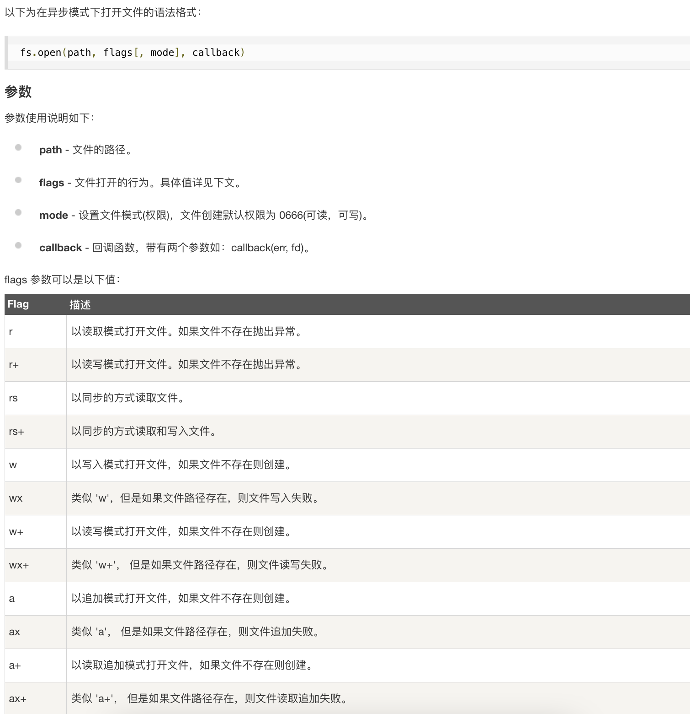

# docker
## image
  `docker build`
  
## container
`docker run`


## nodejs
```shell
 npm init
 npm add express
 npm add body-parser
 node server.js
```
用nodejs,不知道为什么得需要port 8080
但是用docker的container，启动nodejs以后，port是80

Ajax原来只是别用form就行
不然会一直提交
  
