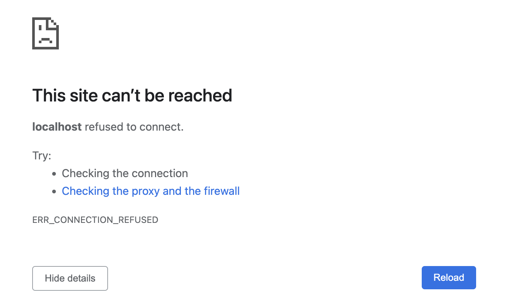

if I use the wrong port, the error would be:
  

我如果单独启动docker，是可以访问的
如果单独启动nodejs，也是可以访问的
只是docker-compose不行，奇了怪了

docker inspect container-name
curl localhost:3002
cURL 是什么意思？ cURL 意思是客户端的URL 工具，是用于在服务器之间传输数据的开源命令行工具和跨平台的库（libcurl），

重启 docker 服务也试过了
`systemctl restart docker`

首先想到的是防火墙，直接进行关闭
`systemctl stop firewalld`

问题的现象是：

1. 在宿主机 curl 对应的端口，处于阻塞状态，无响应
`curl 127.0.0.1:8080`

2. 在镜像内 curl 原端口正常，curl 百度失败
`curl 127.0.0.1:80`
`curl www.baidu.com`
这里也得到了一个信息是不能访问外网，以为是服务问题，又创建了一个新的测试容器结果还是一样
使用 docker port 查看输出是正常的
`$ docker port a7dafeccf24e`
3012/tcp -> 0.0.0.0:3012
80/tcp -> 0.0.0.0:8080

docker inspect 也是正常的

重启 docker 服务也试过了

`systemctl restart docker`
复制
首先想到的是防火墙，直接进行关闭

`systemctl stop firewalld`
复制
关闭了也是不行的，安全组是复用以前的机器，应该是没有问题的

在和 笛声大佬 的交流下继续尝试

nmap 127.0.0.1 -p 8080

iptables -t nat -nvL

结果都是正常的，没看出来有什么问题，然后让我尝试了查看 ip_forward

cat /proc/sys/net/ipv4/ip_forward

结果居然是 0，IP 转发需要进行开启，执行以下命令

echo 1 > /proc/sys/net/ipv4/ip_forward

重启 docker 服务之后还是不能访问，无解了

大佬让提交工单问一下镜像后 docker 是不是得重装才能正常使用，结果我提交了一个工单，腾讯云的回复过于沙雕

非常抱歉，我们属于云平台技术支持人员，云平台产品及解决方案的支持是我们的技术专项，您提出的问题为第三方技术支持需求，我们无法帮您解决，还请您谅解；
为了解决您的需求，您可以考虑使用腾讯云的云市场解决您的问题，点击右上角服务中心 — 联系客服，在线咨询。

此时内心一万个 mmp，算了，直接重装下 docker 试试吧

yum -y remove docker.x86_64 docker-client.x86_64 docker-common.x86_64

sh get-docker.sh --mirror AzureChinaCloud

重新构建镜像和容器，结果还是不可以，打算放弃了突然翻到了一篇知乎文章 阿里云 ECS 的 Docker 为什么无法端口映射？ 中的这个回答

阿里云的内网eth0 网段正好跟Docker 的虚拟网卡都是 172 网段,有冲突.
wtf？突然想到我的机器好像确实是一样的，跑去查看一下

得，确实是一样的，新开的机器是上海三区的，和之前的机器不是一个区域

修改 /etc/docker/daemon.json，加入一行 "bip": "192.168.1.5/24",，然后再次查看 ifconfig，已经变成了 192 网段了

重启 docker 服务，curl 尝试正常，完美解决问题，喜大普奔

原来用docker发布，也不行的
在container的terminal上，用curl是可以的，但是在browser上，是不行的
会有错误：
This page isn’t workinglocalhost didn’t send any data.
ERR_EMPTY_RESPONSE

把port改成8080以后，用curl访问localhost:8080能有hello world提示。访问localhost:80说connection refuse。
但是，用browser，访问localhost:8080,显示
>This site can’t be reachedlocalhost refused to connect.
>Try:
>Checking the connection
>Checking the proxy and the firewall
>ERR_CONNECTION_REFUSED

用localhost:80访问，显示

>This page isn’t workinglocalhost didn’t send any data.
>ERR_EMPTY_RESPONSE
use `docker port ifconfig`
"PortBindings": {
                "8080/tcp": [
                    {
                        "HostIp": "",
                        "HostPort": "80"
                    }
                ]
            },

            "IPAddress": "172.17.0.2",

用docker port ifconfig:
[
    {
        "Id": "33c6b1487bf9ca690b7b2aae5d11c7c8f366cda0cfd9adb2022ae17dc9995664",
        "Created": "2023-02-24T02:06:57.033075762Z",
        "Path": "docker-entrypoint.sh",
        "Args": [
            "/bin/bash"
        ],
        "State": {
            "Status": "running",
            "Running": true,
            "Paused": false,
            "Restarting": false,
            "OOMKilled": false,
            "Dead": false,
            "Pid": 14497,
            "ExitCode": 0,
            "Error": "",
            "StartedAt": "2023-02-24T02:06:57.395689845Z",
            "FinishedAt": "0001-01-01T00:00:00Z"
        },
        "Image": "sha256:1a5e986cc871e07f1181b4031d47251d94cf420f30d7ea449d185377178cccd3",
        "ResolvConfPath": "/var/lib/docker/containers/33c6b1487bf9ca690b7b2aae5d11c7c8f366cda0cfd9adb2022ae17dc9995664/resolv.conf",
        "HostnamePath": "/var/lib/docker/containers/33c6b1487bf9ca690b7b2aae5d11c7c8f366cda0cfd9adb2022ae17dc9995664/hostname",
        "HostsPath": "/var/lib/docker/containers/33c6b1487bf9ca690b7b2aae5d11c7c8f366cda0cfd9adb2022ae17dc9995664/hosts",
        "LogPath": "/var/lib/docker/containers/33c6b1487bf9ca690b7b2aae5d11c7c8f366cda0cfd9adb2022ae17dc9995664/33c6b1487bf9ca690b7b2aae5d11c7c8f366cda0cfd9adb2022ae17dc9995664-json.log",
        "Name": "/compose333",
        "RestartCount": 0,
        "Driver": "overlay2",
        "Platform": "linux",
        "MountLabel": "",
        "ProcessLabel": "",
        "AppArmorProfile": "",
        "ExecIDs": [
            "83f30aee1878726dc824c6beaa3f8100272d36e423322e813806aa1a525e4595"
        ],
        "HostConfig": {
            "Binds": [
                "/Users/helenhang/Projects/mydocker/ass3:/code"
            ],
            "ContainerIDFile": "",
            "LogConfig": {
                "Type": "json-file",
                "Config": {}
            },
            "NetworkMode": "default",
            "PortBindings": {
                "3002/tcp": [
                    {
                        "HostIp": "",
                        "HostPort": "3002"
                    }
                ]
            },
            "RestartPolicy": {
                "Name": "no",
                "MaximumRetryCount": 0
            },
            "AutoRemove": false,
            "VolumeDriver": "",
            "VolumesFrom": null,
            "CapAdd": null,
            "CapDrop": null,
            "CgroupnsMode": "private",
            "Dns": [],
            "DnsOptions": [],
            "DnsSearch": [],
            "ExtraHosts": null,
            "GroupAdd": null,
            "IpcMode": "private",
            "Cgroup": "",
            "Links": null,
            "OomScoreAdj": 0,
            "PidMode": "",
            "Privileged": false,
            "PublishAllPorts": false,
            "ReadonlyRootfs": false,
            "SecurityOpt": null,
            "UTSMode": "",
            "UsernsMode": "",
            "ShmSize": 67108864,
            "Runtime": "runc",
            "ConsoleSize": [
                0,
                0
            ],
            "Isolation": "",
            "CpuShares": 0,
            "Memory": 0,
            "NanoCpus": 0,
            "CgroupParent": "",
            "BlkioWeight": 0,
            "BlkioWeightDevice": [],
            "BlkioDeviceReadBps": null,
            "BlkioDeviceWriteBps": null,
            "BlkioDeviceReadIOps": null,
            "BlkioDeviceWriteIOps": null,
            "CpuPeriod": 0,
            "CpuQuota": 0,
            "CpuRealtimePeriod": 0,
            "CpuRealtimeRuntime": 0,
            "CpusetCpus": "",
            "CpusetMems": "",
            "Devices": [],
            "DeviceCgroupRules": null,
            "DeviceRequests": null,
            "KernelMemory": 0,
            "KernelMemoryTCP": 0,
            "MemoryReservation": 0,
            "MemorySwap": 0,
            "MemorySwappiness": null,
            "OomKillDisable": null,
            "PidsLimit": null,
            "Ulimits": null,
            "CpuCount": 0,
            "CpuPercent": 0,
            "IOMaximumIOps": 0,
            "IOMaximumBandwidth": 0,
            "MaskedPaths": [
                "/proc/asound",
                "/proc/acpi",
                "/proc/kcore",
                "/proc/keys",
                "/proc/latency_stats",
                "/proc/timer_list",
                "/proc/timer_stats",
                "/proc/sched_debug",
                "/proc/scsi",
                "/sys/firmware"
            ],
            "ReadonlyPaths": [
                "/proc/bus",
                "/proc/fs",
                "/proc/irq",
                "/proc/sys",
                "/proc/sysrq-trigger"
            ]
        },
        "GraphDriver": {
            "Data": {
                "LowerDir": "/var/lib/docker/overlay2/b372d38ae752ca3e7a36121c4e7c5958a6eba86a23acb43601fcf25f6d485977-init/diff:/var/lib/docker/overlay2/nba6iyahjk37v06e7fxd6knm9/diff:/var/lib/docker/overlay2/yvec11uy54xlw5vu0j0z4x4wt/diff:/var/lib/docker/overlay2/s1puahevh1zhwzh4a9qqvov5l/diff:/var/lib/docker/overlay2/8cc9b6444ef131497c6cdbaeb7489770bdf9ca0d69a39d091605fee91b755726/diff:/var/lib/docker/overlay2/ec6ee77a5c56980a4a6d0cf787142bc79c13f8734bb6cc4f94c9353c8ac186dc/diff:/var/lib/docker/overlay2/b562d8879655472dd0704bf7aea7798c300aa57d0c8c819f35f693c04251757c/diff:/var/lib/docker/overlay2/5fc39786c63bc4bedfad180b95310e3761a9bab29baa6b18b4ef3f756ed33701/diff:/var/lib/docker/overlay2/04fedcd5e2568b44d195bb9b4aa19b03284197fc48d3abd95fed5202bd7fca96/diff:/var/lib/docker/overlay2/3a9d535017578c797ec514d7d20bfd4fd79acba2ae5b7ca82c58143b6cfc76cb/diff:/var/lib/docker/overlay2/fe754ae381873f3d9d3cf4b1e462d5e8d74e06555a9c3c0e48137542b2a3e72c/diff:/var/lib/docker/overlay2/80e224aca8acd47b8bd6bc81353b2fe90a4ac52b825ebaa3176f0455db73b9bb/diff:/var/lib/docker/overlay2/1ab878984ca5244979c4448d0a493b9e8b58bbfc2f01f734476817378ae6b075/diff",
                "MergedDir": "/var/lib/docker/overlay2/b372d38ae752ca3e7a36121c4e7c5958a6eba86a23acb43601fcf25f6d485977/merged",
                "UpperDir": "/var/lib/docker/overlay2/b372d38ae752ca3e7a36121c4e7c5958a6eba86a23acb43601fcf25f6d485977/diff",
                "WorkDir": "/var/lib/docker/overlay2/b372d38ae752ca3e7a36121c4e7c5958a6eba86a23acb43601fcf25f6d485977/work"
            },
            "Name": "overlay2"
        },
        "Mounts": [
            {
                "Type": "bind",
                "Source": "/Users/helenhang/Projects/mydocker/ass3",
                "Destination": "/code",
                "Mode": "",
                "RW": true,
                "Propagation": "rprivate"
            }
        ],
        "Config": {
            "Hostname": "33c6b1487bf9",
            "Domainname": "",
            "User": "",
            "AttachStdin": true,
            "AttachStdout": true,
            "AttachStderr": true,
            "ExposedPorts": {
                "3002/tcp": {}
            },
            "Tty": true,
            "OpenStdin": true,
            "StdinOnce": true,
            "Env": [
                "PATH=/usr/local/sbin:/usr/local/bin:/usr/sbin:/usr/bin:/sbin:/bin",
                "NODE_VERSION=19.6.0",
                "YARN_VERSION=1.22.19"
            ],
            "Cmd": [
                "/bin/bash"
            ],
            "Image": "compose3",
            "Volumes": null,
            "WorkingDir": "",
            "Entrypoint": [
                "docker-entrypoint.sh"
            ],
            "OnBuild": null,
            "Labels": {}
        },
        "NetworkSettings": {
            "Bridge": "",
            "SandboxID": "20155d5c11c6f62e915fb77f434534138f02eb8ee05630d96bd60be25f9da4d1",
            "HairpinMode": false,
            "LinkLocalIPv6Address": "",
            "LinkLocalIPv6PrefixLen": 0,
            "Ports": {
                "3002/tcp": [
                    {
                        "HostIp": "0.0.0.0",
                        "HostPort": "3002"
                    }
                ]
            },
            "SandboxKey": "/var/run/docker/netns/20155d5c11c6",
            "SecondaryIPAddresses": null,
            "SecondaryIPv6Addresses": null,
            "EndpointID": "7e0fc98b2981b10f0665d047e6466668e78b9c4fde94359a9f7b9ef8aa5e4df4",
            "Gateway": "172.17.0.1",
            "GlobalIPv6Address": "",
            "GlobalIPv6PrefixLen": 0,
            "IPAddress": "172.17.0.2",
            "IPPrefixLen": 16,
            "IPv6Gateway": "",
            "MacAddress": "02:42:ac:11:00:02",
            "Networks": {
                "bridge": {
                    "IPAMConfig": null,
                    "Links": null,
                    "Aliases": null,
                    "NetworkID": "4abcf9f193f21d8ef259bd736f6f67678f82f31bbd9ee4f6816764f0eafcf3e9",
                    "EndpointID": "7e0fc98b2981b10f0665d047e6466668e78b9c4fde94359a9f7b9ef8aa5e4df4",
                    "Gateway": "172.17.0.1",
                    "IPAddress": "172.17.0.2",
                    "IPPrefixLen": 16,
                    "IPv6Gateway": "",
                    "GlobalIPv6Address": "",
                    "GlobalIPv6PrefixLen": 0,
                    "MacAddress": "02:42:ac:11:00:02",
                    "DriverOpts": null
                }
            }
        }
    }
]
但是我在container的terminal上，curl 172.17.0.2:3002是说refuse的。
我甚至用网管gateway的网址，也是不行的curl 172.17.0.1:3002的。
我在hosting 机器上，用curl localhost:3002. 
反馈是curl: (52) Empty reply from server

mac 终端查看端口命令
以8080端口为例，基本上8080端口出现占用的次数最高多
curl 127.0.0.1:3002
curl: (52) Empty reply from server

没有找到解决方案，但是很确定的是，这是网络设置的问题。
记得我原来用过80端口是没有问题的。
我试试用80端口

我在server.js中，host=0.0.0.0，然后在
docker run -p 80:8080 后，可以用0.0.0.0:80访问

如果docker run -p 8080:8080,然后用0.0.0.0:8080就可以访问了，妈的。然后用localhost:8080也可以了。看来在server里面，要监听的host，必须是0。0.0.0

是不是localhost的问题。
**问题解决了！！！**
在server.js中，我要listen的host，设置成0.0.0.0就可以了。别用localhost。OMG，这是什么问题啊？网络的什么原理！！

查看端口所在线程 lsof -i:8080
查看mac终端端口命令netstat -AaLlnW (相当于linux的 netstat -lntp)
查看端口是否被占用 sudo lsof -i :8080
结束占用端口的所有进程
lsof -P | grep ':8080' | awk '{print $2}' | xargs kill -9

当我docker push image的时候，denied。
解决方法：
docker login -u "myusername" -p "mypassword" docker.io
docker push myusername/myimage:0.0.1

