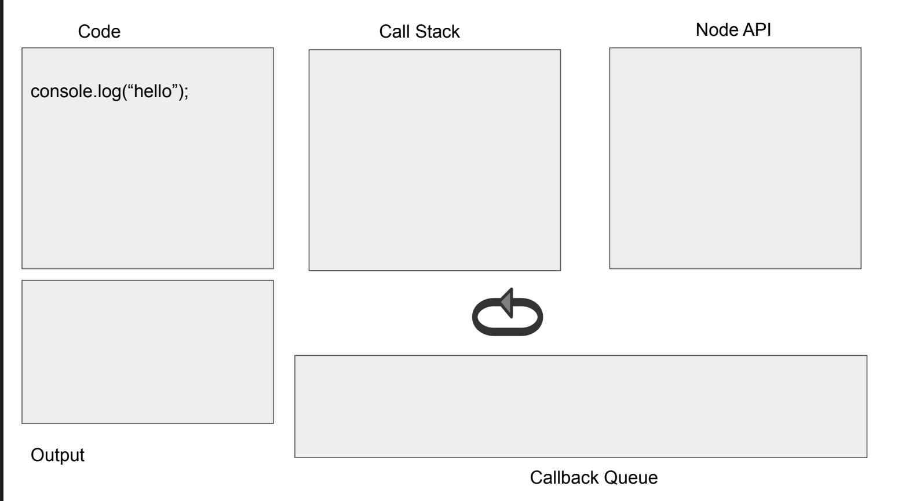

### Nodejs
Node.js是什么？
JavaScript 诞生于 1995 年，几乎是和互联网同时出现；Node.js 诞生于 2009 年，比 JavaScript 晚了 15 年左右。

在 Node.js 之前，JavaScript 只能运行在浏览器中，作为网页脚本使用，为网页添加一些特效，或者和服务器进行通信。有了 Node.js 以后，JavaScript 就可以脱离浏览器，像其它编程语言一样直接在计算机上使用，想干什么就干什么，再也不受浏览器的限制了。

Node.js 不是一门新的编程语言，也不是一个 JavaScript 框架，它是一套 JavaScript 运行环境，用来支持 JavaScript 代码的执行。用编程术语来讲，Node.js 是一个 JavaScript 运行时（Runtime）。

#### Npm是什么
npm（“Node 包管理器”）
NPM 使用介绍
NPM是随同NodeJS一起安装的包管理工具，能解决NodeJS代码部署上的很多问题，常见的使用场景有以下几种：
•	允许用户从NPM服务器下载别人编写的第三方包到本地使用。
•	允许用户从NPM服务器下载并安装别人编写的命令行程序到本地使用。
•	允许用户将自己编写的包或命令行程序上传到NPM服务器供别人使用。
由于新版的nodejs已经集成了npm，所以之前npm也一并安装好了。同样可以通过输入 "npm -v" 来测试是否成功安装。命令如下，出现版本提示表示安装成功:
```shell
$ npm -v
2.3.0
```
https://www.runoob.com/nodejs/nodejs-npm.html


### Executing JS Code
Looking into the V8 engine
* Program
* Call Stack
* Node API
* Callback Queue
* Event Loop

https://zhuanlan.zhihu.com/p/27628685
  
  
V8引擎编译本地代码时使用的主要类如下所示：

Script：表示JavaScript代码，即包含源代码，又包含编译之后生成的本地代码，即是编译入口，又是运行入口；
Compiler：编译器类，辅组Script类来编译生成代码，调用解释器(Parser)来生成AST和全代码生成器，将AST转变为本地代码；
AstNode：抽象语法树节点类，是其他所有节点的基类，包含非常多的子类，后面会针对不同的子类生成不同的本地代码；
AstVisitor：抽象语法树的访问者类，主要用来遍历异构的抽象语法树；
FullCodeGenerator：AstVisitor类的子类，通过遍历AST来为JavaScript生成本地可执行代码。

JavaScript代码编译的过程大致为：Script类调用Compiler类的Compile函数为其生成本地代码。Compile函数先使用Parser类生成AST，再使用FullCodeGenerator类来生成本地代码。本地代码与具体的硬件平台密切相关，FullCodeGenerator使用多个后端来生成与平台相匹配的本地汇编代码。由于FullCodeGenerator通过遍历AST来为每个节点生成相应的汇编代码，缺失了全局视图，节点之间的优化也就无从谈起。

在执行编译之前，V8会构建众多全局对象并加载一些内置的库（如math库），来构建一个运行环境。而且在JavaScript源代码中，并非所有的函数都被编译生成本地代码，而是延迟编译，在调用时才会编译。

由于V8缺少了生成中间代码这一环节，缺少了必要的优化，为了提升性能，V8会在生成本地代码后，使用数据分析器(profiler)采集一些信息，然后根据这些数据将本地代码进行优化，生成更高效的本地代码，这是一个逐步改进的过程。同时，当发现优化后代码的性能还不如未优化的代码，V8将退回原来的代码，也就是优化回滚。下面介绍一下运行阶段，该阶段使用的主要类如下所示：
Script：表示JavaScript代码，即包含源代码，又包含编译之后生成的本地代码，即是编译入口，又是运行入口；
Execution：运行代码的辅组类，包含一些重要函数，如Call函数，它辅组进入和执行Script代码；
JSFunction：需要执行的JavaScript函数表示类；
Runtime：运行这些本地代码的辅组类，主要提供运行时所需的辅组函数，如：属性访问、类型转换、编译、算术、位操作、比较、正则表达式等；
Heap：运行本地代码需要使用的内存堆类；
MarkCompactCollector：垃圾回收机制的主要实现类，用来标记、清除和整理等基本的垃圾回收过程；
SweeperThread：负责垃圾回收的线程。

  


先根据需要编译和生成这些本地代码，也就是使用编译阶段那些类和操作。在V8中，函数是一个基本单位，当某个JavaScript函数被调用时，V8会查找该函数是否已经生成本地代码，如果已经生成，则直接调用该函数。否则，V8引擎会生成属于该函数的本地代码。这就节约了时间，减少了处理那些使用不到的代码的时间。其次，执行编译后的代码为JavaScript构建JS对象，这需要Runtime类来辅组创建对象，并需要从Heap类分配内存。再次，借助Runtime类中的辅组函数来完成一些功能，如属性访问等。最后，将不用的空间进行标记清除和垃圾回收。

https://blog.fundebug.com/2019/07/16/how-does-v8-work/
最近，JavaScript生态系统又多了2个非常硬核的项目。

大神Fabrice Bellard发布了一个新的JS引擎QuickJS，可以将JavaScript源码转换为C语言代码，然后再使用系统编译器(gcc或者clang)生成可执行文件。

Facebook为React Native开发了新的JS引擎Hermes，用于优化安卓端的性能。它可以在构建APP的时候将JavaScript源码编译为Bytecode，从而减少APK大小、减少内存使用，提高APP启动速度。

作为JavaScript程序员，只有极少数人有机会和能力去实现一个JS引擎，但是理解JS引擎还是很有必要的。本文将介绍一下V8引擎的原理，希望可以给大家一些帮助。

#### JavaScript引擎
我们写的JavaScript代码直接交给浏览器或者Node执行时，底层的CPU是不认识的，也没法执行。CPU只认识自己的指令集，指令集对应的是汇编代码。写汇编代码是一件很痛苦的事情，比如，我们要计算N阶乘的话，只需要7行的递归函数：
```js
function factorial(N) {
    if (N === 1) {
        return 1;
    } else {
        return N * factorial(N - 1);
    }
}
```
代码逻辑也非常清晰，与阶乘的数学定义完美吻合，哪怕不会写代码的人也能看懂。
但是，如果使用汇编语言来写N阶乘的话，要300+行代码n-factorial.s：
  

还好，JavaScirpt引擎可以将JS代码编译为不同CPU(Intel, ARM以及MIPS等)对应的汇编代码，这样我们才不要去翻阅每个CPU的指令集手册。当然，JavaScript引擎的工作也不只是编译代码，它还要负责执行代码、分配内存以及垃圾回收。

虽然浏览器非常多，但是主流的JavaScirpt引擎其实很少，毕竟开发一个JavaScript引擎是一件非常复杂的事情。比较出名的JS引擎有这些：
* V8 (Google)
* SpiderMonkey (Mozilla)
* JavaScriptCore (Apple)
* Chakra (Microsoft)
* IOT：duktape、JerryScript
还有，最近发布QuickJS与Hermes也是JS引擎，它们都超越了浏览器范畴，Atwood’s Law再次得到了证明：
`Any application that can be written in JavaScript, will eventually be written in JavaScript.`

##### V8：强大的JavaScript引擎
在为数不多JavaScript引擎中，V8无疑是最流行的，Chrome与Node.js都使用了V8引擎，Chrome的市场占有率高达60%，而Node.js是JS后端编程的事实标准。国内的众多浏览器，其实都是基于Chromium浏览器开发，而Chromium相当于开源版本的Chrome，自然也是基于V8引擎的。神奇的是，就连浏览器界的独树一帜的Microsoft也投靠了Chromium阵营。另外，Electron是基于Node.js与Chromium开发桌面应用，也是基于V8的。

V8引擎是2008年发布的，它的命名灵感来自超级性能车的V8引擎，敢于这样命名确实需要一些实力，它性能确实一直在稳步提高，下面是使用Speedometer benchmark的测试结果：
  
图片来源：https://v8.dev/


V8在工业界已经非常成功了，同时它还获得了学术界的肯定，拿到了ACM SIGPLAN的Programming Languages Software Award：
```
V8’s success is in large part due to the efficient machine code it generates.
Because JavaScript is a highly dynamic object-oriented language, many experts believed that this level of performance could not be achieved.
V8’s performance breakthrough has had a major impact on the adoption of JavaScript, which is nowadays used on the browser, the server, and probably tomorrow on the small devices of the internet-of-things.
```

JavaScript是一门动态类型语言，这会给编译器增加很大难度，因此专家们觉得它的性能很难提高，但是V8居然做到了，生成了非常高效的machine code(其实是汇编代码)，这使得JS可以应用在各个领域，比如Web、APP、桌面端、服务端以及IOT。

严格来讲，V8所生成的代码是汇编代码而非机器代码，但是V8相关的文档、博客以及其他资料都把V8生成的代码称作machine code。汇编代码与机器代码很多是一一对应的，也很容易互相转换，这也是反编译的原理，因此他们把V8生成的代码称为Machine Code也未尝不可，但是并不严谨。

##### V8引擎的内部结构
V8是一个非常复杂的项目，使用cloc统计可知，它竟然有超过100万行C++代码。

V8由许多子模块构成，其中这4个模块是最重要的：

Parser：负责将JavaScript源码转换为Abstract Syntax Tree (AST)
Ignition：interpreter，即解释器，负责将AST转换为Bytecode，解释执行Bytecode；同时收集TurboFan优化编译所需的信息，比如函数参数的类型；
TurboFan：compiler，即编译器，利用Ignitio所收集的类型信息，将Bytecode转换为优化的汇编代码；
Orinoco：garbage collector，垃圾回收模块，负责将程序不再需要的内存空间回收；
其中，Parser，Ignition以及TurboFan可以将JS源码编译为汇编代码，其流程图如下：

  
简单地说，Parser将JS源码转换为AST，然后Ignition将AST转换为Bytecode，最后TurboFan将Bytecode转换为经过优化的Machine Code(实际上是汇编代码)。

* 如果函数没有被调用，则V8不会去编译它。
* 如果函数只被调用1次，则Ignition将其编译Bytecode就直接解释执行了。TurboFan不会进行优化编译，因为它需要Ignition收集函数执行时的类型信息。这就要求函数至少需要执行1次，TurboFan才有可能进行优化编译。
* 如果函数被调用多次，则它有可能会被识别为热点函数，且Ignition收集的类型信息证明可以进行优化编译的话，这时TurboFan则会将Bytecode编译为Optimized Machine Code，以提高代码的执行性能。

Ignition：解释器
TurboFan：编译器
Orinoco：垃圾回收

  
  

### JS HTTP Requests
JS & HTTP Requests
* Why?
	- Performance
	- User Experience

* XMLHttpRequest
	- AJAX
      -  Basic Concept
      -  yes is is all about asynchronous calls

* JS Libraries

#### XMLHttpRequest
* For simplicity the “old” onstatechange pattern will be used
http.onreadystatechange = function() {//Call a function when the state changes.

* The “newer” addEventListener pattern will be presented later
	- Links for event listener
	- https://developer.mozilla.org/en-US/docs/Web/API/XMLHttpRequest/load_event
	- Yes, there is a “newer” way -> fetch
We will discuss this later
```html
<!DOCTYPE html>
<html>
<body>
<p id="demo">Fetch ralph.txt and place it here </p>
<script>
fetch ("ralph.txt") .then(x => x.text()).then(y => document.getElementById("demo").innerHTML = y);
</script> </body> </html>
```
#### Basic Design
1. Creating request object

2. Setting parameters of request object & submitting it

3. Synchronous or asynchronous handling of response

Example -> make aysn. call to node post

Node Code
```js
app.post('/sayHello', (req,res) => {
var name = req.body.name;
var answer = "hello " + name;
res.send(answer);
});

function sayHello()
{
var http = new XMLHttpRequest();
var url = '/sayHello';
var params = 'name=' + document.getElementById("input").value;

http.open('POST', url, true);

http.setRequestHeader('Content-type','application/x-www-form-urlencoded');

http.onreadystatechange = function(){
	if(http.readyState == 4 && http.status == 200){
	document.getElementById("answer").value = http.responseText;
}
};

http.send(params);
};
```
