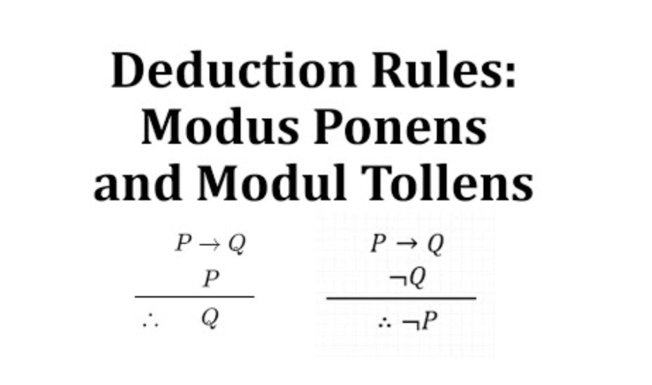
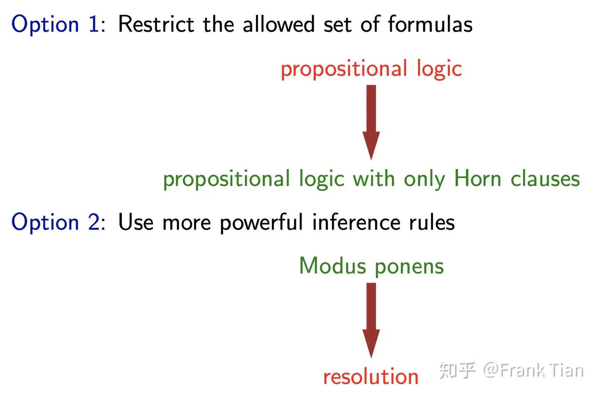

### Logic in AI

#### Formal Languages
The sentences in the KB must be in some formal language
Formal language: Has atomic variables and connectors
Possible Formal Languages:
* Propositional Logic
    - Variables have Boolean values (True or False)
    - Connectors: ∧,∨,¬,⇒,⇔
* Algebra
    - Variables have real-numbered values
    - Connectors: +,−,∗,/,=,>,<

A **possible world** is an assignment of a value to **every** atomic variable mentioned **ANYWHERE** in the **KB**
是不是有点所有的state的感觉？
A **model** is an assignment of values to only the variables in some sentence α
Must pick values such that α is True (according
to the rules of the formal language of α)
We write the set of all models of α as M(α)

The **real world **is ONE of the models of the KB
We don’t know WHICH one.
That’s the whole point


We only care whether α is True in the real world
But how can we know when there are multiple possibilities for the real world?

引用自 https://zhuanlan.zhihu.com/p/203112440
  
AI可以分成learning，model和inference三部分，而model的不同决定了learning和inference是如何进行的。本文中的model是基于**命题逻辑**(Propositional Logic)建立的。

关于逻辑，有三个非常重要的概念，分别是**Syntax**，**Semantics**和**Inference rules**。

Semantics是逻辑真正表达的含义，而Syntax是逻辑形式上表达的含义。

两者看似没有区别，那是因为我们人类具备一套非常强大的Inference rules，我们根据自身的Inference rules推断出来的逻辑（Syntax），往往就是真实的逻辑（Semantics）。

逻辑包含很多种，从抽象程度由低到高，可以分为**命题逻辑**，**一阶逻辑**，**高阶逻辑**。
1. **命题逻辑**只能针对于某一个确定的命题，而不能涉及“对象”的概念。例如“我是个好同学”，就是一个命题逻辑。
2. **一阶逻辑**可以描述对象和关系，例如“南京大学的同学都是好同学”就是一阶逻辑。
3. 而**高阶逻辑**可以把关系看作对象（二阶逻辑把一阶逻辑的关系看作对象，三阶逻辑把二阶逻辑的关系看作对象，以此类推）。

 有点不懂，看起来first-order 和 higher-order是个special的概念。像在functional language中，first-class是function,意思是function可以赋值给一个变量，当作参数传递，当作data-structure的一部分,是不是说function是一个object一样的东西，不是一个relation。 而higher-order 是把function当作参数传递.

 Syntax和Semantics是逻辑背后的两种内容：
  
  

**Syntax**是表面的形式，往往由语句(**formula**)描述，例如 Rain V Wet 表示Rain 和Wet 这两件事至少有一个是真的。

而**Semantics**表示逻辑实际的含义，我们可以用模型(**model**)来描述它。model的概念来自模型论(theory of model)，我们可以把它粗浅的理解为“可能的世界”，例如一个语句包含n个原子命题(atom proposition)，那么有 $2^n$个可能的世界，也就是有 $2^n$个模型。而有一些模型在这个语句中为真，有一些为假，我们用为真的模型描述这个语句，这就是Semantics。

  
  

#### Knowledge-based Agents
* Knowledge-based agents have a knowledge base (KB).
* A collection of sentences that the agent knows are
true in a formal language
* A rule about the "physics" of the world can be a
sentence
  - The KB would likely be **initialized** with these
* A sensory observation can be a sentence
  - New sentences like these are added via the
operation **TELL**

The agent might want to ask whether a sentence can be
**deduced** from what is **already** in the **KB**
  - "Is there a pit in square (1, 3)?"
  - The name for this operation is **ASK**
#### Knowledge base
Knowledge base(KB)是agent知道的事实，在基于命题逻辑的agent中，它是以命题逻辑的方式保持的。

##### Entailment
When α is True in ALL of them
Formal definition:
`Sentence β entails sentence α if, and only if, every model of β is also a model of α. Symbolically:  β |= α ⇐⇒ M(β) ⊆M(α)`
In practice, β is usually our **KB** and α is some question we want to ASK
* Entailment defines the correct answer
* It does not dictate **how** we should compute this answer
这不是包含关系吗？

  
如果一个Knowledge base有n个语句，也可以把他们通过合取形成一个语句。
在agent的学习过程中，它会向KB中不断的加入语句，每插入一个新的语句，都有
  
**KB和f有三种关系**：
1. entainment 是不是包含？？
  
2. controdiction:相反
  
3. contingency 偶然的
  
我们假设agent可以进行两种操作，Tell和Ask，Tell即学习新的知识，将新的语句添加到KB，而Ask是根据KB判断deduce新的语句的真假的。

当Tell(f)时，上面三种关系的表现分别为
  
Tell是从KB里面去掉，验证KB里面的f，如果entailment，就留着，如果是contradiction，就去掉。

当Ask(f)时，上面三种关系的表现分别为
  
到此为止，我们已经基本介绍了一个基于逻辑的agent的运行方式：它不停的被Tell新的知识，根据知识f和KB的关系是否将f加入KB中。在Ask阶段，外界给agent一个新的语句，agent根据KB和语句f的关系判断语句的真假（或是不知道）。

这几乎是所有基于逻辑的agent的运行流程，但是我们仍要深入算法的内部，去看看它是如何做到的。
一个非常重要的工作是：如何判断KB和f的关系。

在这之前，还有一个概念是**Satisfiability**，如果所有模型中至少有一个模型让这个语句为真，这个语句就是Satisfiability的。

  
那么我们可以把KB和f合并，看它是否满足Satisfiability，以此来判断KB和f的关系
  
那么，接下来的问题就是判断一个（一组）语句是否是Satisfiability，我们可以从上面讲到的Syntax和Semantics入手，分别使用**formulas**和**models**判断。

1. Model checking
Model checking的想法非常简单，它试图搜索出一个合适的assignemnt让 KB $\cap$ F为真。

**穷举**把所有的 KB $\cap$ F的原子命题识别出来，假设它有 n个原子命题，那么一共有 $2^n$ 个模型，穷举这些模型来找到一个解。如果所有模型都不能让 KB $\cap$ F为真，说明KB 和f 是contradiction的（我们保证KB自身不会冲突）。

DPLL使用了回溯搜索，并在此基础之上添加了许多启发式的剪枝，以此来减少运算规模。
WalkSat使用了随机的局部搜索。

但是，无论如何，对model的搜索都太浪费时间了，我们可以直接从formula入手，尝试通过**inference rules**推出目标的语句。

2. inference rules
值得注意的是，通过model的穷举可以保证我们的逻辑不会被违背（因为它是Semantics层面的），但是inference rules并不一定能保证我么的结论是可靠的。

这一点不难理解，我们在现实世界中遇到一个人看起来很奇怪，一方面是因为ta的认知（KB）有问题，另一方面是ta的思考方式（inference rules）有问题。比如外面下雨，导致地是湿的，而ta一定要坚持是因为地是湿的导致了下雨，这显然就是错误的。

**我们用两个性质描述一个inference rule是否可靠，那就是Soundness和Completeness。**
##### Inference
* Logical inference answers the question Does β |= α?
* If algorithm i answers yes, we write β ⊢i α
* There are lots of inference algorithms we could try.
* A **correct** inference algorithm i says yes if, and only if, the answer really is yes:β ⊢i α ⇐⇒ β |= α

Breaking down the notion of correctness
* A **correct** inference algorithm i says yes if, and only if, the answer really is yes: β ⊢i α ⇐⇒ β |= α
* Like all statements using if and only if, it’s easier to
address two related questions separately.
  1. An inference algorithm i is **sound** if:
    `β ⊢i α ⇒ β |= α`
  2. An inference algorithm i is **complete** if:
    `β |= α ⇒ β ⊢i α`

##### Soundness
* An inference algorithm i is sound if:
β ⊢i α ⇒ β |= α
* If we say an inference algorithm i is sound, we mean that
* We started with all the queries to which i says yes.
* We checked each one, and the answer for all of
them really was yes.
* It will be relatively easy to show that the inference
algorithms we will study are sound.

##### Completeness
* An inference algorithm i is complete if: β |= α ⇒ β ⊢i α
* If we say an inference algorithm i is complete, we mean
that
  - We started with all the queries that we know the
answer should be yes.
  - We apply inference algorithm i to all of them, and
every one is a yes.
* Completeness is an issue we’ll have to think carefully
about in our study.

Soundness表示**有效性**，即通过inference rule从KB中推理的结果都是正确的。
  
Completeness表示**完备性**，即能通过inference rule将KB中所有是知识推理出来。
  
一种常见的推理方式是假言推理(Modus ponens)，即如果A是真的，且 
A->B为真，那么B也是真的。
* **假言推理(Modus ponens)，即如果A是真的，且A->B为真，那么B也是真**
我们能轻易证明对于任何语句Modus ponens都是Soundness的。
  
但是如果我们自己定义一种推理（可能是某些精神不正常的人所使用的推理方式），它认为
  
那显然这样的推理是不满足Soundness的。
  
那么，Modus ponens是否是Completeness的呢？

很遗憾，并不是，例如
  
我们没办法仅仅通过Modus ponens推断出 f 是真的。（因为我们没有所谓的“短路机制”，在不知道Snow的情况下尚不能判断 Rain V Snow 的真假）

Propositional logic: 

* **Syntax**: Atomic sentences are represented by Capitalized
strings, allowing subscripts.
* E.g. P, Q1, Lost.
  - If a,b are sentences, then so are:
```
¬a (negation)
a ∧ b (conjunction)
a ∨ b (disjunction)
a ⇒ b (implication)
a ⇔ b (biconditional)
 We’ll use brackets to disambiguate.消除歧义
```
Propositional logic: 
* **Semantics**: A model m will indicate the truth value of an atomic
sentence.
* E.g. m = {P = True,Q1 = False}.
* If a, b are sentences, and m is a model, then:
```
¬a is True if a is False in m
a ∧ b is True if both a,b are True in m
a ∨ b is True if one or both a,b are True in m
a ⇒ b is True unless a is True in m, but b is False in m
a ⇔ b is True if a,b are both True or both False in m
```
  

##### Logic for AI
Minimal Acceptable Conceptual Understanding 
* We need models because we don’t know everything. 
* We need inference because we can’t always go and look.  
* The concept of entailment sets the standard for what it means to be sure that a sentence is true in the worlds we care about.
* Inference is only correct if it lives up to the standard of entailment.
* Correctness is decomposed into two properties, namely soundness and completeness. 
* These two concepts make it easier to demonstrate the correctness of an algorithm. Of the two, completeness is the one that we
have to tackle with special care.

我们有，两种方法补救这个遗憾，一种是使用更强大的Inference rule，另一种是将语句限制在Horn clauses。
  
Horn clauses
Horn clauses是一个析取范式，同时它要求每个文字都是原子命题，且**最多有一个正文字**。

例如 
 -a V -b V c 是Horn clauses，
 -a V -b V -c 是Horn clauses，
 而-a V b V c 不是Horn clauses。

Definite clause意味着命题可以写作蕴涵的形式
  
Horn clauses可以转化为Definite clause
  
在Horn clauses的基础之上，我们可以使用Forward chaining 和 backward chaining检查KB和f的关系。

backward chaining就是从KB出发，将所有为真的命题找出来，下面是一个Horn clauses和它对应的图。
  
而backward chaining与之相反，从f出发检查KB能否判断它为真。

### Resolution Inference Rule

#### Resolution

刚才的方法虽然既满足Soundness，也满足Completeness，但是将语句限制在了Horn clauses，这无疑限制了逻辑的表达能力。

我们可以使用更强大的inference rule，例如Resolution，对所有命题逻辑进行inference，同时保持它的Soundness和Completeness。

**resolution**将**两个析取式 disjunction->or**合并为**一个析取式disjunction->or**，它的要求是这两个析取式中包含同一个文字的正好相反的形式
  
resolution的正确性很容易证明，只要把上面的命题拆成 f1Vf2Vf3...fm，和 g1Vg2...Vgm，然后根据真值表分类讨论即可。

可以证明Resolution满足了Soundness和Completeness，在AIMA书中可以找到这个证明。

Resolution要求KB中的每一个命题都是**析取式 disconjunction->or clause**，然后将所有析取式两两归并。但是，我们没办法保证将每一个命题都转化为一个析取式->disconjunction->or clause。但是，我们可以将一个命题转化为一个合析范式(a or b) and (b or c)。
  

CNF是过个析取式的合取，我们可以把KB看作一个大的命题（用合取将每一个命题连起来），在将其转化为CNF，这样就可以使用Resolution了。

同时，我们可以**将任何语句转化为一个CNF**，例如
  
可以证明，我们只需要下面6个rules，就可以将所有命题转化为CNF
  
遗憾的是，Resolution的时间复杂度是指数的，而Modus ponens的时间复杂度是线性的，这意味着尽管Resolution的表达能力强得多，我们仍在某些情况下需要**Modus ponens**。
##### **Modus ponens**:
Suppose we have KB = (A ∨B) ∧(¬B ∨C).
* We can easily show that KB |= (A ∨C).
* We can turn this into a rule called **resolution**. For all sentences α,β,γ
  
* The rule says: if both sentences above the line are in the KB, then the sentence below the line is entailed.

Resolution Inference Algorithm
* Suppose we have KB containing many sentences.
* Algorithm:
  1. Choose two sentences `α∨β` and `¬β ∨ γ` from the KB.
  2. Add `α ∨ γ` to the KB.
*  Repeat as needed.

resolution 是处理(or clause) and (or clause)，用modus ponens
**CNF就是模式(or clause) and (or clause)**

Conjunctive Normal Form (a ∧ b)
* A normal form defines a standard way of expressing
logical syntax.
* We need the following definitions:
  1. A literal is an atomic sentence, or a negation of an atomic sentence.
  2. A clause is a disjunction(a V b) of literals.
  3. A sentence is in conjunctive normal form (CNF) if it is expressed as a conjunction of clauses.

* Theorem: Any sentence written using the standard propositional connectives can be converted to CNF using a compiler.

##### A KB in CNF
This sentence is in CNF:
(A ∨B) ∧(¬B ∨C ∨D) ∧F
* A **KB** is conceptually just one giant sentence.
* We often write each clause on its own line, with the ’ands’
between each line being implicit.
1. A ∨B
2. ¬B ∨C ∨D
3. F

Converting to CNF
1. Eliminate ⇔, replacing α ⇔β with (α ⇒β) ∧(β ⇒α)
2. Eliminate ⇒, replacing α ⇒β with (¬α ∨β)
3. Move negation inwards, by repeatedly applying:
    * ¬(¬α) ≡α
    * ¬(α ∨β) ≡(¬α ∧¬β)
    * ¬(α ∧β) ≡(¬α ∨¬β)
Until only literals are negated.
4. Distribute ∨ over ∧ by repeatedly applying:
    * α ∨(β ∧γ) ≡(α ∨β) ∧(α ∨γ)

##### Using Refutation with Resolution
* **Refutation**: For any sentences α and β, α |= β if and only if (α ∧¬β) is unsatisfiable.
* **Ground Resolution Theorem**: If a set of CNF clauses is unsatisfiable, then repeated application of the resolution rule will contain the empty clause.
* An empty clause is unsatisfiable!

Resolution Theorem Proving Algorithm
```
Add -a to the KB
Convert -a to CNF if needed
while there are clause pairs that have not been Resolved:
  choose two clauses from the KB
  (that have not yet been resolved)
  Resolve them to get a result
  if the result is the empty clause:
    return yes
else:
 add the result to the KB
return no
 ```

 ##### Inference as SearchMinimal Acceptable Conceptual Understanding
* Using logic means we can create Knowledge Bases that
represent knowledge in a standard and well-understood
language
* A valid sentence is True in all worlds; a satisfiable
sentence is True in at least one world
* The Refutation theorem implies an inference algorithm
* Inference algorithms are based on search
* Any sentence can be converted to CNF; CNF is needed
to apply Resolution
* The Resolution Inference algorithm repeatedly applies
Resolution until it generates the empty clause

**Keywords**
* reasoning 推理
* Deductive reasoning(for a basic logic) 演绎推理
* analogy 类比；比喻 /əˈnælədʒi/ 
* definition of terminology  /ˌtɜːmɪˈnɒlədʒi/术语的定义
* proposition/ˌprɒpəˈzɪʃn/命题
* distinction/dɪˈstɪŋkʃn/n. 区别；差别
* arithmetic /əˈrɪθmətɪk/ 算术，算法
* anthropomorphize/,ænθrəpəʊ'mɔːfaɪz/vt. 赋与人性，人格化
* knowledge base(KB) 知识库
* connectionism /kə'nekʃənizəm/ 联结主义
* retrieval /rɪˈtriːvl/n. 检索；恢复；取回；拯救
* inference: 推理
* entailment：蕴含
* syntax:  /ˈsɪntæks/n. 语法；句法；
* semantic: /sɪˈmæntɪk/adj. 语义的；语义学的
* falsity: /ˈfɔːlsəti/n. 虚伪；错误；谎言；不真实
* notation /nəʊˈteɪʃn/n. 符号
* terminology：/ˌtɜːmɪˈnɒlədʒi/n. 术语，术语学；用辞
* theorem/ˈθɪərəm/n. [数] 定理；原理
* axiom: /ˈæksiəm/n. [数] 公理
* iff: 当且仅当
* K |= a是语义蕴含，K |- b是形式推演

What is a logic?#
A logic consists of:
A formal system for expressing knowledge about a domain consisting of
Syntax: Sentences(well formed formulae)
Semantics: Meaning
A proof theory: rules of inference for deducing sentences from a knowledge base
 
Provability#
λ ⊢ ρ: we can construct a proof for ρ from λ using axioms and rules  of inference
If λ is empty (i.e., 0⊢ρ) and ρ is a single formula, then we say that ρ is a theorem of the logic
 
Entailment#
λ |= ρ: whenever the formula(s) λ are true, one of the formula(s) in ρ is true
In the case where ρ is a single formula, we can determine whether  λ |= ρ by constructing a truth table for λ and ρ. If, in any row of the  truth table where all the formulae in λ are true, ρ is also true, then  λ |= ρ.
If λ is empty, we say that ρ is a tautology
 
Soundness and Completeness
* λ |= a是语义蕴含， λ |- b是形式推演
  - An inference procedure (and hence a logic) is sound if and only if it  preserves truth
* In other words ⊢ is sound iff whenever λ ⊢ ρ, then λ |= ρ
Soundness 是说右侧推演的知识都是被λ蕴含的（推出来的知识都是正确的）
* A logic is complete if and only if it is capable of proving all truths
In other words, whenever λ |= ρ, then λ ⊢ ρ
* Completeness 是说，左侧蕴含出来的知识都可以推演出来
  - A logic is decidable if and only if we can write a mechanical procedure (computer program) which when asked λ ⊢ ρ it can eventually halt and answer “yes” or answer “no”