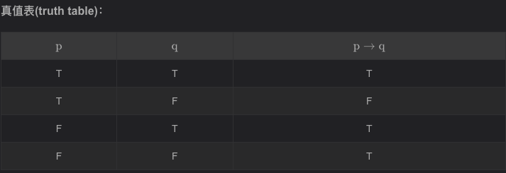
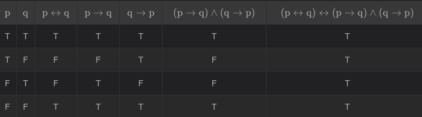
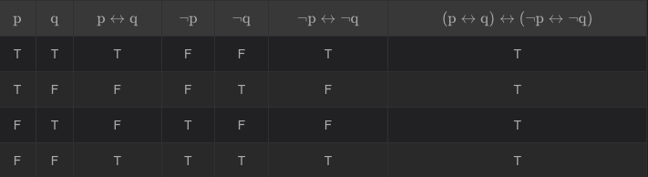
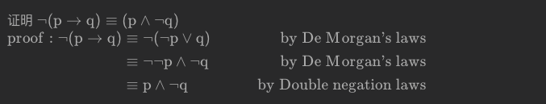

## 数学基础：逻辑 (Mathematical foundations: logic)
https://blog.csdn.net/weixin_44225602/article/details/121173926

第一章 - 算法基础与算法分析 fundamentals of algorithms and algorithm analysis
1.1 数学基础：逻辑 (Mathematical foundations: logic)
1.1.1 命题逻辑 - Propositional logic
(1)、命题(Propositions)
(2)、命题记法(Notation)
(3)、逻辑运算符(Logic Operator)
(3.1)、否定(Negation) - 逻辑 非
(3.2)、连接、合取 (Conjunction) - 逻辑 与
(3.3)、析取(Disjunction) - 逻辑 或
(3.4)、推导(Implication) - 逻辑 条件
(3.5)、逆反(Converse and contrapositive) - 逻辑 双条件(Biconditional statement)
(4)、复合命题(Compound propositions)
(5)、逻辑运算符的优先级(Precedence of logical operators)
(6)、命题公式与真值赋值(Propositional formulas and truth assignments)
(7)、重言式与矛盾式(Tautology and contradiction)
(8)、逻辑等价(Logical equivalence)
(8.1)、命题逻辑的基本等价定理(Fundamental equivalences of propositional logic theorem)
(8.2)、使用条件语句的等价性定理( Equivalences using conditional statements theorem)
(8.3)、使用双条件语句的等价性定理( Equivalences using biconditional statements theorem)
1.1.2、谓词逻辑 - Predicate logic
(1)、命题逻辑的限制(Limitations of propositional logic)
(2)、谓词和命题函数(Predicates and propositional functions)
(2.1)、单个变量
(2.2)、多个变量
(2.3)、n维谓词(n-ary predicates)
(3)、全称量词(Predicates and propositional functions)
(3.1)、'所有'一词的其他表达方式(Other ways of expressing `for all` in English)
(3.2)、反例(counter examples)
(4)、存在量词(Predicates and propositional functions)
(4.1)、'存在'一词的其他表达方式(Other ways of expressing `there exists` in English)
(4.2)、量词优先级(Precedence of quantifiers)
(5)、否定量化表达式(Negating quantified expressions)
(5.1)、全称量词的否定(Negating a universal quantification)：
(5.2)、存在量词的否定(Negating an existential quantification)：
(5.3)、量词的德摩根定律(De Morgan`s Laws for quantifiers)
(6)、用谓词逻辑建模英语句子 (Modelling English sentences with predicate logic)
(7)、嵌套量词(Nested Quantifiers)
(7.1)、量词的顺序

#### 1.1 数学基础：逻辑 (Mathematical foundations: logic)
`逻辑`一词来自希腊语(Greek)：`logos`，等同于英语中的 logic(逻辑)、reason(推理)。它是计算机科学、数学、哲学、语言学和修辞学等的子学科。

`逻辑`在计算机科学中有很多应用：

知识和学习的表示 (Representation of knowledge and learning)
作为编程语言的一部分，例如：在IF语句中表达条件
用于验证，例如：
电路。证明电路或芯片正确工作
程序。证明程序具有某些理想特性
协议。证明遵循特定`协议`的两个`代理`之间的通信是安全的，例如，第三方窃听或操纵都是不可能的
用于自动定理证明
作为数据库查询语言的基础
计算机是`物化逻辑` (materialised logic)

1.1.1、命题逻辑 - Propositional logic
##### 命题(Propositions)
命题是一个陈述句(declarative sentence)，即一个陈述事实的句子。
命题是真或假的，不能两者兼而有之。
举例：

|序号	|待判断的句子|
| ------------- |:-------------:|
|1|	London is the capital of the UK.|
|2|	Toronto is the capital of the Canada.|
|3|	1 + 1 = 2|
|4|	2 + 2 = 3|
|5|	Are you study Algorithms?|
|6|	Read this carefully.|
|7|	x + 1 = 2|
|8|	x + y = z|

  

##### 命题记法(Notation)
陈述句作为人的自然语言，比较冗长，通过根据需求提取关键部分为命题变量(propositional variables)，去简化句子。

一般使用字母去表达命题变量，比较常规的有：p、q 、 r 、 s 、 p 1 、 p 2 …

`Today is Monday, so I'm very happy.`

然而，更常规的情况会根据句子关键部分去命名变量，如上句子：Today 或者表示成 T 、Monday 或者表示成 M 、Happy 或者表示成 H。

变量如何命名没有任何要求，如大小写，拼写正确等等都不影响，以方便理解、直观为准。但是，有些记法已经成为了通识，不会去改变，比如：一个命题如果为真，则用 T表示；如果为假则用 F 表示。

##### 逻辑运算符(Logic Operator)
对于命题逻辑，基本的操作符有5种：“非”（¬）、“与”（∧）、“或”（∨）、“条件”（→）以及“双条件”（↔）。

“非”是一个一元操作符，它只操作一项（¬ P）。

剩下的是二元操作符，操作两项来组成复杂语句（P ∧ Q, P ∨ Q, P → Q, P ↔ Q）。

(3.1)、否定(Negation) - 逻辑 非
自然语言中有表达否定的概念，比如:我今天不高兴，I`m not happy today，这种否定的表达就相当于逻辑运算符中的“非”(not)，符号表示为：¬ .

假设 p是一个命题，那么该命题的否定是：¬p，语言描述为：It is not the case that p

如何表达Today is Friday的否定？
It is not the case that today is Friday

因为对于同一个意思，语言表达方式的多种多样，所以也可以简单的表达为：
Today is not Friday
It is not Friday today

真值表(truth table)：

|p	|¬p|
| ------------- |:-------------:|
|T|	F|
|F|T|

(3.2)、连接、合取 (Conjunction) - 逻辑 与
有时候，我们会将两个可能相关的语句组合在一起，
假设 p  和 q 是两个命题，将p 和 q进行连接表示为句子 p and q 同样也是一个命题，符号表示可以写成 p∨q 。

  

自然语言与逻辑的差异：
再一次句子的连接中，有时为了正确表达含义，我们习惯使用`但是`(but)而不是`与`(and)，比如：
`The sun is shining, but it is raining.`

在自然语言中(natural language)，两者之间存在着微妙的差异，但一般不会去关注这种细微差别，而是简化为数学逻辑本身，将“与”(and)代替“但是”(but)进行表达。

举例：
问题一：
寻找命题 p 与 q的连接，其中:
p是命题Today is Friday.
q 是命题 It is raining today.
句子表示为：
Today is Friday and it is raining today
逻辑表示为:p∧q

问题二：
该连接，什么时候是正确的，什么时候是错误的？
当同时满足今天是周五并且下雨时，该命题正确；当今天不是周五而是其他任意一天，或者今天是周五但不下雨时，该命题错误。

##### 析取(Disjunction) - 逻辑 或
p pp 与 q qq 是两个命题，实现 p pp 与 q qq的析取操作，可以表示为句子：p pp or q qq，符号表示为：p ∨ q p \vee qp∨q.

真值表(truth table)：

  

举例：
问题一：
寻找命题 p与 q 的析取，其中:
p是命题Today is Friday.
q 是命题 It is raining today.
句子表示为：
Today is Friday or it is raining today
逻辑表示为:p∨q

注意：
在析取中使用连接词“或”(or)对应于自然语言中的包含或，而不是排他或（即“要么……要么……但不是两者兼而有之”）

##### 推导(Implication) - 逻辑 条件
p 与 q 是两个命题，实现 p 推导 q的操作，可以表示为句子：if p then q,符号表示为：p∨q.
如果命题 p为true，而操作 p→q 为false，则 q 为false；若操作p→q 为true，则 q 为true。

在这个推导中， p 被称作 前提(hypothesis)，而 q被称作 结论 (conclusion)。

p→q 也被称作条件语句(conditional statement)，因为q的结果取决于条件p的成立与否。

真值表(truth table)：
  
注意真值表第三行！

举例：
Politician: `If I am elected, then I will lower taxes`.
政治家说：如果我当选，我会降低税收。

如果政治家当选，选民会希望他降低税收。(p=T,q=T)
如果这位政客没有当选，选民们就什么都不期望，尽管这位政客可能有足够的影响力来降低税收。(p=F,q=T or q = F)
只有当这位政治家当选但不降低税收时，选民才能说选举承诺被打破了。(p=T, q=F)
延展：
因为条件语句在数学推理中有很重要的作用，有很多属于用来表达p→q。
  

only if 用来强调，或表示“唯一条件”，也就是“前提”，可以翻译为“前提是”、“只有”、“除非”。

I`ll tell you, but only if you don`t tell anyone else.
我会告诉你，但前提是你不告诉别人

举例：
如果p是命题：Maria learns discrete mathematics.
q是命题：Maria will find a good job.
如何英文表达p→q？

解答：
If Maria studies Algorithms then she will find a good job.
For Maria to get a good job, it is sufficient for her to study Algorithms.

自然语言与逻辑的差异：
注意：用英语中的条件语句时，通常需要假设前提和结论之间存在关系。

例如：
一般情况下：
`If it is sunny today, then we will go to the beach`.
晴天去海滩，前提和假设有很明显的关系。

`If today is Friday, then 2 + 3 = 5`.
人的理解来说，该前提和假设没关系，但是符合条件语句的定义，需要假设存在关系。

编程中的if语句：
在编程语言中，存在语句：if p then s
其中， p是一个命题、判断条件，s是一个执行程序段。

该编程语句的执行与逻辑语句的执行不同，在编程语言中，当 p 为true时，能推导执行 s，但是当 p为false时， s并不执行。

##### 逆反(Converse and contrapositive) - 逻辑 双条件(Biconditional statement)
存在命题 p→q，那么:q→p 是命题p→q 的逆
¬q→¬p 是命题 p→q 的反

举例：
求下列句子的逆(Converse)和反(contrapositive)：
The home team wins whenever it is raining.

逆：
It is raining whenever the home team wins.

反：
Whenever the home team does not win, then it is not raining.

双条件(Biconditional statement):
p 和 q是两个命题。双条件语句可表示为：p ↔ q，该语句的命题为：p成立，当且仅当 q成立(p if and only if q)。

双条件语句，当 p和 q有相同真值(真实值，truth value)时为true，其他情况都为false。

双条件语句同时又叫做：双推导(bi-implications)。

真值表(truth table)：
  
注意：
当 p→q 和q→p 为true时，语句p↔q 才为true，否则为false，这就是为什么我们使用语句“当且仅当”(if and only if) 去表达这个逻辑连接。

其他方法表达 p↔q：
p是 q的充分必要条件(`pis necessary and sufficient for q`)
如果p pp成立，则q qq成立，反之亦然 (`if p pp then q qq, and conversely)
"if and only if"的简写版(`p iff q` )
p⇔q (自然语言"if and only if"的通用数学表示法)
举例：
p是命题`You can take the flight`
q是命题`you buy a ticket`
用英语表达p↔q:
解答：`You can take the flight if and only if you buy a ticket`

##### 复合命题(Compound propositions)
很多陈述句由多个命题组合而成(多个子陈述句组成)，且这些命题之间使用连接词连接(connectives，或者，专业术语叫：逻辑运算符 logical operators)，如：非 (not)、与 (and)、或 (or)、条件(if … then …)、双条件(if and only if …) 。

Today is Sunday and I′m so happy.

Today is Sunday. 与I′m so happy. 是两个句子，他们通过连接词而关联到一起。

举例：
构建命题(p∨¬q)→(p∧q)的真值表.

真值表(truth table)：
  

##### 逻辑运算符的优先级(Precedence of logical operators)
当构建复合函数时，我们一般使用括号去指定逻辑运算符执行的顺序。

例如：(p∨q)∧(¬q) 是 (p∨q)和(¬q)的合取。

为了避免过多的括号(bracket)，我们指定一个逻辑运算符优先级：
  

因为某些逻辑运算符优先级相等，某些时候，我们也必须要使用括号。例如：对于 p∧q∨r 或者 p↔q→r 都不是语法正确的表达式。因为我们不知道以什么顺序去执行该逻辑运算符。

##### 命题公式与真值赋值(Propositional formulas and truth assignments)
一个命题公式(propositional formula)是一个命题或者复合命题。

一个命题公式的真值赋值(truth assignment)是将真值分配给每一个出现在公式中的命题

真值表上的每一行对应一个真值赋值

##### 重言式与矛盾式(Tautology and contradiction)
一个公式在任何真值分配下为真，就叫做重言式(Tautology)或永真式。

一个公式在任何真值分配下为假，就叫做矛盾式(Contradiction)或永假式。

例如：
p∨¬p是一个永真式，p∧¬p 是一个永假式, 而 p → q 两者都不是。

##### 逻辑等价(Logical equivalence)
问题：p↔q 与 (p→q)∧(q→p)是否相等？
要进行证明，我们的目标是理解何谓“相等”。

在数学论证中使用的一条重要步骤是用有相同真值的另一条语句替换一条语句。

在所有可能的真值赋值下具有相同真值的公式称为逻辑等价公式。我们对这一概念的定义如下：

公式 p和 q被称为逻辑等价, 当p↔q 是一个重言式时。
符号 p≡q 表示 p和 q逻辑相等。

符号 ≡ 不是一个逻辑连接符，并且 p≡q 不是复合命题。相反，它是“p↔q 是一个重言式”这句话的一个简短表达。

符号 ≡ 有时可以用 ⇔ 来代表逻辑等价。

逻辑等价的例子：
  

##### 命题逻辑的基本等价定理(Fundamental equivalences of propositional logic theorem)
  

##### 使用条件语句的等价性定理( Equivalences using conditional statements theorem)
  

##### 使用双条件语句的等价性定理( Equivalences using biconditional statements theorem)
  

注意：前三个等式的使用需要证明。

一般使用真值表进行证明：

1:
  <!--  -->
2:
  <!-- ¸ -->
3:
  

例子1：摩尔根定律的使用：
德摩根定律告诉我们，如何否定合取和析取。

下面的例子用摩根定律来表达：
`Miguel has a mobile phone and he has a laptop`.
解决：
p: ` Miguel has a mobile phone`
q: `Miguel has a laptop.`

句子能够表示为： p∧q
因此否定可表示为：¬(p∧q)
通过摩尔根定律，它同样等于：¬p∨¬q.
所以，我们能表示原有句子的否定形式为：
`Miguel does not have a mobile phone or he does not have a laptop`.

例子2：逻辑等式的构建

证明 ¬(p→q) 和 p∧¬q 为逻辑等价的。
  ​

### 谓词逻辑 - Predicate logic
(1)、命题逻辑的限制(Limitations of propositional logic)
命题逻辑可以用来建模：
`PC42 is offline or not responding.`

对下列句子进行建模：
`Every computer connected to the university network is functioning properly,`

从而推导出
`If PC007 is connected to the university network, then it is functioning properly.`

命题逻辑不太合适，对于computer，难以表示实例PC42和PC007等等。

(2)、谓词和命题函数(Predicates and propositional functions)
首先看一个句子：`x is greater than 3`
该句子一般分成两个部分：
变量 `x`，是句子的主语(subject)
谓词(predicate ) `is greater than 3`
我们将句子`x is greater than 3`表示成P(x)，这里 P 表示谓词`is greater than 3`，并且`x`表示变量。

句子P(x)也可以说是命题函数P在x处的值。一旦一个值被分配给变量x，这个句子P(x)就变成了一个命题并且有一个真值。

###### 单个变量
让P(x)表示句子x> 3。对于P(4)和P(2)的真值是什么？
当x=4，得到4>3，因此P(4) 为true
当x=2，得到2>3，因此P(2) 为false

##### 多个变量
我们同样可以处理含有多个变量的句子，例如：
x = y + 3
我们可以表示成Q(x, y)，这里x, y是变量，Q是谓词。当值被分配给x和y，句子Q(x, y)就有一个真值。
问：对于命题Q(1, 2)和Q(3, 0)的真值是什么？
设置句子Q(x, y)中的x=1，y=2
因此Q(1, 2)表示句子 1 = 2 + 3，为false
设置句子Q(x, y)中的x=3，y=0
因此Q(3, 0)表示句子 3 = 0 + 3，为true

To obtain Q(1, 2), set x = 1 and y = 2 in the statement Q(x, y).
Hence, Q(1, 2) is the statement 1 = 2 + 3, which is false.

##### n维谓词(n-ary predicates) 
一般情况下，一个句子涉及n个变量x1, x2, …, xn，可以表示为P(x1, x2, … ,xn)，该形式的句子是命题函数P在n维元组(x1, x2, . . . , xn)时的值，并且P也同时叫做一个n维谓词。

##### 全称量词(Predicates and propositional functions)
对于句子P(x)的全称量词是：

P(x)对于所有x在x定义域内的值
`P(x) for all values of x in the domain of x.`

P(x)全称量词的符号是∀x P(x)
符号∀叫做全称量词
我们将∀x P(x)读作`for all x P(x)` 或者`for every x P(x)`
x的定义域是一个集合。我们必须指定x的定义域
使P(x)为false的某个元素被称作∀x P(x)的反例
举例：
让P(x)表示x + 1 > x，对于定义域内的所有实数，求得∀x P(x)的真值。

因为P(x)为真对于所有实数x，所以∀x P(x)为true。

注意：
如果定义域为空，然后∀x P(x)为true对于每一个命题函数P(x)，因为定义域中没有元素x使得P(x)为false。

##### '所有`一词的其他表达方式(Other ways of expressing `for all` in English)
`for every`
`all of`
`all`
`for each`
`for any`
`for arbitrary`
注意：
最好避免使用`for any`，因为`any`到底是指`every`还是`some`会引起歧义(ambiguous )。

在一些例子中，'any`是不歧义的，例如当它被用于否定句时，比如：`there is not any reason to avoid studying`(没有任何理由不学习)。

##### 反例(counter examples)
什么时候 ∀x P(x) 为false？
一个∀x P(x)为false的句子在一个给定的定义域内，当且仅当在该定义域中，至少有一个元素x使得P(x)为false，即证明∀x P(x)在给定的定义域上不成立的一种方法是找到一个∀x P(x)的反例。
注意：我们只需要一个反例就能证明∀x P(x)为false。
举例1：

让 Q(X)表示句子 x < 2。试问，在由所有实数组成的定义域内，∀x P(x)的真值是什么？

对于所有实数，Q(x)不为true，因为，例如Q(3)是false
也就是说，x=3是∀x P(x)的一个反例
因此∀x P(x)为false

举例2：
在由所有实数组成的定义域内，∀x(x^2 >x)的真值是什么？
如果定义域由所有整数组成，那么真值是什么？

当x = 1/2时，我们有x=1/4<1/2，因此该x是一个反例(counter example)，于是∀x(x ^2>x)为false
为true，因为整数不存在0-1之间的区间

##### 存在量词(Predicates and propositional functions)
对于句子P(x)，它的存在量词为：

存在一个元素x在定义域内使得P(x)成立
`There exists an element x in the domain such that P(x).`

记法 ∃P(x) 表示P(x)的存在量词
符号 ∃叫做存在量词
∃P(x)一般叫做`there exists an x P(x)`
或者`there is an x P(x)`

注意：
当语句∃P(x)使用时，定义域必须被指明
当定义域改变时，∃P(x)的含义也改变
不指明定义域时，语句∃P(x)没有意义

(4.1)、'存在`一词的其他表达方式(Other ways of expressing `there exists` in English)
`for some`
`for at least one`
`there is`
存在量词∃P(x)能够被描述为：

`There is an x such that P(x)`.
`There is at least one x such that P(x)`, or
`For some x P(x)`.
举例：

1. 让 P(x)表示句子`x>3`。当定义域由所有实属组成时，量词∃P(x)的真值是什么？

因为在定义域中，某些元素使`x>3`是true，例如：对于x = 4，存在量词∃P(x)为true

2. 让 Q(x)表示句子`x = x + 1`。当定义域由所有实属组成时，量词∃P(x)的真值是什么？

因为对于每一个真值x，Q(x)都为false，那么Q(x)的存在量词∃Q(x)就为false。

注意：
如果定义域使空集，则∃P(x)总是为false，因为在定义域内，没有元素使P(x)为true。

总结：
  

##### 量词优先级(Precedence of quantifiers)
量词∀ 和 ∃ 的优先级高于命题逻辑中的所有逻辑运算符。

例如：
∀xP(x)∨Q(x) 是 ∀xP(x) 和 Q(x) 的析取。

也就是说，该式子代表∀xP(x) ∨ Q(x)，而不是 ∀xP(x) ∨ Q(x)

(5)、否定量化表达式(Negating quantified expressions)

(5.1)、全称量词的否定(Negating a universal quantification)：
对于描述：
你班上的所有学生都上过微积分。
`Every student in your class has taken a course in calculus`
是一个全称量词，可以记为∀xP(x)，这里P(x) 可以表示为：`x has taken a course in calculus`，定义域由班上所有学生组成。

它的否定形式如何表达？
你班上不是所有学生都上过微积分。
`It is not the case that every student in your class has taken a course in calculus`.

还可以如何表达？
在你班上有一位学生没有上过微积分。
`There is a student in your class who has not taken a course in calculus`,

符号表示为：
¬∀x P(x) ≡ ∃x ¬P(x).

##### 存在量词的否定(Negating an existential quantification)：
对于句子：
你班上有一个学生上过微积分。
`There is a student in your class who has taken a course in calculus.`
是一个存在量词，可以记为：∃xQ(x)。

这里Q(x)表示句子`x has taken a course in calculus`，定义域同样由班上所有学生组成。

它的否定形式如何表达？
你班上不存在一个学生上过微积分。
`It is not the case that there exists a student in your class who has taken a course in calculus.`

还可以如何表达？
你班上所有学生都没参加过微积分。
`Every student in your class has not taken a course in calculus`。

符号表示为：
¬∃x P(x).= ∀x ¬Q(x).

##### 量词的德摩根定律(De Morgan`s Laws for quantifiers)
  

举例1：
寻找下列句子的否定形式：
`There is an honest politician.`

让 H(x)表示`x is honest.`
对于上面句子`there is an honest politicion` 通过∃ x H(x)建模，并且定义域由所有政治家组成。
该句子的否定形式为¬∃x H(x)，或者写成∀x ¬ \neg¬H(x)
否定可以表达成：`every politician is dishonest.`

注意：注:在英语中，`All politicians are not honest` 这句话是模棱两可的。在通常情况下，这句话的意思是`Not all politicians are honest.`因此，我们不用这句话来表示否定。

举例2：
寻找下列句子的否定形式：
∀x(x^2 > x)对于句子 ∀x(x^2 >x) 的否定形式是：¬∀x(x^2 > x) ，同时也可以写成∃x¬(x^2 > x) ，还可以继续重写成：∃x(x^2≤x)

##### 用谓词逻辑建模英语句子 (Modelling English sentences with predicate logic)
该技能在数学、逻辑编程、人工智能、软件工程、验证等方面起关键作用。

举例：
对下列语句进行建模：
`Every student in this class has studied calculus`.

首先，我们重写句子，以至于我们能清楚的辨别合适的量词去使用。通过这样做，我们得到：
`For every student in this class, that student has studied calculus.`
然后我们引入一个变量 x 以至于我们的句子变成：
`For every student x xx in this class, x xx has studied calculus.`
继续，我们引入 C(x)，它表示 `x has studied calculus`.
因此，如果定义域x由教室的学生组成，我们能够转换句子为:∀xC(x)

可以使用不同的语篇域和其他谓词。我们的方法选择取决于我们想要执行的后续推理。例如,我们可能对更广泛的人群感兴趣，而不仅仅是你班上的人。如果我们将域名改为包含所有人，我们需要表达我们的声明为：
`For every person x, if person x is a student in this class then x has studied calculus.`
如果 S(x) 代表句子`person x is in this class`，我们的句子能够表达成：∀x(S(x)→C(x))

注意：
我们的句子不能表达成∀x(S(x)∧C(x)) 因为该句子说明：all people are students in this class and have studied calculus(所有人都是教室里的学生并且学过微积分)。

当我们对微积分以外的人的背景感兴趣时，对于句子`student x has studied subject y`，我们可能偏向于使用双变量量词Q(x,y)。

然后我们可以用 $Q(x, calculus) $来代替C(x)，于是我们可以获得：
∀xQ(x,calculus)或者：∀x(S(x)→Q(x,calculus))

##### 嵌套量词(Nested Quantifiers)
到目前为止，我们避免了有嵌套量词的句子，即一个量词在在另一个量词的范围内。例如：∀x∃y(x+y=0)

注意：
量词范围内的任何东西都可以被认为是命题函数。例如，上式同样可以表示成：∀xQ(x), where Q(x) is ∃yP(x,y), whereP(x,y) is x+y=0
上式表达层层嵌套。
对于每个被量化的变量，我们需要指定定义域。不同的变量可以有不同的域。

举例：
假设变量x和y的定义域由所有实数组成。对于句子：∀x∀y(x+y=y+x)
x+y=y+x 对于所有实数x和y，这是实数相加的交换律。

∀x∃y(x+y=0)对于这个式子，说明每一个实数都有一个可加的逆(additive inverse)

##### 量词的顺序
举例1：
设P(x, y)为x + y = y + x。
量词∀x∀yP(x,y)和∀y∀xP(x,y)的真值是什么，其中所有变量的定义域由所有实数组成?
注意两个公式在量词上顺序的差异。
两个公式的真值都为true。事实上，两个连续的全称量词的顺序并不重要。

举例2：
设 Q(x, y) 为x+y=0
量词∀x∃yQ(x,y) 和 ∃y∀xQ(x,y) 的真值是什么，其中所有变量的定义域由所有实数组成?

∀x∃yQ(x,y) 的真值为 `true`.
∃y∀xQ(x,y) 的真值为 `false`.

注意：
当量词不同时，出现的顺序很重要。注意与上面相同量词出现顺序的区别。