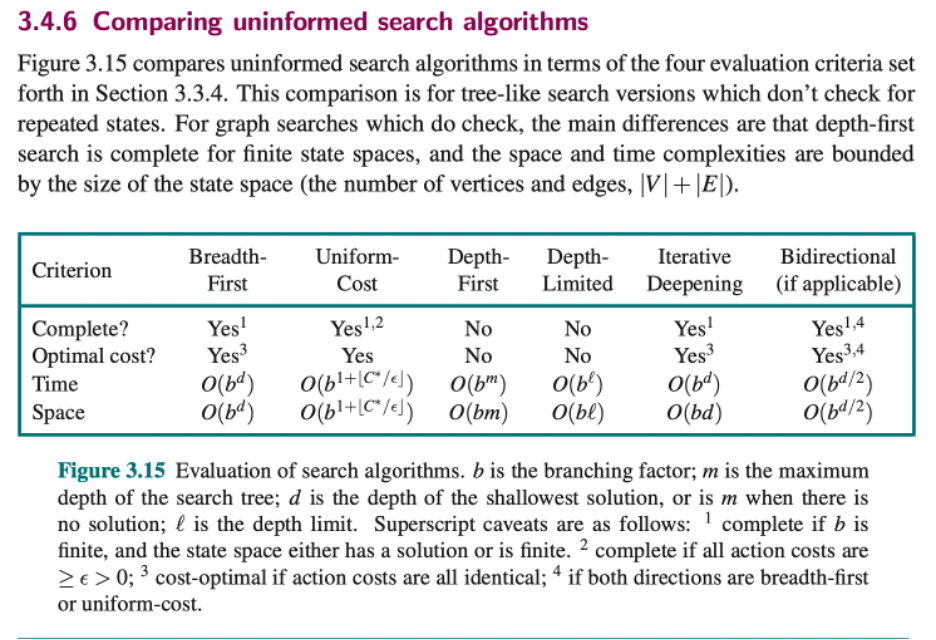
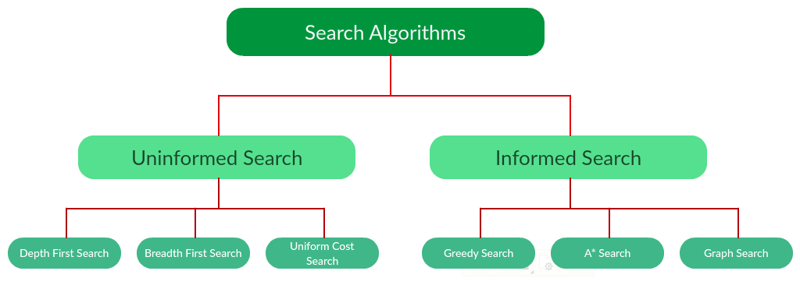
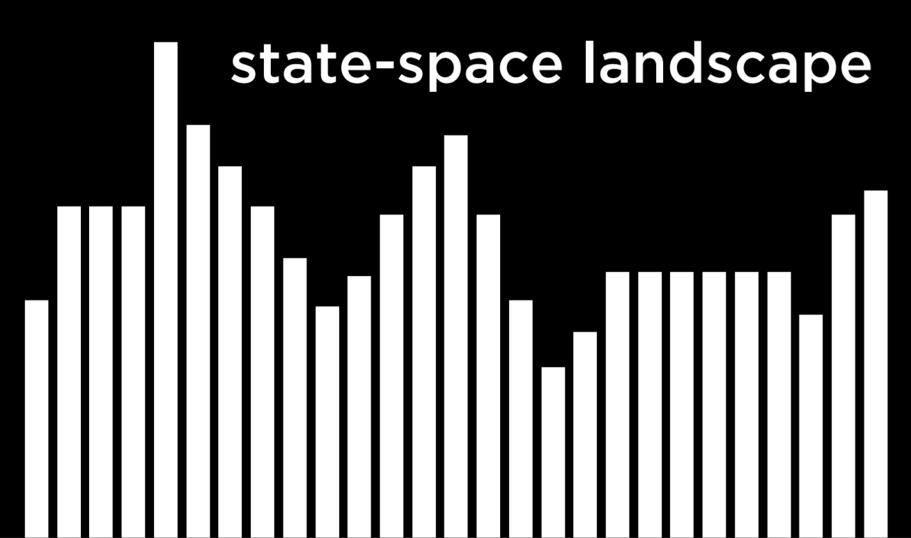
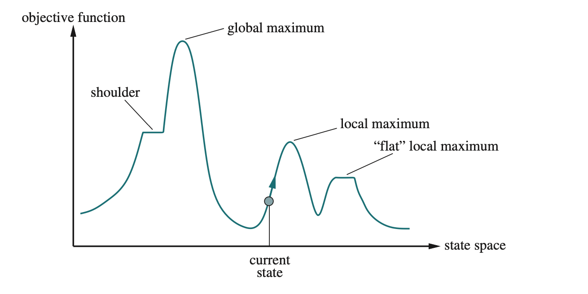
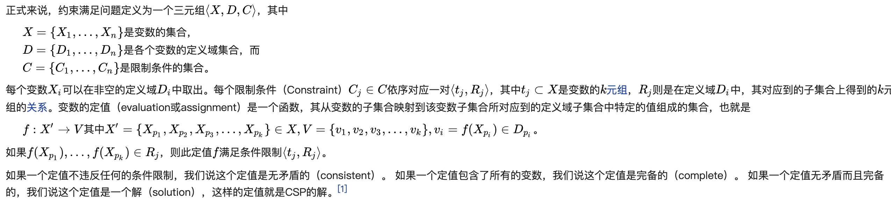

# CMPT317 Introduction to Artificial Intelligence

## Lectures: Mon/Wed/Fri 2:30-3:20pm, Arts 134 (sec 02)
###Labs: Tues 11:30-12:50pm, Phys 107 (sec 02)

Career Fair: Thursday Jan12, 4pm in Marquis
Great grade: apply for NSERC
	Mail banani.roy@usask.ca

1. Monday: in-person class
2. Wednesday*Lab slot Synchronous Zoom class
3. Fridays: Quiz over Zoom during class time
4. Final exam: in-person in April

- Quizzes (10 @ 1% each)) 10%
- Assignments (10 @ 4% each) 40 %
- Final Exam 50%

- Friday Quizzes:
Students will write a multiple-choice quiz each Friday, starting January 20th. The quiz will be written in small groups during the Friday class time. 
Each group will have ONE opportunity to check their quiz with the instructor prior to submission. The group will be told how many questions are wrong, but not which ones.
The group may then resume discussions before making their final quiz submission.
All True / False questions

**Assignments** will be due weekly each Thursday at 5:00pm,但是提交在11:59pm之前，no penalty.  starting January 26th. Some assignments will require programming (in Python) and others will consist of theory questions and written answers.

The **final exam** will be an in-person, on-paper, 3-hour exam. The exam will consist of a combination of multiple choice and short written-answer questions. You can bring in one sheet of personal notes. The negative Bias will be used in T/F.


## Search
Search Problem: to find a solution
Probability
Optimization the goal, better way to 
Machine learning
Neural Networks
* Agent: entity that perceives its environment and acts upon that environment
* State: a configuration of the agent
* Initial state: begin with an initial state
* Goal state: end up with a goal state
* Actions: choices that can be made in a state
	  Actions(s) returns the set of actions that can be executed in state s
* transition model: a description of what state results from performing any applicable action in any state.
	- result(s, a) return the state resulting from performing action a in state s
		state may be a 2-D array

- `State space`: the set of all states reachable from the initial state by any sequence of actions.
- `Goal test`: way to determine whether a given state is a goal state
	In a complex problem, it might be multiple goals, multiple ways to solve the problem.
- `Path cost`: numerical cost associated with a given path.
- `Solution`: a sequence of actions that leads from initial state to goal state
`Optimal solution`: a solution that has the lowest path cost among all solution

**Search Problems:**
•	Initial state
•	Actions
•	Transition model
•	Goal test
•	Path cost function

**Node**:
A data structure that keeps track of 
•	A state
•	A parent (node that generated this node)
•	An action (action applied to parent to get node)
•	A path cost (from initial state to node)

**Frontier**：
Approach：
•	Start with a frontier that contains the initial state
•	Repeat:
-	If the frontier is empty, then no solution.
- Else Remove a node from the frontier
    -	If node contains goal state, return the solution
    -	Else expand node, add resulting nodes to the frontier

What could be wrong?
 
在A和B中，不停loop。
Solution:
	Revised approach:
-	Start with a frontier that contains the initial state
-	Start with an empty explored set
-	Repeat:
    	- If the frontier is empty, then no solution.
    	- Else Remove a node from the frontier
        - If node contains goal state, return the solution
    	- Add the node to the explored set
        - Else expand node, add resulting nodes to the frontier if they aren’t already in the frontier or the explored set.
**Frontier**:
•	Stack: LIFO. Depth-first-search.
•	Queue: FIFO. Breadth-first-search.
  

BFS用于找到每个边的权值是一样的图的最短路径，如果图中每个边的权值不一样了，就用到了UCS。
##算法流程

1. 将起始点加入到frontier中，将与frontier相连的点进行探索，每个点的代价（后面用cost替代）是从起点到该点的距离，然后将所有的点加入到frontier里面

2. 从frontier里面挑出cost最小的点A，判断该点是不是终点，如果是终点算法结束。如果不是终点，探索与该点相连的所有点，每个点的cost是A点的cost加上A点到B点的路径的权重。如果B点是已经出现在frontier里面了，比较一下原来的cost与新生成的cost哪个更小，然后将最小的cost赋值给B点，并更新它的父节点。

3.  如果frontier为空还没有找到终点，则没有到达终点的最短路径

Search 算法分为两种：**知情算法**和**不知情算法**。
  
Uninformed Search，顾名思义就是消息不灵通的search，被蒙蔽的search，也可以叫做Blind Search（盲目搜索）或者Brute-force Search（也就是传说中的暴力解法）
### Uninformed Search不知情算法有：
1. **Depth-First Search（DFS）深度优先**
    - 深度优先搜索是用于遍历树或图数据结构的递归算法。
    - 它从根节点开始并在移动到下一个路径之前跟随每个路径到其最大深度节点。
    - DFS使用堆栈数据结构来实现它。
    - DFS算法的过程类似于BFS算法。
    - 注意：回溯是一种使用递归查找所有可能解决方案的算法技术。
**优点**：
    - DFS需要非常少的内存，因为它只需要在从根节点到当前节点的路径上存储一堆节点。
    - 到达目标节点所需的时间比BFS算法少(如果它在正确的路径中移动)。
**缺点**：
    - 许多状态有可能继续发生，并且无法保证找到解决方案。
    - DFS算法用于深入搜索，有时可能会进入无限循环。
2. 	**Depth-Limited Search（DLS）深度有限搜索算法**
    - DLS其实是DFS的变体，它限制住了访问的深度，在DFS算法的第（2）步中，若该节点当前深度大于限制深度，那就不再把它的子女Push进去了。
    - 深度有限搜索算法类似于具有预定限制的深度优先搜索。深度限制搜索可以解决深度优先搜索中无限路径的缺点。在该算法中，深度限制的节点将被视为没有后继节点。
    - 	可以使用两个失败条件终止深度限制搜索：
    - 	标准故障值：表示问题没有任何解决方案。
    - 	截止故障值：它在给定的深度限制内没有定义问题的解决方案。
**优点**：
    - 深度限制搜索是内存高效。
**缺点**：
    - 深度限制搜索也具有不完整性的缺点。
    - 如果问题有多个解决方案，则可能不是最佳选择。
###Informed Search: 知情搜索算法
*	Best first Search
*	A* search

知情搜索算法对于大型搜索空间更有用。知情搜索算法使用启发式思想，因此也称为启发式搜索。
启发式函数：启发式是一种在Informed Search中使用的函数，它找到了最有希望的路径。它将代理的当前状态作为其输入，并生成估计代理与目标的接近程度。然而，启发式方法可能并不总是提供最佳解决方案，但它保证在合理的时间内找到一个好的解决方案。启发式函数估计状态与目标的接近程度。它由h(n)表示，它计算这对状态之间的最佳路径的成本。启发式函数的值始终为正值。
启发函数的可接受性如下：
h(n) <= h*(n)
这里h(n)是启发式成本，h *(n)是估计成本。因此，启发式成本应小于或等于估计成本。
纯启发式搜索
纯启发式搜索是最简单的启发式搜索算法。它根据启发式值h(n)扩展节点。它维护两个列表，OPEN和CLOSED列表。在CLOSED列表中，它放置那些已经扩展的节点，并在OPEN列表中放置尚未展开的节点。
在每次迭代中，具有最低启发式值的每个节点n被扩展并生成其所有后继者，并且n被放置到闭合列表中。该算法继续单元找到目标状态。
在知情搜索中，我们将讨论以下两种主要算法：
*	最佳搜索算法(贪婪搜索)
*	A *搜索算法
1. 最佳搜索算法(贪婪搜索)
贪心最佳优先搜索算法总是选择当时最佳的路径。它是深度优先搜索和广度优先搜索算法的组合。它使用启发式功能和搜索。最佳优先搜索允许我们利用这两种算法的优势。借助最佳优先搜索，在每一步，我们都可以选择最有前途的节点。在Best-first算法中，我们扩展最接近目标节点的节点，并且通过启发函数估计最接近的成本，即 -
f(n)= g(n)
是，h(n)= 从节点n到目标的估计成本。
贪婪best-first算法由优先级队列实现。
2. Best-first最佳优先搜索算法：
*	步骤1：将起始节点放入OPEN列表。
*	步骤2：如果OPEN列表为空，则停止并返回失败。
*	步骤3：从具有最低值h(n)的OPEN列表中删除节点n，并将其放在CLOSED列表中。
*	步骤4：展开节点n，并生成节点n的后继节点。
*	步骤5：检查节点n的每个后继节点，并查找是否有任何节点是目标节点。如果任何后继节点是目标节点，则返回成功并终止搜索，否则继续执行步骤6。
*	步骤6：对于每个后继节点，算法检查评估函数f(n)，然后检查节点是否已处于OPEN或CLOSED列表中。如果节点未在两个列表中，则将其添加到OPEN列表中。
*	步骤7：返回步骤2。
**优点**：
*	最佳优先搜索可以通过获得两种算法的优势在BFS和DFS之间切换。
*	该算法比BFS和DFS算法更有效。
**缺点**：
*	在最坏的情况下，它可以表现为无指导的深度优先搜索。
*	它可以像DFS一样陷入循环。
*	该算法不是最优的。
示例：
考虑下面的搜索问题，我们将使用贪婪的最佳优先搜索来遍历它。在每次迭代时，使用评估函数f(n)= h(n)扩展每个节点，该函数在下表中给出。

时间复杂性：最佳优先搜索的最坏情况时间复杂度是O(bm)。
空间复杂性：最佳优先搜索的最坏情况空间复杂度是O(bm)。其中，m是搜索空间的最大深度。
完成：即使给定的状态空间是有限的，贪婪最佳优先搜索也是不完整的。
最优：贪心最佳优先搜索算法不是最优的。
3. **A \*搜索算法**：
A *搜索是最常见的最佳优先搜索形式。它使用启发函数h(n)，并且从开始状态g(n)到达节点n的成本。它结合了UCS和贪婪的最佳优先搜索功能，可以有效地解决问题。A *搜索算法使用启发式函数找到通过搜索空间的最短路径。此搜索算法扩展了较少的搜索树并更快地提供最佳结果。A *算法类似于UCS，除了它使用g(n)+ h(n)而不是g(n)。
在A *搜索算法中，我们使用搜索启发式以及到达节点的成本。因此可以将两种成本结合起来，并将此总和称为适合度数。
 
在搜索空间中的每个点处，仅扩展具有最小值f(n)的那些节点，并且算法在找到目标节点时终止。
A *搜索算法过程
*	步骤1：将起始节点放在OPEN列表中。
*	步骤2：检查OPEN列表是否为空，如果列表为空则返回失败并停止。
*	步骤3：从OPEN列表中选择具有最小评估函数值(g + h)的节点，如果节点n是目标节点则返回成功并停止，否则继续。
*	步骤4：展开节点n并生成其所有后继节点，并将n放入关闭列表中。对于每个后来者n’，检查n’是否已经在OPEN或CLOSED列表中，如果没有，则检查n’的评估函数并放入打开列表。
*	步骤5：否则如果节点n’已经处于OPEN和CLOSED状态，那么它应该连接到反向最低g(n’)值的后向指针。
*	步骤6：返回步骤2。
**优点**：
*	A * 搜索算法是比其他搜索算法更好的算法。
*	A * 搜索算法是最佳和完整的。
*	该算法可以解决非常复杂的问题。
**缺点**：
*	它并不总是产生最短路径，因为它主要基于启发式和近似。
*	A * 搜索算法存在一些复杂性问题。
•	A * 主要缺点是内存需求，因为它将所有生成的节点保存在内存中，因此对于各种大规模问题是不实际的。
**示例**：
在这个例子中，我们将使用A * 算法遍历给定的图形。所有状态的启发式值在下表中给出，因此将使用公式f(n)= g(n)+ h(n)计算每个状态的f(n)，其中g(n)是成本 从开始状态到达任何节点。
下面是将使用OPEN和CLOSED列表。
- 初始化: {(S, 5)}
- 迭代1: {(S—> A, 4), (S—>G, 10)}
- 迭代2: {(S—> A—>C, 4), (S—> A—>B, 7), (S—>G, 10)}
- 迭代3: {(S—> A—>C—->G, 6), (S—> A—>C—->D, 11), (S—> A—>B, 7), (S—>G, 10)}
- 迭代4将给出最终结果，如： S—->A—->C—->G 它提供了成本6的最佳路径。
**要记住的要点**：
*	A * 算法返回首先发生的路径，并且不搜索所有剩余路径。
*	A * 算法的效率取决于启发式的质量。
*	A * 算法扩展满足条件f(n)的所有节点
**完成 complete**：
A * 算法完成，只要：
*	分支因子是有限的。
*	每项行动的成本都是固定的。
**最佳 optimal**：
如果遵循以下两个条件，A *搜索算法是最佳的：
*	可接受admissible：第一个要求最优的条件是h(n)应该是A * 树搜索的可接受的启发式算法。可接受的启发式算法本质上是乐观的。
*	一致性consistent：第二个必需条件是仅A * 图搜索的一致性。
**如果启发式函数是可接受的，则A * 树搜索将始终找到最低成本路径。**
**可采纳启发式 Admissible Heuristic**
**一致性启发式 Consistent Heuristic**
1. 可采纳启发式 Admissible Heuristic：**就是不能比真实的距离多**
这个是说，可采纳启发式不会高估到达目标的距离，f(n)永远不会超过实际解的距离。

我个人觉得，就是说，A*每次找的路径，都不超过实际到达解的距离，因为他每次找的 f(n)都是最小的，所以他每次找的路径都是近路，他不会绕远路去找解。

2. 一致性启发式 Consistent Heuristic：**直接去的距离，不能比从中间点去要高**
是说，对于节点 n 和通过任一行动 a 生成的每个 n 的后继节点 n’，从节点 n 到达目标的代价都不大于从 n 到 n’ 的单步代价与从 n’ 到达目标的代价之和，公式为：
h ( n ) ≤ c ( n , a , n ′ ) + h ( n ′ ) 
**时间复杂度：** A * 搜索算法的时间复杂度取决于启发式函数，并且扩展的节点数量是指数d的深度的指数。因此，时间复杂度为O(b ^ d)，其中b是分支因子。
**空间复杂度：**A *搜索算法的空间复杂度为O(b ^ d)

**我的天啊，AI是不会回去的，state是不会改变的，所以会无限生成state，来叠加，然后看看能不能生成一个对的state**

之前的章节是聚焦在the problem in fully observable, deterministic, static,known environment, solution is a sequence of actions.

# optimization
- choosing the best option from a set of option
## local search
- Local search is a search algorithm that maintains a single node and searches by moving to a neighboring node. 
- This type of algorithm is different from previous types of search that we saw. Whereas in maze solving, for example, we wanted to find the quickest way to the goal, local search is interested in finding the best answer to a question. 
- Often, local search will bring to an answer that is not optimal but “good enough,” conserving computational power. 
    

## Hill climbing
```
function HILL-CLIMBING(problem) returns a state that is a local maximum current←problem.INITIAL
while true do
neighbor ← a highest-valued successor state of current
if VALUE(neighbor) ≤ VALUE(current) then return current current ← neighbor
```
**Local search** algorithms can also solve **optimization problems**, in which the aim is to find the best state according to an objective function.
**Local search** algorithms operate by searching from a start state to neighboring states, without keeping track of the paths, nor the set of states that have been reached. That means they are not systematic
  

hill climbing variants
| variant  | definition |
| ------------- |:-------------:|
| steepest-ascent      | choose the highest-valued neighbor     |
| stochastic      | choose randomly from higher-valued neighbors     |
| first-choice      | choose the first higher-valued neighbor     |
| random-restart | conduct hill climbing multiple times|
| local beam search| chooses the k-highest-valued neighbors|

**Hill Climbing**:  It keeps track of one current state and on each iteration moves to the neighboring state with highest value.
the **steepest ascent**. It terminates when it reaches a “peak” where no neighbor has a higher value. 
Hill climbing is sometimes called greedy local search because it grabs a good neighbor state without thinking ahead about where to go next. 
**Stochastic hill climbing** chooses at random from among the uphill moves; 
**First-choice hill climbing** implements stochastic hill climbing by generating successors randomly until one is generated that is better than the current state.
Another variant is **random-restart hill climbing**, which adopts the adage, “If at first you don’t succeed, try, try again.” It conducts a series of hill-climbing searches from randomly generated initial states, until a goal is found.

**Simulated annealing** 
```
function SIMULATED-ANNEALING(problem,schedule) returns a solution state current←problem.INITIAL
for t = 1 to ∞ do
T ← schedule(t)
if T = 0 then return current
next ← a randomly selected successor of current ∆E←VALUE(current) – VALUE(next)
∆E = how much better neighbor is than current
if ∆E > 0 then current ← next
else current ← next only with probability e−∆E /T
```
就是一直选比当前好的state，不选worse state。因为火灾，肯定选择温度更低的地方. 又种greedy的感觉

**4.2 Local Search in Continuous Spaces**
One way to deal with a continuous state space is to discretize it. 


##Linear Programming
* minimize a cost function c1x1 + c2x2 +... + cnxn
* with constraint of form  c1x1 + c2x2 +... + cnxn <= b
* or of form c1x1 + c2x2 +... + cnxn = b
* with bounds for each varible l <=xi <=ui
Inference

maintaining arc-consistency
* when we make a new assignment to X, calls AC-3, starting with a queue of all arcs(Y,X)


#### 约束满足问题（**Constraint satisfaction problem，CSPs**）
是种数学的问题，其定义为一组物件（object），而这些物件需要满足一些限制或条件。CSPs将其问题中的单元（entities）表示成在变数上有限条件的一组同质（homogeneous）的集合，这类问题透过“约束满足方法”来解决。CSPs是人工智慧和运筹学的热门主题，因为它们公式中的规律，提供了共同基础来分析、解决很多看似不相关的问题。通常约束满足问题具有高度复杂性，需要同时透过启发式搜索和联合搜索的方法，来在合理的时间内解决问题。布林可满足性问题（SAT），可满足性的理论（SMT）和回答集程式设计（ASP）可以算是某种程度上的约束满足问题。

**我的问题**：
1. CSP能解决什么问题？什么样的问题能简化成数学问题？？我知道local search不能用于single agent的问题。那么CSP更进一步了？一个continuous envirenment的问题中，为什么需要CSP？直接用Local Search来逐步找到最佳值不就好了吗？ CSP是怎么出来的？


##### 正式来说，约束满足问题定义为一个三元组
  
解决方法
定义域有限的约束满足问题通常利用搜索方法来解决。最常用的技术是回溯法（**backtracking**）、约束传递**constraint propagation**，以及局部搜索**local search**的改良。

**回溯法**是一种递回演算法，它保持部分变数的赋值。一开始，所有的变数都还没被赋值。在每一个步骤中，先选取一个变数，并且将所有可能的值依次赋予该变数。对于每一个值，在限制条件下的局部赋值的无矛盾性（**consistency**）都进行检查。在符合无矛盾（consistency）的情况下，就会递回地往下呼叫。当所有的值都试过，演算法则回溯上层。在这个基本回溯演算法中，无矛盾性（consistency）被定义为满足所有的条件限制，且这些条件限制的变数已被赋值。若干回溯变数存在。回溯法提高了检查无矛盾性的效率。回跳法可以使在某些在某些情况中，透过回溯”一个以上的变数“，来省去部分的搜寻。约束学习则借由减少新的条件限制，来避免部分的搜寻。可预见性也常常在回溯法中应用，用来去预期选择一个变数或值的影响，因此常常用来预先判定一个子问题什么时候满足或不满足。约束传递（**Constraint propagation**）技术是用来修饰一个CSP的方法。更精确地说，是一种方法，用来增强一种形式的局部一致性，是一种条件牵连到一组变数或条件限制的一致性。约束传播应用在各个领域。一来，它把问题转化为一个等价但通常是最简单的解决方法。二来，他可以用来验证满足或不满足于问题。一般来说他不保证会发生，但是它总是会发生一些形式的约束传递（Constraint propagation）或某些种类的问题。最有名的惯用的局部一致性是弧协调性，超弧一致性，和路径一致性。最流行的方法是AC-3约束传播演算法，该演算法可以执行弧的一致性。

局部搜索方法是不完全满足的演算法。人们可能找到解决问题的方法，但这方法可能令我们失望。其反复更改变数来改进整个任务，而得以运作。在每一步，要更改少量变数的值，与整体目标数量的增加条件限制以满足的任务。最小冲突演算法是局部搜索演算法和基于特定CSPs原则。在实践中，局部搜索似乎工作当这些变化也受随机选择。整合搜索和局部搜索被开发了，导致混合演算法。

如果一个定值不违反任何的条件限制，我们说这个定值是无矛盾的（consistent）。 如果一个定值包含了所有的变数，我们说这个定值是完备的（complete）。 如果一个定值无矛盾而且完备的，我们说这个定值是一个解（solution），这样的定值就是CSP的解。

Random Guess
Random Search
Hill climbing
Hill climbing  with long restart
hill climbing with fast restart
####Lecture Feb14
### Logic in AI
####Learning Objectives
After studying this topic, a student should be able to:
* Describe the difference between a possible world, and a model.
* Define and distinguish between the terms entailment and inference.
* Define the properties correctness, soundness and completeness of
an inference algorithm.
* Identify and construct syntactically correct sentences in
propositional logic.
* Determine the truth value of any sentence in propositional logic,
given an appropriate model.
* Describe simple example problem domains using propositional logic
sentences.
#### Perspective
*  In Chapters 3-4, knowledge was encoded as State and
Problem class code.
*  Knowledge is implicitly encoded by methods
actions() and result()
*  These technologies show how to solve problems,
but the knowledge is not explicitly represented.
*  In contrast, humans know things (maybe)
*  What could we accomplish if our programs explicitly
represented knowledge?
#### Knowledge-based Agents
• Knowledge-based agents have a knowledge base (KB).
• A collection of sentences that the agent knows are
true in a formal language
• A rule about the "physics" of the world can be a
sentence
• The KB would likely be initialized with these
• A sensory observation can be a sentence
• New sentences like these are added via the
operation **TELL**
