## Error and exception
#### Basic idea:
* Can represent failures and exceptions with ordinary values
* Can write higher-order functions that abstract out common patterns of error handiling and recovery
* Advantages
    - Safer and retains referential 
    - By using higher-order functions, can preserve the primary benefit of exceptions: consolidation of error-handling logic
#### Plan
*	Recreate **option** and **either** type
* problems of exception
  1. Exception break RT and introduce context dependence.
       - moves us away from simple reasoning of the substitution model
       - makes it possible to write confusing exception based code (exceptions should be used only for error handling, not for control flow)
  2. Exceptions are not type-safe
     1. The type of failingFn — Int => Int — tells us 
nothing about the fact that exceptions may occur
        - The compiler will certainly not force callers of failingFn to make a decision about how to handle those exceptions. 
        - If we forget to check for an exception in 
failingFn, this won’t be detected until runtime

CHECKED EXCEPTIONS
1. Java’s checked exceptions force a decision about 
whether to handle or reraise an error, but:
    - they result in significant boilerplate for callers 
    - they don’t work for higher-order functions, 
    - HOF cannot be aware of exceptions that could be raised by their arguments
  


#### Benefit of exeption
* They allow us to: 
   - consolidate and centralize error handling logic
* Purely functional solution should preserve this benefit
* Goal 
    - Completely type-safe, with full assistance from type-checker
  
  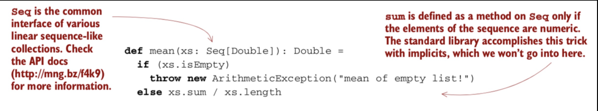  

* 解决方案有:
1. paritial function
      - Typically when function makes assumptions about inputs which are not implied by input types
      -  Also when function may not terminate on some input values 
         -  Not a recoverable error, so not of immediate interest
2. posibility 1
      - return a bogus value of type Double
        - always return xs.sum / xs.length, which becomess 0.0 / 0 (i.e., Double.NaN) when input is empty
        - return some sentinel value（是不是比如None，Nil之类的？）
      - problems with this
        - errors can silently propagate
          - caller can forget to check condition, and won't be alerted by compiler
            - failure in subsequent code
            - error may be detected much later
        - significant bolerplate code at caller end
          - 又很多的if statement来checkexception
        - not applicable to polymorphic code
        -   
        - special policies(i.e., callling conventions) expected from callers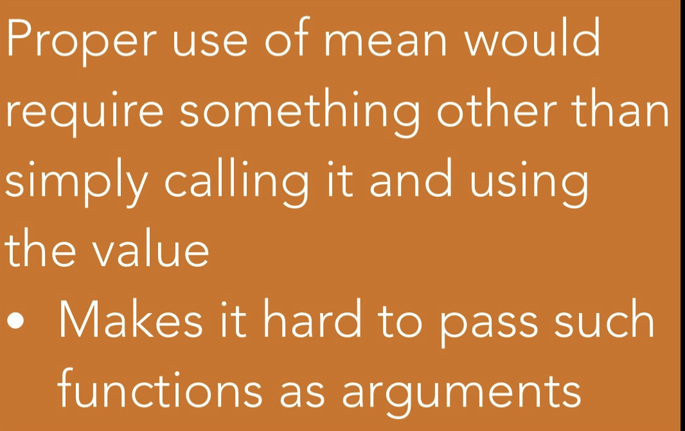  


    - posibility 2
      - force caller to supply argument that tells function what to do when it can't handle input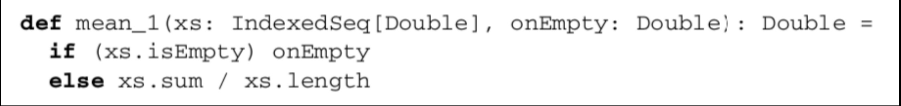  

      - This turns mean into a toal function, but
        - immediate callers need direct knowlege of handling undefined case
          - limits caller to returning Double
          - what if the larger computation should be aborting instead? or doing something else?
          - caller把如果是exception要做什么的function也传进来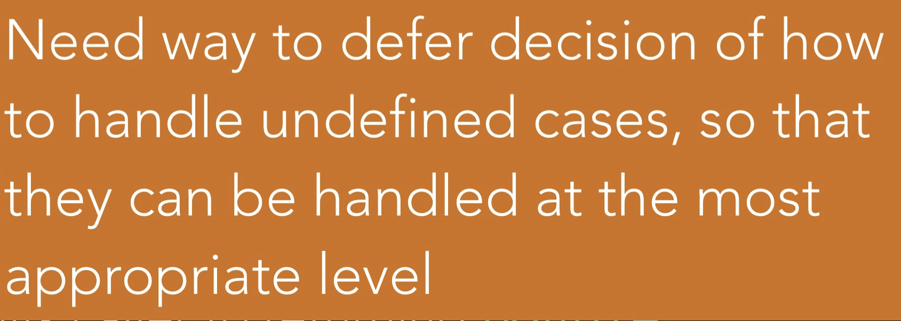  


### error and exception solution: option data type
  

- represent-explicitly- in return type that function may not always have an answer: Defer to the caller for error-handling
- has two cases: 
  - some, for when it is definded; 
  - None, for when it is underind
option是一个collection，但是at most have one element.要么是None，要么是Some，some里面可以是任意类型的值，比如单值，或者another collection
- can be used for mean as follows
#### sentinel vs. option type
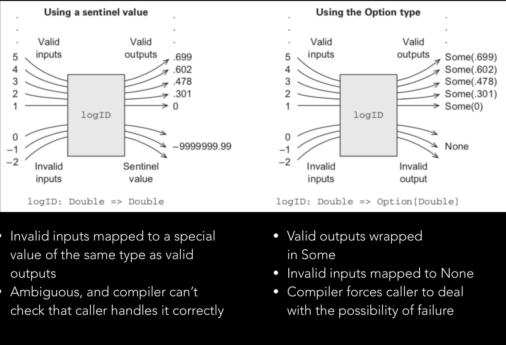 

之前说的是，如果想把error和exception考虑进去，那么把功能细分也不行，返回None Nil也不行，让caller传进去错误处理方法也不行。**那么为什么java这么做就行**？那么解决办法是option：

回答：避免 null 使用
大多数语言都有一个特殊的关键字或者对象来表示一个对象引用的是"无"，在 Java，它是 null。在 Java 里，null 是一个关键字，不是一个对象，所以对它调用任何方法都是非法的。但是这对语言设计者来说是一件令人疑惑的选择。为什么要在程序员希望返回一个对象的时候返回一个关键字呢？

**Scala 的 Option类型**
为了让所有东西都是对象的目标更加一致，也为了遵循函数式编程的习惯，Scala 鼓励你在变量和函数返回值可能不会引用任何值的时候使用 Option 类型。在没有值的时候，使用 None，这是 Option 的一个子类。如果有值可以引用，就使用 Some 来包含这个值。Some 也是 Option 的子类。 None 被声明为一个对象，而不是一个类，因为我们只需要它的一个实例。这样，它多少有点像 null 关键字，但它却是一个实实在在的，有方法的对象。

Option 有两个子类别，Some 和 None。当程序回传 Some 的时候，代表这个函式成功地给了你一个 String，而你可以透过 get() 函数拿到那个 String，如果程序返回的是 None，则代表没有字符串可以给你。

在返回 None，也就是没有 String 给你的时候，如果你还硬要调用 get() 来取得 String 的话，Scala 一样是会抛出一个 NoSuchElementException 异常给你的。 我们也可以选用另外一个方法 getOrElse。这个方法在这个 Option 是 Some 的实例时返回对应的值，而在是 None 的实例时返回传入的参数。换句话说，传入 getOrElse 的参数实际上是默认返回值。

通过模式匹配分离可选值，如果匹配的值是 Some 的话，将 Some 里的值抽出赋给 x 变量：
```scala
def showCapital(x: Option[String]) = x match {
    case Some(s) => s
    case None => "?"
}
```
Scala 程序使用 Option 非常频繁，在 Java 中使用 null 来表示空值，代码中很多地方都要添加 null 关键字检测，不然很容易出现 NullPointException。因此 Java 程序需要关心那些变量可能是 null,而这些变量出现 null 的可能性很低，但一但出现，很难查出为什么出现 NullPointerException。 Scala 的 Option 类型可以避免这种情况，因此 Scala 应用推荐使用 Option 类型来代表一些可选值。使用 Option 类型，读者一眼就可以看出这种类型的值可能为 None。

实际上，多亏 Scala 的静态类型，你并不能错误地尝试在一个可能为 null 的值上调用方法。虽然在 Java 中这是个很容易犯的错误，它在 Scala 却通不过编译，这是因为 Java 中没有检查变量是否为 null 的编程作为变成 Scala 中的类型错误（不能将 Option[String] 当做 String 来使用）。所以，Option 的使用极强地鼓励了更加弹性的编程习惯。

详解 Option[T]
在 Scala 里 Option[T] 实际上是一个容器，就像数组或是 List 一样，你可以把他看成是一个可能有零到一个元素的 List。

当你的 Option 里面有东西的时候，这个 List 的长度是 1（也就是 Some），而当你的 Option 里没有东西的时候，它的长度是 0（也就是 None）。

**for 循环**
如果我们把 Option 当成一般的 List 来用，并且用一个 for 循环来走访这个 Option 的时候，如果 Option 是 None，那这个 for 循环里的程序代码自然不会执行，于是我们就达到了「不用检查 Option 是否为 None 这件事。
``` shell
scala> val map1 = Map("key1" -> "value1")
map1: scala.collection.immutable.Map[String,String] = Map(key1 -> value1)

scala> val value1 = map1.get("key1")
value1: Option[String] = Some(value1)

scala> val value2 = map1.get("key2")
value2: Option[String] = None

scala> def printContentLength(x: Option[String]) {
     |   for (c <- x){
     |     println(c.length)
     |   }
     | }
printContentLength: (x: Option[String])Unit

scala> printContentLength(value1)
6

scala> printContentLength(value2)
```
**map 操作**
在函数式编程中有一个核心的概念之一是转换，所以大部份支持函数式编程语言，都支持一种叫 map() 的动作，这个动作是可以帮你把某个容器的内容，套上一些动作之后，变成另一个新的容器。

现在我们考虑如何用 Option 的 map 方法实现 length: xxx 的输出形式：先算出 Option 容器内字符串的长度,然后在长度前面加上 "length: " 字样,最后把容器走访一次，印出容器内的东西
```
scala> value1.map(_.length).map("length: " + _).foreach(println)
length: 6

scala> value1.map("length: " + _.length).foreach(println)
length: 6
```
透过这样「转换」的方法，我们一样可以达成想要的效果，而且同样不用去做「是否为 None」的判断。
#### Map vs flatMap
Let's say you have a List:

```scala
val names = List("Benny", "Danna", "Tal")
names: List[String] = List(Benny, Danna, Tal)
```
Now let's go with your example. Say we have a function that returns an Option:
```scala
def f(name: String) = if (name contains "nn") Some(name) else None`
```
The map function works by applying a function to each *element* in the list:
```scala
names.map(name => f(name))
List[Option[String]] = List(Some(Benny), Some(Danna), None)
```
In the other hand, flatMap applies a function that **returns a sequence for each element in the list, and flattens the results into the original list**

### basic functions on option
#### 4.3. The Option data type
```scala
sealed trait Option[+A]
case class Some[+A](get: A) extends Option[A]
case object None extends Option[Nothing]
```
Option是一个collection，最多只有一个element，要么是none，要么是里面的东西，这个东西可以是一个值类型，也可是是另一个collection
##### 4.3.1. Usage patterns for Option
1. can factor out common patterns of error handling via higher-order functions
   1. frees us from writing boiler-plate that comes with exception-handling code

2. **many List functions have their analogs for option**:
所以把option可以看成只有一个element的List，要么none，要么Some
   1. Think of an Option like a List with at most one element
  - 
```scala
def map [B] (f: A => B): Option[B] = this match {
    case None => None
    case Some(a) => Some(f(a))
}
def getOrElse [B>:A] (default: => B): B = this match {
    case None => default
    case Some(a) => a
}
def flatMap [B] (f: A => Option[B]): Option[B] = this match {
    case None => None
    case Some(a) => f(a)
}
def flatMap [B] (f: A => Option[B]): Option[B] = map(f) getOrElse None

def orElse [B>:A](ob: => Option[B]): Option[B] = this match {
 case None => ob 
 case _ => this
}
def orElse [B>:A] (ob: => Option[B]): Option[B] = 
 this map (Some(_)) getOrElse ob

def filter (f: A => Boolean): Option[A] = this match {
 case Some(a) if f(a) => this
 case _ => None
}

def filter (f: A => Boolean): Option[A] =
 flatMap(a => if (f(a)) Some(a) else None)
```
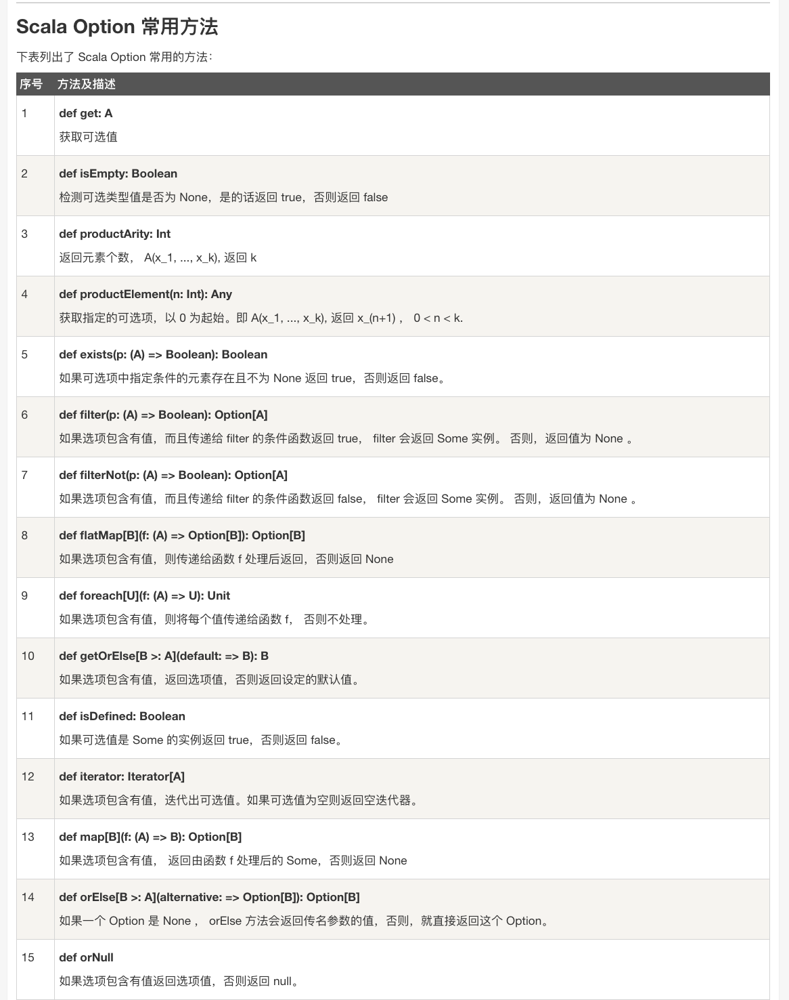 

```scala
def map2[A,B,C](a: Option[A], b: Option[B])(f: (A, B) => C): Option[C] = a flatMap (aa => b map (bb =>f(aa, bb)))
```
Option[T] 是一个类型为 T 的可选值的容器： 如果值存在， Option[T] 就是一个 Some[T] ，如果不存在， Option[T] 就是对象 None 
Option 有两个子类别，一个是 Some，一个是 None，
* getOrElse() 方法
你可以使用 getOrElse() 方法来获取元组中存在的元素或者使用其默认的值，实例如下：
 
option functinos: orelse
```scala
def map [B] (f: A => B): Option[B] = this match {
     case None => None
     case Some(a) => Some(f(a))
}
def getOrElse [B>:A] (default: => B): B = this match {
     case None => default
     case Some(a) => a
}

def flatMap [B] (f: A => Option[B]): Option[B] = this match {
     case None => None
     case Some(a) => f(a)
}

def flatMap [B] (f: A => Option[B]): Option[B] = 
     map(f) getOrElse None

def orElse[B>:A](ob:=>Option[B]:Option[B] = this match {
  case Node => ob
  case _=>this
})

def orElse [B>:A] (ob: => Option[B]): Option[B] = 
       this map (Some(_)) getOrElse ob

def filter (f: A => Boolean): Option[A] = this match {
     case Some(a) if f(a) => this
     case _ => None //这里一种可能是None，一种是f(a)==false
}
def filter (f: A => Boolean): Option[A] =
     flatMap(a => if (f(a)) Some(a) else None)
```
example:
Variance function: If mean of sequence is m, variance is mean of math.pow(x-m, 2).  
* Implement this using flatMap
```scala
def vaiance(xs:Seq[Doulb])): Option[Double]=
  mean(xs) flatMap(m=>mean(xs.map(x=>math.pow(x-m, 2))))

``` 
* None.flatMap(f) immediately returns None
* Can construct a computation with multiple stages:
* Any stage may fail, and the computation will abort as 
soon as the first failure is encountered, without running f 
* Can use filter to convert successes into failures if the successful 
values don’t match the given predicate
* A common pattern is to transform an Option via calls to map, flatMap, and/or filter, and then use getOrElse to do error handling at the end
  
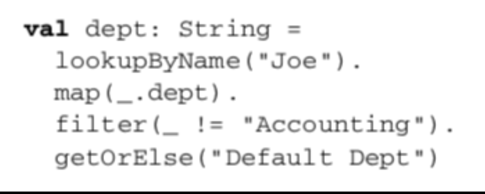  

getOrElse converts from an Option[String] to a String, by providing a default department in case the key "Joe" didn’t exist in the Map or if Joe’s department was "Accounting"

4.4. The Either data type
```scala
sealed trait Either[+E, +A]
case class Left[+E](value: E) extends Either[E, Nothing]
case class Right[+A](value: A) extends Either[Nothing, A]
```

Usage Scenarios IV
* orElse is similar to getOrElse, except that: 
  - We return another Option if the first is undefined 
  - This is often useful when we need to chain together possibly failing computations, trying the second if the first hasn’t succeeded

我的问题： 为什么不把None做成Object的子类，像java一样，做一个check就可以了？？？
回答：为了去掉对于null的check，所以做了一个option，这样对于collection，null和没有数据是一样的处理

Can convert None to an exception
      - o.getOrElse(throw new Exception("FAIL")) 
* General rule of thumb: 
    - Use exceptions only if no reasonable program would ever catch the exception
    - If for some callers the exception might be a recoverable error, we use Option (or Either, discussed later) to give them flexibility 
????没看懂

我懂了，因为一连串的计算，有很多种可能出错，用这个能指定是哪一种error，哪儿出错了
Summary
* Returning errors as ordinary values can be convenient
* Use of higher-order functions lets us achieve the same sort of 
consolidation of error-handling logic as we would get from using 
exceptions 
* Note: We don’t have to check for **None** at each stage of the computation  
* We can apply several transformations and then check for and 
handle **None** when we’re ready 
* We get additional safety, because **Option[A]** is a different type 
from **A**, and the compiler won’t let us forget to explicitly defer or 
handle the possibility of **None**

#### LIFTING FUNCTIONS TO OPERATE ON  OPTION 

* May seem like our entire code will be infected with Options
  - That every function will need to be modified to deal with Options
  - But not really: We can **lift** ordinary functions to become functions which deal with Options
* **map** lets us operate on values of type Option[A] using a function of type A => B, returning Option[B]
  - Turns a function f of type A => B into a function of type Option[A] => Option[B] 
  - Let’s make this explicit: 
```
def lift[A,B](f: A => B): Option[A] => Option[B] = _ map f
= ((o:Option[A]) => o.map(f)
= _ map f
```
* This tells us that any function can be transformed (via lift) to operate within the context of a single **Option** value 
就是不管哪一个collection，都调用map(f)，而不是只调用f,因为map有能力把A=>B,turn to Option[A]=>Option[B]

example:
```scala
val absO: Option[Double] => Option[Double] = lift(math.abs)
```
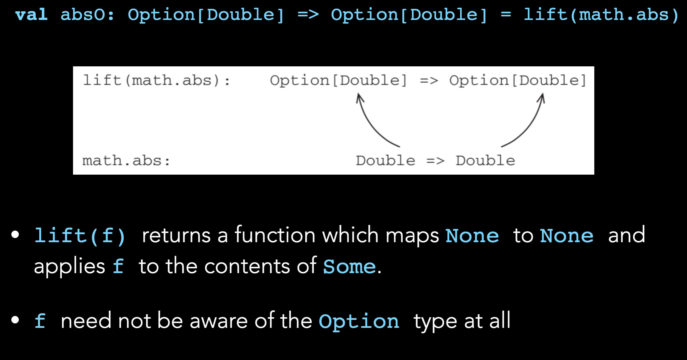  

**lift(f)** returns a function which maps None to None and applies f to the contents of Some.
  - f need not be aware of the Option type at all 

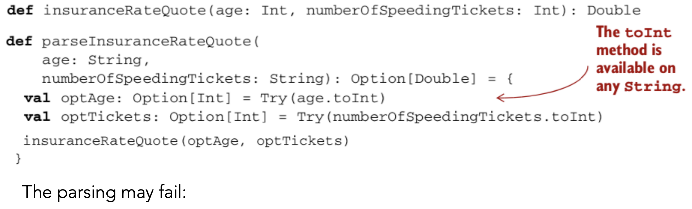  

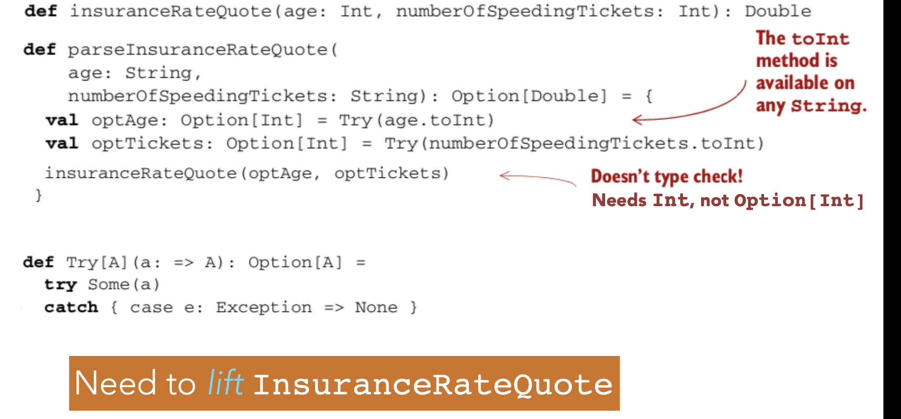  

try[A]: evaluate lazy, so it will go to the runtime
Need to lift insuranceRateQuote
```scala
def map2[A,B,C](a: Option[A], b: Option[B])(f: (A, B) => C): Option[C] =
 a flatMap (aa => b map (bb => f(aa, bb)))
```
  
## Leture Feb10

#### GENERALIZING TO LISTS

change a List of Option, to Option of List, so inside the values are good values

* What if we have to map over a list using a function that might fail?
* May want to place the entire resulting list in an Option
  
```scala
 def sequence[A](a: List[Option[A]]): Option[List[A]] =
 a match {
  case Nil => Some(Nil)
  case h :: t => h flatMap (hh => sequence(t) map (hh :: _))
 }
 def parseInts(a: List[String]): Option[List[Int]] =
  sequence(a map (i => Try(i.toInt)))
 
 ```
 所以，map不是一个数据结构在FP中，是一个方法，因为List本身也是一个map
 not very effient: makes two passes of the list

* Often need to sequence results of a map
```scala
 def traverse[A, B](a: List[A])(f: A => Option[B]): Option[List[B]] = a match {
  case Nil => Some(Nil)
  case h::t => map2(f(h), traverse(t)(f))(_ :: _)
 }
 ```
 Scala provides a syntactic construct called **for-comprehension** that is automatically expanded to a series of flatMap and map calls
 ##### for-comprehension
* A for-comprehension consists of: 
  - A sequence of bindings — like aa <- a — inside a pair of braces
  - A yield after the closing brace, which may make use of values on the left hand side of  <- binding. 
  -  The compiler desugars the bindings to flatMap calls, with the final binding and **yield** being converted to a call to map. 
- Example: map2 can be implemented using for-comprehension as follows:

```scala
def map2[A,B,C](a: Option[A], b: Option[B])(f: (A, B) => C): 
Option[C] = 
a flatMap (aa => 
b map (bb => 
f(aa, bb)))

def map2 [A,B,C] (a: Option[A], b: Option[B]) (f: (A, B) => C): Option[C] = for { 
        aa  <- a  
        bb <- b 
    } yield f(aa, bb) 
```
因为上面的，不用修改已经存在的function
Never have to modify an existing function

for-comprehensions are syntactic sugar for the latter kind of nested use of a number of **flatMap** applications followed by an application of **map**.

#### LIMITATIONS OF OPTIONS 

Option doesn’t tell us anything about what went wrong
* It just gives us None, indicating that there’s no value
* Sometimes we want to know more 
* We might want a String that gives more information
* If an exception was raised, we might want to know what 
that error actually was 
option只能告诉出错了，得到了None，但是不能看到为什么，either就可以返回，left可以告诉出错了，同时，left的内容告诉了为什么出错

#### EITHER  DATA  TYPE 
A simple extension to **Option**, which lets us **track a reason for the failure**
``` scala
sealed trait Either[+E, +A]
case class Left[+E](value: E) extends Either[E, Nothing] 
case class Right[+A](value: A) extends Either[Nothing, A]
```
#### EITHER   DATA   TYPE 
* Either has only two constructors: each case carries a value
* It represents — in a very general way — values that can be one of two things (In other words, a disjoint union of two types)
* Right is reserved for the success (i.e., right / correct) case 
* Left is used for failure 
       [We’ve used a suggestive E (for error) as the parameter name for left type]

##### EXAMPLE: MEAN 
* Can return a string when undefined
```
def mean(xs: IndexedSeq[Double]): Either[String, Double] =    
    if (xs.isEmpty) 
        Left("mean of empty list!")
    else 
        Right(xs.sum / xs.length)
```
* May want to return stack trace showing location of error
```
def safeDiv(x: Int, y: Int): Either[Exception, Int] = 
    try Right(x / y) 
    catch { case e: Exception => Left(e) } 
 ```
* Can write a function Try to factor out this pattern to convert thrown exceptions into values
```
def Try[A](a: => A): Either[Exception, A] = 
    try Right(a) 
    catch { case e: Exception => Left(e) } 
```
 midterm room 105
我也是觉得奇怪，为什么会有either这个type
老师意思是另一个solution，先别dismiss
```scala
def map[B](f: A => B): Either[E, B] = 
  this match {
    case Right(a) => Right(f(a))
    case Left(e) => Left(e)
  }
def flatMap[EE >: E, B](f: A => Either[EE, B]): 
  Either[EE, B] = this match {
    case Left(e) => Left(e)
    case Right(a) => f(a)
  }
  ```
### BASIC   FUNCTIONS   ON EITHER
```scala
def orElse[EE >: E, AA >: A](b: => Either[EE, AA]): 
  Either[EE, AA] = this match {
    case Left(_) => b
    case Right(a) => Right(a)
  }
def map2[EE >: E, B, C](b: Either[EE, B])(f: (A, B) => C): 
  Either[EE, C] = for { a <- this; b1 <- b } yield f(a,b1)
  ```
For是干什么用的

Either can be used in for-comprehensions:
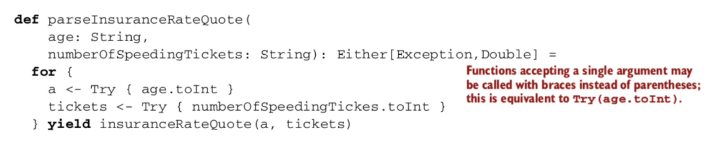  

Can implement versions of sequence and traverse for Either:
  

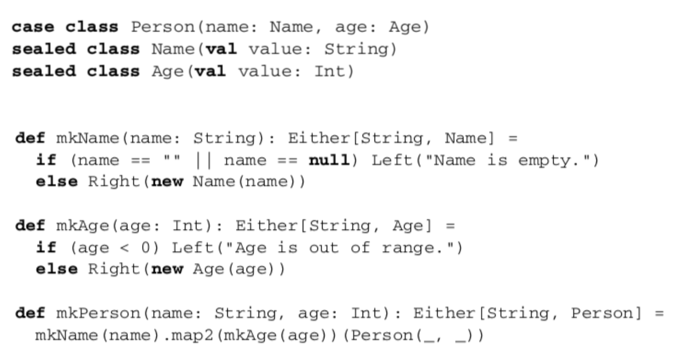  

```scala
class Person(name: String){
    def apply(age:Int) = println(s"I have aged $age years")
  }
  val bob = new Person("bob")
  bob.apply(43)
  bob (43) //invoking bob as a function === bob.apply(43)

  /*
  Scala runs on the JVM
  Functional programming:
  - compose functions
  - pass functions as args
  - return functions as results

  conclusion: FunctionX = Function1, Function2...Function 22
   */

  val simpleIncrementer = new Function1[Int, Int]{
    override def apply(arg: Int): Int = arg + 1
  }

  simpleIncrementer.apply(23) //24
  simpleIncrementer(23) // simpleIncrementer.apply(23)
  //defined a function!
  //All SCALA FUNCTIONS ARE INSTANCES OF these function_x types

  val stringConcatenator =  new Function2[String,String,String] {
    override def apply(v1: String, v2: String): String = v1+v2
  }

  //syntax sugars
  val doubler : Function1[Int,Int] = (x:Int)=>2 * x
  doubler(4)//8

  /*
  equivalent to the much longer:
  new Function[Int,Int] {
    override def apply(v1: Int): Int = 2 * x
  }
   */
//Higher-oirder functions: take functions as args / return functions as results

  val aMappedList = List(1,2,3).map(x=>x+1)
  println(aMappedList)
  val aFlatMappedList = List(1,2,3).flatMap(x=>List(x, 2*x))
  println(aFlatMappedList)
  val aFilterList = List(1,2,3,4,5).filter(_<=3) // equivalent to x => x <=3
  println(aFilterList)

  //all pairs between the numbers 1, 2, 3 antd the letters 'a','b','c'
  val allPairs = List(1,2,3).flatMap(number => List("a","b","c").map(letter=>s"$number-$letter"))
  println(allPairs)

  // for comprehensions
  val alternativePairs = for {
    number <- List(1,2,3)
    letter <- List('a','b,'c')
  }yield s"$number -$letter"

  /*
  Collections
   */
  //lists
  val aList = List(1,2,3,4,5)
  val firstElement = aList.head
  val rest = aList.tail
  val aPrependedList = 0 :: aList //List(0,1,2,3,4,5)
  val anExtendedList = 0+: aList :+ 6 //List(1,2,3,4,5,6)

  //sequences
  val aSequence: Seq[Int] = Seq(1,2,4) //Seq.apply(1,2,3)
  val accessedElement = aSequence(1) // the element at index 1 : 2

  //vectors: fast Seq implement
  val aVector = Vector(1,2,3,4,5)

  //sets = no duplicates
  val aSet = Set(1,2,3,4,5)//Set(1,2,3,4)
  val setHas5 = aSet.contains(5)// false
  val anAddedSet = aSet + 5 // Set(1,2,3,4)
  val aRemovedSet = aSet - 3 //Set(1,2,4)

  //ranges
  val aRange = 1 to 1000
  val twoByTwo = aRange.map(x=>2 * x).toList //List(2,4,6,8,...,2000)

  //tuples
  val aTuple = ("Bon Jovj","Helen",1840)

  //maps
  val aPhoneBook: Map[String,Int] = Map{
    ("Jack",23232323)
    ("Helen",22222)
    "Ryan" -> 384934
  }

```
