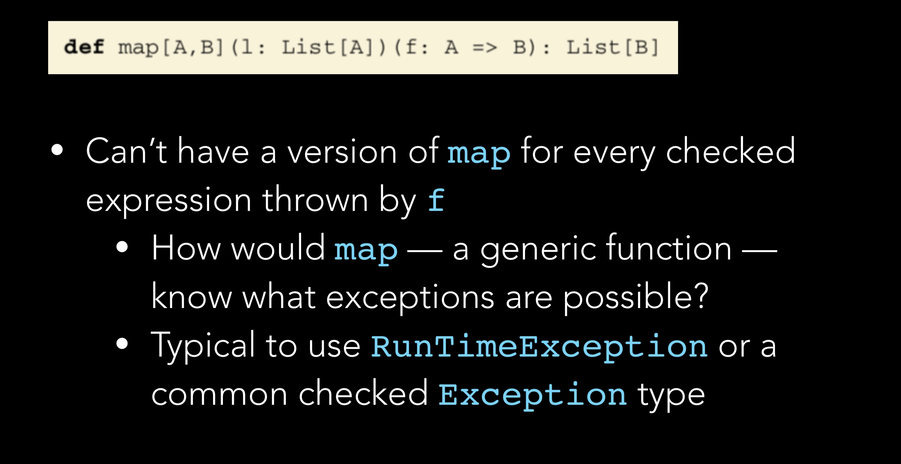

## Error and exception
#### Basic idea:
* Can represent failures and exceptions with ordinary values
* Can write higher-order functions that abstract out common patterns of error handiling and recovery
* Advantages
    - Safer and retains referential 
    - By using higher-order functions, can preserve the primary benefit of exceptions: consolidation of error-handling logic
#### Plan
*	Recreate **option** and **either** type
* problems of exception
  1. Exception break RT and introduce context dependence.
       - moves us away from simple reasoning of the substitution model
       - makes it possible to write confusing exception based code (exceptions should be used only for error handling, not for control flow)
  2. Exceptions are not type-safe
     1. The type of failingFn — Int => Int — tells us 
nothing about the fact that exceptions may occur
        - The compiler will certainly not force callers of failingFn to make a decision about how to handle those exceptions. 
        - If we forget to check for an exception in 
failingFn, this won’t be detected until runtime

CHECKED EXCEPTIONS
1. Java’s checked exceptions force a decision about 
whether to handle or reraise an error, but:
    - they result in significant boilerplate for callers 
    - they don’t work for higher-order functions, 
    - HOF cannot be aware of exceptions that could be raised by their arguments
  


#### Benefit of exeption
* They allow us to: 
   - consolidate and centralize error handling logic
* Purely functional solution should preserve this benefit
* Goal 
    - Completely type-safe, with full assistance from type-checker
  
    

* 解决方案有:
1. paritial function
      - Typically when function makes assumptions about inputs which are not implied by input types
      -  Also when function may not terminate on some input values 
         -  Not a recoverable error, so not of immediate interest
2. posibility 1
      - return a bogus value of type Double
        - always return xs.sum / xs.length, which becomess 0.0 / 0 (i.e., Double.NaN) when input is empty
        - return some sentinel value（是不是比如None，Nil之类的？）
      - problems with this
        - errors can silently propagate
          - caller can forget to check condition, and won't be alerted by compiler
            - failure in subsequent code
            - error may be detected much later
        - significant bolerplate code at caller end
          - 又很多的if statement来checkexception
        - not applicable to polymorphic code
        -   
        - special policies(i.e., callling conventions) expected from callers  


    - posibility 2
      - force caller to supply argument that tells function what to do when it can't handle input  

      - This turns mean into a toal function, but
        - immediate callers need direct knowlege of handling undefined case
          - limits caller to returning Double
          - what if the larger computation should be aborting instead? or doing something else?
          - caller把如果是exception要做什么的function也传进来  

之前说的是，如果想把error和exception考虑进去，那么把功能细分也不行，返回None Nil也不行，让caller传进去错误处理方法也不行。**那么为什么java这么做就行**？那么解决办法是option：

避免 null 使用
大多数语言都有一个特殊的关键字或者对象来表示一个对象引用的是"无"，在 Java，它是 null。在 Java 里，null 是一个关键字，不是一个对象，所以对它调用任何方法都是非法的。但是这对语言设计者来说是一件令人疑惑的选择。为什么要在程序员希望返回一个对象的时候返回一个关键字呢？

**Scala 的 Option类型**
为了让所有东西都是对象的目标更加一致，也为了遵循函数式编程的习惯，Scala 鼓励你在变量和函数返回值可能不会引用任何值的时候使用 Option 类型。在没有值的时候，使用 None，这是 Option 的一个子类。如果有值可以引用，就使用 Some 来包含这个值。Some 也是 Option 的子类。 None 被声明为一个对象，而不是一个类，因为我们只需要它的一个实例。这样，它多少有点像 null 关键字，但它却是一个实实在在的，有方法的对象。

Option 有两个子类别，Some 和 None。当程序回传 Some 的时候，代表这个函式成功地给了你一个 String，而你可以透过 get() 函数拿到那个 String，如果程序返回的是 None，则代表没有字符串可以给你。

在返回 None，也就是没有 String 给你的时候，如果你还硬要调用 get() 来取得 String 的话，Scala 一样是会抛出一个 NoSuchElementException 异常给你的。 我们也可以选用另外一个方法 getOrElse。这个方法在这个 Option 是 Some 的实例时返回对应的值，而在是 None 的实例时返回传入的参数。换句话说，传入 getOrElse 的参数实际上是默认返回值。

通过模式匹配分离可选值，如果匹配的值是 Some 的话，将 Some 里的值抽出赋给 x 变量：
```scala
def showCapital(x: Option[String]) = x match {
    case Some(s) => s
    case None => "?"
}
```
Scala 程序使用 Option 非常频繁，在 Java 中使用 null 来表示空值，代码中很多地方都要添加 null 关键字检测，不然很容易出现 NullPointException。因此 Java 程序需要关心那些变量可能是 null,而这些变量出现 null 的可能性很低，但一但出现，很难查出为什么出现 NullPointerException。 Scala 的 Option 类型可以避免这种情况，因此 Scala 应用推荐使用 Option 类型来代表一些可选值。使用 Option 类型，读者一眼就可以看出这种类型的值可能为 None。

实际上，多亏 Scala 的静态类型，你并不能错误地尝试在一个可能为 null 的值上调用方法。虽然在 Java 中这是个很容易犯的错误，它在 Scala 却通不过编译，这是因为 Java 中没有检查变量是否为 null 的编程作为变成 Scala 中的类型错误（不能将 Option[String] 当做 String 来使用）。所以，Option 的使用极强地鼓励了更加弹性的编程习惯。

详解 Option[T]
在 Scala 里 Option[T] 实际上是一个容器，就像数组或是 List 一样，你可以把他看成是一个可能有零到一个元素的 List。

当你的 Option 里面有东西的时候，这个 List 的长度是 1（也就是 Some），而当你的 Option 里没有东西的时候，它的长度是 0（也就是 None）。

**for 循环**
如果我们把 Option 当成一般的 List 来用，并且用一个 for 循环来走访这个 Option 的时候，如果 Option 是 None，那这个 for 循环里的程序代码自然不会执行，于是我们就达到了「不用检查 Option 是否为 None 这件事。
``` shell
scala> val map1 = Map("key1" -> "value1")
map1: scala.collection.immutable.Map[String,String] = Map(key1 -> value1)

scala> val value1 = map1.get("key1")
value1: Option[String] = Some(value1)

scala> val value2 = map1.get("key2")
value2: Option[String] = None

scala> def printContentLength(x: Option[String]) {
     |   for (c <- x){
     |     println(c.length)
     |   }
     | }
printContentLength: (x: Option[String])Unit

scala> printContentLength(value1)
6

scala> printContentLength(value2)
```
**map 操作**
在函数式编程中有一个核心的概念之一是转换，所以大部份支持函数式编程语言，都支持一种叫 map() 的动作，这个动作是可以帮你把某个容器的内容，套上一些动作之后，变成另一个新的容器。

现在我们考虑如何用 Option 的 map 方法实现 length: xxx 的输出形式：先算出 Option 容器内字符串的长度,然后在长度前面加上 "length: " 字样,最后把容器走访一次，印出容器内的东西
```
scala> value1.map(_.length).map("length: " + _).foreach(println)
length: 6

scala> value1.map("length: " + _.length).foreach(println)
length: 6
```
透过这样「转换」的方法，我们一样可以达成想要的效果，而且同样不用去做「是否为 None」的判断。
### solution: option data type
  

- represent-explicitly- in return type that function may not always have an answer: Defer to the caller for error-handling
- has tow cases: 
  - some, for when it is definded; 
  - None, for when it is underind
option是一个collection，但是at most have one element.要么是None，要么是Some，some里面可以是任意类型的值，比如单值，或者another collection
- can be used for mean as follows
#### sentinel vs. option type
  

### basic functions on option
1. usage patterns for option
   1. can factor out common patterns of error handling via higher-order functions
      1. frees us from writing boiler-plate that comes with exception-handling code

2. many List functions have their analogs for option:
   1. Think of an Option like a List with at most one element
  - 
```scala
def map [B] (f: A => B): Option[B] = this match {
    case None => None
    case Some(a) => Some(f(a))
}
def getOrElse [B>:A] (default: => B): B = this match {
    case None => default
    case Some(a) => a
}
def flatMap [B] (f: A => Option[B]): Option[B] = this match {
    case None => None
    case Some(a) => f(a)
}
def flatMap [B] (f: A => Option[B]): Option[B] = map(f) getOrElse None

def orElse [B>:A](ob: => Option[B]): Option[B] = this match {
 case None => ob 
 case _ => this
}
def orElse [B>:A] (ob: => Option[B]): Option[B] = 
 this map (Some(_)) getOrElse ob

def filter (f: A => Boolean): Option[A] = this match {
 case Some(a) if f(a) => this
 case _ => None
}

def filter (f: A => Boolean): Option[A] =
 flatMap(a => if (f(a)) Some(a) else None)
```

