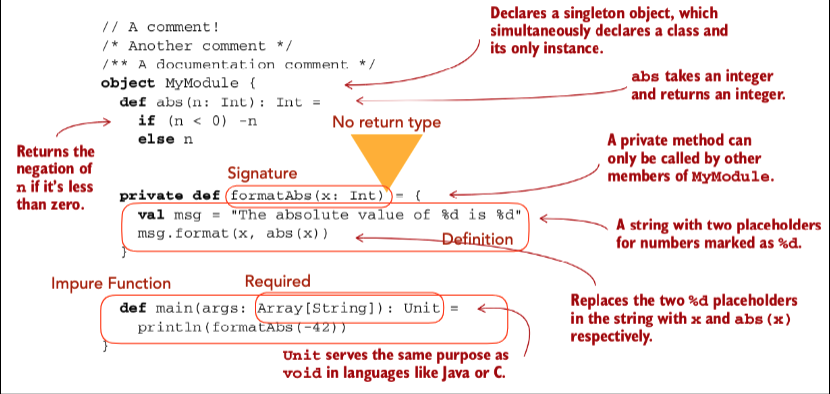
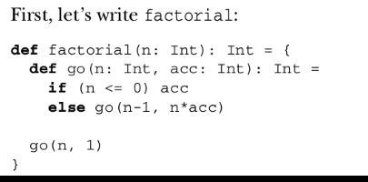

## Scala language
* Functional programming is a restriction on how you 
write code, not what you can express.  
* You can do everything without side effects
#### EXACTLY WHAT IS A (PURE) FUNCTION?
*  A function f with input type A and output type B is: 
     [written in Scala as a single type: **A => B**, pronounced “**A to B**” or “A arrow B”]
* A computation that relates:  Every value a of type A to Exactly one value b of type B 
* Such that b is determined solely by the value of a. 
* Any changing state of an internal or external process is irrelevant to computing the result f(a).
* For example, a function intToString having type Int => String will take every integer to a corresponding string. Furthermore, if it really is a function, it will do nothing else.
#### REFERENTIAL TRANSPARENCY (RT)
* An expression* e is referentially transparent if, for all programs p, all occurrences of e in p can be replaced by the result of evaluating e without affecting the meaning of p. 

#### RT,PURITY AND THE SUBSTITUTION MODEL 
* With referential transparency, everything a function 
does is represented by the value that it returns, 
according to the result type of the function. 
* Enables a simple and natural way of reasoning about 
program evaluation called the substitution model.  
* Computation proceeds much like we’d solve an 
algebraic equation, enabling equational reasoning 
about programs.
对纯粹度的概念进行形式化，有助于我们深入了解函数式编程为什么更加模块化。模 块化程序是由组件组成的，这些组件又是可理解、可复用，并独立于整体存在的。
#### LOCAL REASONING 
* Substitution model is simple to reason about because 
effects of evaluation are purely local:
  - They affect only the expression being evaluated
  - Need not mentally simulate sequences of state 
updates to understand a block of code. 
* Understanding requires only local reasoning:
  - Simply look at the function’s definition and substitute the arguments into its body.
因为对运算的影响纯粹是局部的（只对那些 赋值表达式产生影响），不需要先在内心模拟一系列状态的更新才理解这一段代码。只需要理解局部的推理（local reasoning），不必费心地去跟踪函数执行前后的状态变化，只用 简单地看一下函数的定义，把它替换成一个参数。即使没有用过“替代模型”这一名词， 你也一定用过这种方式来推理程序。

#### MODULARITY, COMPOSABILITY 
* Modular programs consist of composable components that can be understood and 
reused independently of the whole 
  - Meaning of  the whole depends only on: 
    - the meaning of the components, and 
    - the rules governing their composition
* A pure function is modular and composable because it is a black box: 
  - It separates the logic of the computation itself from “what to do with the result” and “how to obtain the input”
    - Input is obtained exactly one way: via argument(s) to the function
    - Output is simply computed and returned
整体程 序只取决于组件和它们组成的规则，也就是说它们是可组合的（composable）。纯函数是模 块化的、可组合的，因为它从“对结果做什么”和“如果获取输入”中分离了计算本身的逻辑，就像一个黑盒子。对输入的获取只有一种方式：通过参数传给函数。输出也只是简 单地将计算结果返回。
#### REUSABILITY 
* Separating these concerns makes the computation’s 
logic more reusable:
  - We may reuse the logic wherever we want  
without worrying about side effects
把这些关注点分离开，计算也更容易被复用。我们可以复用这些逻 辑，而不必担心输入或输出对整个上下文引起的副作用。可以看到在 buyCoffee 的例子 里，消除了支付完成时的输出所引起的副作用，测试或者进一步组合（比如 buyCoffees 和 coalesce）时，函数更容易复用。
  
REPL--> Read-Evaluate-Print Loop

### MODULES,OBJECTS,NAMESPACES 
1. Every value in Scala is an object
2. Any object may have zero or more members
  - Methods declared with def
  - Other objects declared with val or object
3. An object whose primary purpose is giving its members a namespace is sometimes called a module
4. Members within an object can refer to each other unqualified, but need to use this. to access the enclosing object
5. infix
   - Method names can be used infix when being called with a single argument
   - Example: MyModule.abs(-42) can be called by: MyModule abs -42
6. An **object’s** member can be brought into scope by **importing** it
7. **All** (nonprivate) members can be brought into scope by using an underscore
   - import MyModule._
8. Scala **functions** are values: 
  - Can be assigned to variables
  - Can be stored in data structures
  - Can be passed as arguments to functions
 1. INNER FUNCTIONS  
  
  - Scala compiler detects this sort of self-recursion and compiles it to the same sort of byte code as would be for a while loop, so long as recursive call is in tail position
  - Can tell Scala compiler when tail call elimination is 
expected using tailrec annotation: compilation error if it’s unable to eliminate tail calls for the function
2. POLYMORPHIC   FUNCTIONS 
  - Specifically, **parametric polymorphism**
  - Polymorphic functions can operate on any type of data
3. ANONYMOUS FUNCTIONS 
   - We often want to write functions for one-time use of sending to an HOF.  Functional programming allows for anonymous functions or function literals.
   - `scala> findFirst(Array(7,9,3), (x: Int) => x == 9)`
4. An object is being created with a method called apply
res2: 
  - An object with an apply method can be called as if it were the method
    - 比如val as = List(1,3,5)，这个是因为List这个object，里面有一个apply方法，所以可以像调用方法一样
  - When we write `(a, b) => a < b`, it is syntactic sugar for:
  ```
    val lessThan = new Function2[Int, Int, Boolean] {
            def apply(a: Int, b: Int) = a < b
    }
  ```
   lessThan has type **Function2**[Int, Int, Boolean],another way of writing `(Int, Int) => Boolean`.  **Function2 is a trait** (i.e., interface) with an apply method.
   - When lessThan(10, 20) is called, actually its **apply** method is called:
  ```
  scala> val b = lessThan.apply(10, 20)
            b: Boolean = true
  ``` 
  在Scala中，有22个Function0()，function1,function2, function...,function22
#### FOLLOWING TYPES TO IMPLEMENTATIONS 
* Consider this HOF for performing **partial application**:
  `def partial1[A, B, C] (a: A, f: (A, B) => C): B => C`
* Three type parameters: A, B, C
* Two arguments: a (of type A) and f (function of type (A, B) => C)
• Return type is a function of type B => C

##### paritial application:
```scala
scala> def plainOldSum(x: Int, y: Int) = x + y
plainOldSum: (x: Int,y: Int)Int
scala> plainOldSum(1, 2)
res4: Int = 3 

scala> def curriedSum(x: Int)(y: Int) = x + y
curriedSum: (x: Int)(y: Int)Int
scala> curriedSum(1)(2)
res5: Int = 3 
```
plainOldSum是旧式的求和函数，curriedSum是柯里化后的版本。你会看到，curriedSum函数是有两个参数列表的，也就是两对小括号。当你以curriedSum(1)(2)的形式去调用这个函数时实际上发生的动作是：curriedSum接受第一个参数1之后，会返回一个函数，这个返回的函数再来接受传入的第二个参数2，这是柯里化的运作方式。但是这并不意味着你可以这样去调用：
```scala> def curriedSum(x: Int)(y: Int) = x + y
curriedSum: (x: Int)(y: Int)Int

scala> val first=curriedSum(1)
<console>:8: error: missing arguments for method curriedSum;
follow this method with `_' if you want to treat it as a partially applied function
       val first=curriedSum(1)
                           ^
```
你看到了，编译器报错了，因为前面我们说的是一个柯里化函数的后台运作方式，从调用的角度来看，curriedSum毕竟是需要两个参数集合的，如果你只给定一个，编译器自然会报错，除非你显式地告诉编译器：我想要得到“接受了第一个参数之后转化而来的那个函数”，具体的做法就是在curriedSum(1)加一个下划线。
```scala
scala> val first=curriedSum(1)_
first: Int => Int = <function1>
```
上面的动作就是做了一个partially apply,下划线就是转化之后的函数的参数列表的占位符。但是这里有一个有意思的地方，按理说我们应该这样写：val first=curriedSum(1) _也就是在函数名后面加一个空格再跟下滑线，就像val p=println _一样,但是你不能写成val p=println_，因为println_永远是一个合法的标示符，因而发生了歧义，但是curriedSum(1)_则不会有歧义，所以是可以这样写的。但总的来说统一使用空格再加下划线更直观易读。

柯里化技术的使用场景是把一个通用性或者讲叫泛化的函数向一个特定的方向去转化，进而得到一个需要的函数。
`Most of time, we actually use in the other way by creating a specialized version of generalized function through curry function.`
这里我们只是再通过改变参数的值的展示柯里化技术，更加丰富和生动的示例应该是发生在高阶函数里。

最后提一下，Scala提供了相应的机制可以让函数在柯里化和非柯里化之间自由的转换：
```
scala> def plainOldSum(x: Int, y: Int) = x + y
plainOldSum: (x: Int, y: Int)Int
scala> val curriedSum = (plainOldSum _).curried
curriedSum: Int => (Int => Int) = <function1>
scala> curriedSum(1)(2)
res2: Int = 3
scala> val uncurriedSum = Function.uncurried(curriedSum)
uncurriedSum: (Int, Int) => Int = <function2>
scala> uncurriedSum(1,2)
res4: Int = 3
```
##两种技术的对比

只从最终实再的效果上来看，我认为两种技术是非常相似的，都是通过对函数参数进行部分应用（partially apply )将函数转换成了另一个函数。从灵活性上对比的话，显然Partially Applied Function更加灵活，因为它不需要像柯里化那样，必须针对参数列表集从左至右链式地进行转换。

————————————————
版权声明：本文为CSDN博主「Laurence Geng」的原创文章，遵循CC 4.0 BY-SA版权协议，转载请附上原文出处链接及本声明。
原文链接：https://blog.csdn.net/bluishglc/article/details/51042940

1.2. 换行字符
语法:
`semi ::= ";" | nl{nl}`
Scala 是一个基于行的语言。分号和换行均可作为语句的结束。如果换行满足以下三
个条件则会被认为是一个特殊符号"nl":
1. 换行之前的符号是一个语句的结束
2. 换行之后的符号是一个语句的开始
3. 符号处在一个允许多语句的区域中
1.3. 字面值 literal
字面值包括整数，浮点数，字符，布尔值，记号，字符串。这些字面值的语法均和
Java 中的字面值一致。
语法：
```scala
Literal ::= ["-"] integerLiteral
| ["-"] floatingPointLiteral
| booleanLiteral
| characterLiteral
| stringLiteral
| symbolLiteral
| "null"
```
### 3.2. 值类型
Scala 中的每个值都有一个以下格式的类型。
* 3.2.1. 单例类型
语法：
`SimpleType ::= Path "." type`
单例类型具有 p.type 的形式，p 是一个路径，指向一个期望与 scala.AnyRef 一
致(§6.1)的值。类型指一组为 null 的或由 p 表示的值。
一个稳定类型指要么是一个单例类型，要么是特征 scala.Singleton 的子类型。
* 3.2.2. 类型映射
语法：
SimpleType ::= SimpleType "#" id
类型映射 T#x 指类型 T 的类型成员 x。如果 x 指向抽象类型成员，那么 T 必须是一个
稳定类型(§3.2.1)。
语法：
* 3.2.4. 参数化类型
语法：
```scala
SimpleType ::= SimpleType TypeArgs
TypeArgs ::= "[" Types "]"
```
参数化类型 T[U1,...,Un]包括类型指示 T 以及类型参数 U1,...,Un，n >=1。T 必
须指向一个具有个参数类型 a1,...,an的参数构造方法。
类型参数具有下界 L1,...,Ln和上界 U1,...,Un。参数化类型必须保证每个参数
与其边界一致：σLi<:Ti<:σUi，这里 σ 表示[a1:=T1,...,an:=Tn]。
示例 3.2.2 以下是一些类型定义(部分)：
class TreeMap[A <: Comparable[A], B]{ ... }
class List[A] { ... }
class I extends Comparable[I] { ... }
以下是正确的参数化类型：
TreeMap[I, String]
List[I]
List[List[Boolean]]
* 3.2.5. 元组类型
语法：
`SimpleType ::= "(" Types [","] ")"`
元组类型(T1,...,Tn)是类 scala.Tuplen[T1,...,Tn](n>=2)的别名形式。此类
型可以在结尾处有个额外的逗号，例：(T1,...,Tn,)。
元组类是 case 类，其字段可以用选择器_1,...,_n 来访问。在对应的 Product 特
征中有他们的抽象函数。这些元组类以及 Product 特征都是标准 Scala 类库的一部分，
其形式如下：
```scala
case class Tuplen[+T1,...,+Tn](_1: T1,...,_n: Tn) extends
Productn[T1,...,Tn]{}
trait Productn[+T1,...,+Tn]{
 override def arity = n
 def _1: T1
 ...
 def _n: Tn
}
```
* 3.2.6. 标注类型
语法：
AnnotType ::= SimpleType {Annotation}
标注类型 T a1,...,an 就是给类型 T 加上标注 a1,...,an.
* 3.2.7. 复合类型
语法：
```scala
CompoundType ::= AnnotType {"with" AnnotType} [Refinement]
| Refinement
Refinement ::= [nl] "{" RefineStat {semi RefineStat} "}"
RefineStat ::= Dcl
| "type" TypeDef
|
```
复合类型 T1 with ... with Tn {R}指一个拥有 T1,...,Tn 类型中的成员以及修
饰{R}的对象。如果对象中有声明或定义覆盖了成分类型 T1,...,Tn 中的声明或定义，就
会应用通常的覆盖规则(§5.1.4)；否则这个声明或定义就将是所谓的“结构化的”2。在
一个结构化修饰的方法声明中，任何值参数的类型只是指修饰内部包含的类型参数或抽象
类型。也就是它必须指代一个函数本身的类型参数，或者在修饰内部的一个类型定义。该
* 3.2.8. 中缀类型
语法：
`InfixType ::= CompoundType {id [nl] CompoundType}`
中缀类型 T1 op T2由一个中缀算符 op 应用到两个操作数 T1和 T2上得来。这个类型
等价于类型应用 op[T1, T2]。中缀算符可以是除*之外的任意的标识符，因为*被保留作
为重复参数类型的后缀(§4.6.2)。
所有类型的中缀算符拥有同样的优先级；因此必须用括号来改变顺序。类型算符的结
合性(§6.12)由其形式来决定：由":"结尾的类型算符是右结合的，其他的是左结合的。
在 一 个 连 续 的 类 型 中 缀 运 算 t0 op1 t1 op2...opn tn 里 ， 所 有 的 算 符
op1,...,opn 必须具有相同的结合性。如果都是左结合的，该序列就被解析为(...(t0
op1 t1) op2...) opn tn，否则会被解析为 t0 op1 (t1 op2 (...opn tn)..)。
* 3.2.9. 函数类型
语法：
`Type ::= InfixType "=>" Type`
`| "(" ["=>" Type] ")" "=>" Type`
类型 (T1,...,Tn) => U 表示那些参数类型为 T1,...,Tn，并产生一个类型为 U 的
结果的函数。如果只有一个参数类型则(T)=>U 可以简写为 T=>U。类型(=>T)=>U 表示以
类型为 T 的传名(§4.6.1)参数并产生类型为 U 的结果。函数类型是右结合的，例：
S=>T=>U 等价于 S=>(T=>U)。
函数类型是定义了 **apply 函数** 的类类型的简写。比如 n 型函数类型(T1,...,Tn) =>
U 就是类 Functionn[T1,...,Tn,U]的简写。Scala 库中定义了 n 为 0 至 9 的这些类类
型，如下所示：
```scala
package scala
trait Functionn[-T1,...,-Tn, +R] {
 def apply(x1: T1,...,xn: Tn): R
 override def toString = “<function>”
}
```
因此，函数类型与结果类型是协变(§4.5)的，与参数类型是逆变的。
传名函数类型(=>T)=>U 是类类型 ByNameFunction[T,U]的简写形式，定义如下：
```scala
package scala
trait ByNameFunction[-T, +R] {
 def apply(x: => T): R
 override def toString = “<function>”
}
```
* 3.2.10.既存类型
语法：
```scala
Type ::= InfixType ExistentialClauses
ExistentialClauses ::= "forSome" "{" ExistentialDcl
{semi ExistentialDcl} "}"
ExistentialDcl ::= "type" TypeDcl
| "val" ValDcl
```
既存类型具有 T forSome {Q}的形式，Q 是一个类型声明的序列(§4.3)。设
t1[tps1]>:L1<:U1,...,tn[tpsn]>:Ln<:Un 是 Q 中声明的类型(任何类型参数部分
[tpsi]都可以没有)。每个类型 ti 的域都包含类型 T 和既存子句 Q。类型变量 ti 就称为
在类型 T forSome {Q}中被绑定。在 T 中但是没被绑定的类型变量就被称为在 T 中是自
由的。
T forSome {Q}的类的实例就是类 σT，σ 是 t1,...,tn 上的迭代，对于每一个 i，
都有 σLi<:σti<:σUi。既存类型 T forSome{Q}的值的集合就是所有其类型实例值的集

* 3.2.11. Predef 中定义的原始类型
每个 Scala 程序都默认 import 一个 Predef 对象。该对象定义了一些原始类型做
为类类型的别名。数值类型和布尔型有标准的 Scala 类。String 类型与宿主系统的
String 类型一致。在 Java 环境下，Predef 包括以下类型绑定：
type byte = scala.Byte
type short = scala.Short
type char = scala.Char
type int = scala.Int
type long = scala.Long
type float = scala.Float
type double = scala.Double
type Boolean = scala.Boolean
type String = java.lang.String
### 3.3. 非值类型
以下类型并不表示值的集合，也并不显式地出现在程序中。它们只以已定义标识符的
内部类型而引入。
* 3.3.1. 方法类型
* 方法类型在内部表示为(Ts)U，(Ts)是一个类型序列(T1,...,Tn) n>=0，U 是一个
(值或者方法)类型。这个类型表示一个命名的方法，其参数的类型是 T1,...,Tn，返回结
果的类型是 U。
方法类型是右结合的，(Ts1)(Ts2)U 被处理的方式是(Ts1)((Ts2)U)。
一个特例是没有参数的方法类型。可以写为=>T 的形式。无参数方法名称表达式将会
在每次名称被引用时求值。
方法类型并不以值的类型的形式存在。如果方法名以值的方式被引用，其类型将会被
自动转换为对应的函数类型(§6.25)。
示例 3.3.1 以下声明：
```scala
def a: Int
def b (x: Int): Boolean
def c (x: Int)(y: String, z: String): String
产生以下类型：

a: => Int
b: (Int) Boolean
c: (Int)(String, String) String
```

* 3.3.2. 多态方法类型
多态方法类型在内部表示为 [tps]T，[tps]是类型参数部分 [a1 >: L1 <:
U1,...,an >: Ln <: Un]，n>=0，T 是一个(值或方法)类型。该类型表示一个以
S1,...,Sn 为类型参量并产生类型为 T 的结果的命名方法，参数类型 S1,...,Sn 与下界
L1,...,Ln 和上界 U1,...,Un 一致(§3.2.4)。
示例 3.3.2 以下声明：
```scala
def empty[A]: List[A]
def union[A <: Comparable[A]] (x: Set[A], xs: Set[A]): Set[A]
产生如下类型：
empty: [A >: Nothing <: Any] List[A]
union: [A >: Nothing <: Comparable[A]] (x: Set[A], xs: Set[A]) Set[A]
```

* 3.3.3. 类型构造器
类型构造器 在 内部的表示方法类似于多态方法类型 。 [+/- a1 >: L1 <:
U1,...,+/-an >: Ln <: Un] T 表示一个期望是类型构造器参数(§4.4)或有对应类型
参数子句的抽象类型构造器绑定(§4.3)的类型。
示例 3.3.3 以下是类 Iterable[+X]的片段：
```scala
trait Iterable[+X] {
 def flatMap[newType[+X]<:Iterabe[X], S](f: X => newType[S]): newType[S]
}
```
从概念上来讲，类型构造器 Iterable 是匿名类型[+X] Iterable[X]的名称，在flatMap 中传递给 newType 类型构造器参数。
* 3.4. 基本类型和成员定义
类成员的类型取决于成员被引用的方式。主要有三个概念：
1. 类型 T 的基本类型集合
2. 从前缀类型 S 中可见的类 C 中的类型 T
3. 类型 T 的成员绑定集合
   
以下是这三个概念的详细定义
1. 类 T 的基本类型集合定义如下
   -  C 是类型 C 以及其父类型 T1,...,Tn 的基本类型，同时也是组合类型 T1
with ... with Tn {R}的基本类型。
   - 类型别名的基本类型是别名的类型的基本类型
   - 抽象类型的基本类型是其上界的基本类型
   - 参数化类型 C[T1,...,Tn]的基本类型是类型 C 的基本类型，C 的每一个类
型参数 ai被对应的参数类型 Ti 代替
   - 单例类型 p.type 的基本类型是类型 p 的基本类型
   - 复合类型 T1 with ... with Tn {R}的基本类型是所有 Ti 的基本类型的
缩减合并。意思是设合集 Φ 为 Ti 的基本类型的合集，如果 Φ 包括同一个类
的多个类型实例，比如 Si#C[Ti1,...,Tin](i∈I)，那么所有的这些实例
将会被一个与其他一致的实例代替。如果没有这样一个实例存在就会导致错
误。如果存在这样一个缩减合并，那么该集合会产生类类型的集合，不同的
类型是不同类的实例。
    - 类型选择 S#T 的基本类型如下确定：如果 T 是一个抽象类或别名，那么前面的子句就会被应用。否则 T 必须是一个定义在某个类 B 中的(可能还是参数化的)类类型。那么 S#T 的基本类型就是从前缀类型 S 中看到的 B 中 T 的基
本类型。
    - 既存类型 T forSome {Q}的基本类型是所有 S forSome {Q}类型，S 是T 的基本类型
2. 从前缀类型 S 中可见的类 C 中的类型 T 只在以下条件下起作用，前缀类型 S 有一
个类型 C 的类型实例作为基本类型，即 S"#C[T1,...,Tn]。我们有以下定义
    - 如果 S = ε.type，那么从 S 看到的 C 中的 T 就是 T 本身
    - 否则，如果 S 是既存类型 S" forSome {Q}，从 S"看 C 中的 T 将会是 T"，那么从 S 看 T 中的 C 将会是 T" forSome {Q}
    - 否则，如果 T 是某类 D 的第 i 个类型参数，那么
    - 如果 S 有基本类型 D[U1,...,Un]，[U1,...,Un]是类型参数，那么从S 中看到的 C 中的 T 就是 Ui
    - 否则，如果 C 定义在类 C"中，那么从 S 中看到的 C 中的 T 与在 S"中看到的 C"中的 T 是一样的
    - 否则，如果 C 不是定义在其他类中，那么从 S 中看到的 C 中的 T 就是 T本身
    - 否则，如果 T 是某类 D 的单例类型 D.this.type，那么
    - 如果 D 是 C 的子类，S 的基本类型中有一个类 D 的类型实例，那么从 S中看到的 C 中的 T 就是 S
* 3.5. 类型间的关系
  **类型间有两种关系**：
1. 类型恒等 T ≡ U T 和 U 可以在任何情况下互相替换
2. 一致 T <: U 类型 T 与类型 U 一致

4. 基本声明与定义
语法：
```scala
Dcl ::= "val" ValDcl
| "var" VarDcl
| "def" FunDcl
| "type" {nl} TypeDcl
PatVarDef ::= "val" PatDef
| "var" VarDef
Def ::= PatVarDef
| "def" FunDef
| "type" {nl} TypeDef
| TmplDef
```
4.1. 值声明与定义
语法：
```scala
Dcl ::= "val" ValDcl
ValDcl ::= ids ":" Type
Def ::= "val" PatDef
PatDef ::= Pattern2 {"," Pattern2} [":" Type] "=" Expr
ids ::= id {"," id}
```
4.2. 变量声明与定义
语法：
Dcl ::= "var" VarDcl
Def ::= "var" VarDef
VarDcl ::= ids ":" Type
VarDef ::= PatDef
| ids ":" Type "=" "_"

* 4.3. 类型声明与类型别名
语法：
```scala
Dcl ::= "type" {nl} TypeDcl
TypeDcl ::= id [TypeParamClause] [">:" Type] ["<:" Type]
Def ::= type {nl} TypeDef
TypeDef ::= id [TypeParamClause] "=" Type
```
type t[tps] = T 中的类型 T 不能直接或间接的引用到命名 t。如果抽象类型是其自身
直接或间接的上界或下界也会导致错误。
示例 4.3.1 下面是合法的类型声明与定义：
type IntList = List[Integer]
type T <: Comparable[T]
type Two[A] = Tuple2[A, A]
type MyCollection[+X] <: Iterable[X]
* 4.5. 差异标注
差异标注指示了参数化类型的实例在子类型(§3.5.2)上是如何不同的。“+”类型的差异指协变的依赖，“-”类型的差异指逆变的依赖，未标注指不变依赖。
* 4.6. 函数声明与定义
语法：
```scala
Dcl ::= "def" FunDcl
FunDcl ::= FunSig : Type
Def ::= "def" FunDef
FunDef ::= FunSig [":" Type] "=" Expr
FunSig ::= id [FunTypeParamClause] ParamClauses
FunTypeParamClause ::= "[" TypeParam {"," TypeParam} "]"
ParamClauses ::= {ParamClauses} [[nl] "(" "implicit" Params ")"]
ParamClause ::= [nl] "(" [Params] ")"}
Params ::= Param {"," Param}
Param ::= {Annotation} id [":" ParamType]
ParamType ::= Type
        | "=>" Type
        | Type "*"
```
函数声明具有这样的形式：def f psig: T，f 是函数的名称，psig 是参数签名，T 是返回类型。
函数定义 def f psig: T = e 还包括了函数体 e

* 4.6.1. 叫名参数
语法：
`ParamType ::= "=>" Type`
值参数类型可以有前缀=>，例如: x: => T。这样一个参数的类型就是无参方法类型=>T。这表明对应的参数并没有在函数应用处求值，而是在函数中每次使用时才求值。也就是该参数以叫名的方式求值。
示例 4.6.1 声明：
`def whileLoop (cond: => Boolean) (start: => Unit): Unit`
表示 whileLoop 的所有参数都以叫名的方式求值

* 4.6.2. 重复参数
语法：
`ParamType ::= Type "*"`
参数段中的最后一个参数可以有后缀"*"，例如：(…, x: T*)。方法中这样一个重复参数的类型就是序列类型 scala.Seq[T]。具有重复参数 T*的方法具有可变数目的类型为 T 的参数。也就是,如果方法 m 的类型(T1,…,Tn,S*)U 应用到参数(e1,…,ek)上，且有 k>=n，那么 m 就被认为在应用中具有类型(T1,…,Tn,S,…,S)U，S 重复 k-n 次。这个规则的唯一例外是如果最后一个参数用_*类型标注的方式被标记为一个序列参量。如果以上的m应用到参数(e1,…,en,e":_*) 上,那么该应用中m的类型就被认为(T1,…,Tn,scala.Seq[S])。
示例 4.6.2 以下方法定义计算了可变数目的整形参数的和：
```scala
def sum(args: Int*) = {
 var result = 0
 for(arg <- args.elements) result += arg
 result
}
```
以下对该方法的应用可得出的结果为 0，1，6：
sum()
sum(1)
sum(1,2,3)
更进一步的，假设以下定义：
var xs = List(1,2,3)
以下对方法 sum 的应用是**错误**的：
sum(xs) // ***** error: expected: Int, found: List[Int]
相比较，以下应用是正确的，并产生结果 6：
sum(xs:_*)

4.6.3. 过程
语法
```scala
FunDcl ::= FunSig
FunDef ::= FunSig[nl] "{"Block"}"
```
过程有特殊语法，例如，返回 Unit 值{}的函数。过程声明只是返回类型被忽略的函数声明。返回类型自动定义为 Unit 类型。例如 def f(ps)等价于 def f(ps):Unit。
过程定义是返回类型及等号被忽略的函数定义；其定义表达式必须是一个代码块。例
如：def f(ps){stats}等价于 def f(ps):Unit={stats}.
示例 4.6.3 以下是名为 write 的过程的声明与定义：
```scala
trait Writer {
 def write(str: String)
}
object Terminal extends Writer{
 def write(str: String) {System.out.println(str)}
}
以上代码被内部自动完成为：
trait Writer {
 def write(str: String): Unit
}
object Terminal extends Writer{
 def write(str: String): Unit = {System.out.println(str)}
}
```
* 4.6.4. 方法返回类型推断
类成员定义 m 重载了基类 C 中的一些其他的函数 m"可以略去返回类型，即使是递归的也无所谓。因此被重载的函数 m"的返回类型 R"(被认为是 C 的成员) 在对 m 的每次调用中被认为是 m 的返回类型。在以上方式中，m 右侧的类型 R 可以被确定，并作为 m 的返回类型。注意到 R 可以与 R"不同，只要 R 与 R"一致即可。
示例 4.6.4 假定有以下定义：
```
trait I {
 def factorial(x: Int): Int
}
class C extends I {
 def factorial(x: Int) = if (x==0) 1 else x * factorial(x - 1)
}
```
这里忽略 C 中 factorial 的返回类型是没问题的，即使这是一个递归的方法。

5. 类与对象
语法：
```scala
TmplDef ::= ["case"] "class" ClassDef
| ["case"] "object" ObjectDef
| "trait" TraitDef
```
Scala Trait(特征) 相当于Java 的接口，实际上它比接口还功能强大。 与接口不同的是，它还可以定义属性和方法的实现。 一般情况下Scala的类只能够继承单一父类，但是如果是Trait(特征) 的话就可以继承多个，从结果来看就是实现了多重继承。
类(§5.3)与对象(§5.4)都用模板来定义。
* 5.2. 修饰符
语法：
```scala
Modifier ::= LocalModifier
| AccessModifier
| "override"
LocalModifier ::= "abstract"
| "final"
| "sealed"
| "implicit"
| "lazy"
AccessModifier ::= ("private" | "protected") [AccessQualifier]
AccesQualifier ::= "[" (id | "this") "]"
```
成员定义前的修饰符会影响其标定的标识符的可见性及使用。如果给出了多个修饰符，
其顺序没有关系，但是同一个修饰符不能重复出现。重复定义前的修饰符将应用于所有定
义上面。控制修饰符的有效性与含义的规则如下：
- **private** 修饰符可以应用在模板的任何定义与声明上。这些成员只能被直接封闭
的模板和其伴随模块及伴随类访问(示例 5.4.1)。他们不能被子类继承，也不能
覆盖父类中的定义。此修饰符可由一个标识符 C 限定(如 private[C])，表示该类或包包含该定义。由该标识符标识的成员只能由包 C 或类 C 以及他们的伴随模块(§5.4)来访问。这些成员也仅能由 C 内的模板访问。
限定的一个特殊形式是 private[this]。由该标识符标记的成员 M 只能从该成员定义的对象内访问。也就是选择 p.M 只有在前缀是 this 和包含该引用的类 O的 O.this 时才合法。这也就是没有加限定的 private 的应用。标记为没有限定的 private 的成员称为类私有，标记为 private[this]的成
员称为对象私有。不管是类私有还是对象私有都可以称为私有成员，但是
private[C]不是，C 是一个标识符，在后者该成员称为限定私有。
类私有或对象私有成员不能是抽象的，并且不能再由 protected，final 或override 修饰符限定。
- **protected** 标识符应用到类成员定义上。类的保护成员可以从以下位置访问：
  - 定义的类模板内
  - 所有以定义的类为基类的模板
- **override** 修饰符应用于类成员定义或声明。对于那些覆盖了父类中某些实体成
员定义的成员定义与声明，该修饰符是必须的。如果给出了 override 修饰符，
那么应当至少有一个被覆盖的成员定义或声明(可以是实体的或者抽象的)
- 当 override 和 abstract 一起出现时具有显著不同的意义。该修饰符组合仅用于特征的值成员。标记为 abstract override 的成员必须覆盖至少一个其他成员，所有被其覆盖的成员必须是不完整的。成员 M 是不完整的条件是：M 是抽象的(例如由一个声明定义)或者标记为abstract 和 override，这样即使是被 M 覆盖的成员也成为不完整的。
注意修饰符组合 abstract override 并不影响一个成员是不是实体或者抽象
的概念。如果一个成员仅给出了一个声明，那么它就是抽象的；如果给出了完整
定义，那么它就是实体的。
- **abstract** 修饰符可用于类定义。但没必要用于特征。对于具有不完整成员的类
来说是必须的。抽象类不能通过构造器调用初始化(§6.10)，除非后跟覆盖了类
中所有不完整成员的混入和/或修饰体。只有抽象类和特征可以有抽象术语成员。
正如前文所述，abstract 修饰符可以和 override 连用，应用于类成员定义。
- **final** 修饰符应用于类成员定义和类定义。标记为 final 的类成员定义不能在子类中被覆盖。标记为 final 的类不能被模板继承。final 对于对象定义是多余的。标记为 final 的类或对象的成员隐含定义为 final 的，所以对它们来说final 修饰符也是多余的。final 修饰符不能修饰不完整成员，并且在修饰符列
表中不能与 private 或 sealed 组合。

- **sealed** 修饰符应用于类定义。标记为 sealed 的类不能被直接继承，除非继承的模板和该类定义于同一源文件。然而 sealed 的类的子类可以在任何地方继承。
- **lazy** 修饰符应用于值定义。标记为 lazy 的值只在其第一次被访问(可能永远也不发生)时初始化。试图在值初始化时访问该值可能导致循环行为。如果在初始化时有异常被抛出，该值则被认为没有被初始化，随后的访问将会继续尝试对其右侧表达式求值。

### 6. 表达式
语法：
```scala
Expr ::= (Bindings | id | "_") "=>" Expr| Expr1
Expr1 ::= "if" "(" Expr ")" {nl} Expr [[semi] else Expr]
| "while" "(" Expr ")" {nl} Expr
| "try" "{" Block "}" [catch "{"
CaseClauses "}"] ["finally" Expr]
| "do" Expr [semi] "while" "(" Expr ")"
| "for" ("(" Enumerators ")" |
"{" Enumerators "}") {nl} ["yield"] Expr
| "throw" Expr
| "return" Expr
| [SimpleExpr "."] id "=" Expr
| SimpleExpr1 ArgumentExprs "=" Expr
| PostfixExpr
| PostfixExpr Ascription
| PostfixExpr "match" "{" CaseClauses "}"
PostfixExpr ::= InfixExpr [id [nl]]
InfixExpr ::= PrefixExpr
| InfixExpr id [nl] InfixExpr
PrefixExpr ::= ["-" | "+" | "~" | "!"] SimpleExpr
SimpleExpr ::= "new" (ClassTemplate | TemplateBody)
| BlockExpr
| SimpleExpr1 ["_"]
SimpleExpr1 ::= Literal
| Path
| "_"
| "(" [Exprs [","] "]"
| SimpleExpr "." ids
| SimpleExpr TypeArgs
| SimpleExpr1 ArgumentExprs
| XmlExpr
Exprs ::= Expr {"," Expr}
BlockExpr ::= "{" CaseClauses "}"
| "{" Block "}"
Block ::= {BlockStat semi} [ResultExpr]
ResultExpr ::= Expr1
| (Bindings | (id | "_") ":" CompoundType) "=>" Block
Ascription ::= ":" InfixType
| ":" Annotation {Annotation}
| ":" "_" "*"
```

* 6.16. 条件表达式
语法：
Expr1 ::= "if" "(" Expr ")" {nl} Expr [[semi] "else" Expr]
* 6.17. While 循环表达式
语法：
Expr1 ::= "while" "(" Expr ")" {nl} Expr
* 6.18. Do 循环表达式
语法：
Expr1 ::= "do" Expr [semi] "while" "(" Expr ")"
* 6.19. For 语句段
语法：
Expr1 ::= "for" ("(" Enumerators ")" | "{" Enumerators
"}") {nl} ["yield"] Expr
Enumerators ::= Generator {semi Enumerator}
Enumerator ::= Generator
| Guard
| "val" Pattern1 "=" Expr
Generator ::= Pattern1 "<-" Expr [Guard]
Guard ::= "if" PostfixExpr
* 6.20. Return 表达式
语法：
Expr1 ::= "return" [Expr]
* 6.21. Throw 表达式
语法：
Expr1 ::= "throw" Expr
* 6.22. Try 表达式
语法：
Expr1 ::= "try" "{" Block "}" ["catch" "{" CaseClauses "}"]
["finally" Expr]
* 6.23. 匿名函数
语法：
```scala
Expr ::= (Bindings | Id | "_") "=>" Expr
ResultExpr ::= (Bindings | (Id | "_") ":" CompoundType) "=>" Block
Bindings ::= "(" Binding {"," Binding} ")"
Binding ::= (id | "_") [":" Type]
```
匿名函数的占位符语法
语法：
SimpleExpr1 ::= "_"
示例 6.23.2 左侧的匿名函数使用了占位符语法。每个都等价于其右侧的匿名函数
```scala
_ + 1 x => x + 1
_ * _ (x1, x2) => x1 * x2
(_: Int) *2 (x: Int) => (x: Int) * 2
if (_) x else y z => if (z) x else y
_.map(f) x => x.map(f)
_.map(_ + 1) x => x.map(y => y + 1)
```
* 6.24. 语句
语法：
```scala
BlockStat ::= Import
| ["implicit"] Def
| {LocalModifier} TmplDef
| Expr1
|
TemplateStat ::= Import
| {Annotation} {Modifier} Def
| {Annotation} {Modifier} Del
| Exp
```


### 模式匹配
8.1. 模式
语法：
```scala
Pattern ::= Pattern1 { "|" Pattern1 }
Pattern1 ::= varid ":" TypePat
| "_" ":" TypePat
| Pattern2
Pattern2 ::= varid ["@" Pattern3]
| Pattern3
Pattern3 ::= SimplePattern
| SimplePattern {id [nl] SimplePattern}
SimplePattern ::= "_"
| varid
| Literal
| StableId
| StableId "(" [Patterns [","]] ")"
| StableId "("[Patterns ","][varid "@"] "_" "*" ")"
| "(" [Patterns [","]] ")"
| XmlPattern
Patterns ::= Pattern {"," Patterns}
```


```scala
  /**
   * 1  - context parameters / arguments
   */
  val aList = List(2,1,3,4)
  val anOrderedList = aList.sorted // contextual argument: (descendingOrdering)
  //ordering
  //val descendingOrdering: Ordering[Int] = Ordering.fromLessThan(_>_) //(a,b) => a>b
  //Given descendingOrdering1: Ordering[Int] = Ordering.fromLessThan(_>_) //(a,b) => a>b

  //analogous to an implicit val
  trait Combinator[A]{
    def combine(x:A, y:A):A
  }
  /*
  def combineAll[A](list: List[A])(using combinator: Combinator[A]) : A =
    list.reduce((a,b)=>combinator.combine(a,b))


   */

  //combineAll(List(1,2,3.4))

  /*
  Given places
  - local scope
  - imported scope: import yourpackage.given
  - the companions of all the types involved in the call
    - companion of List
    - companion of Int
   */

  /*
  context bounds
   */
  /*
  2. extension methods
   */
  /*
  extension(string:String)
  def greet():String - new Person(string).

   */
```

