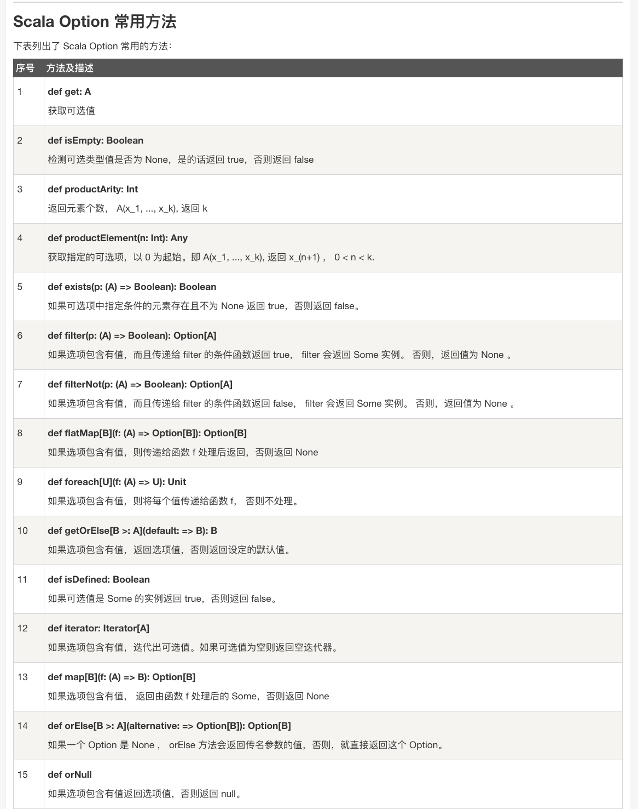
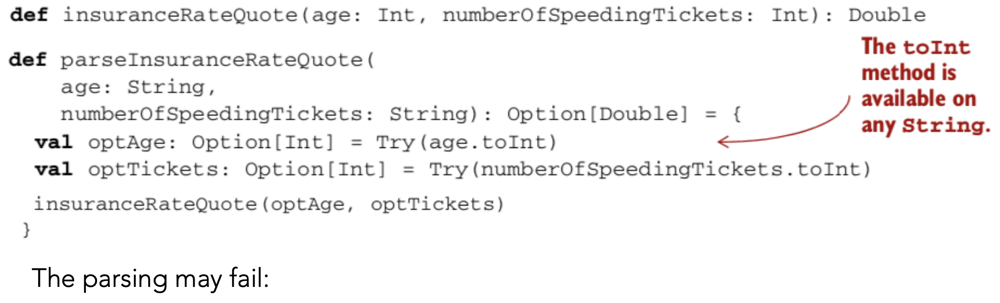
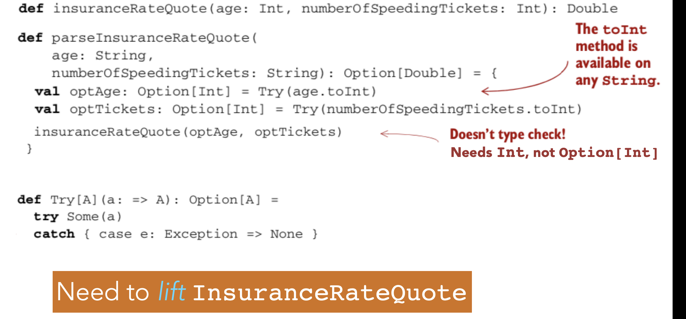
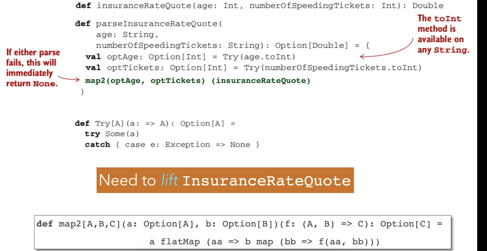
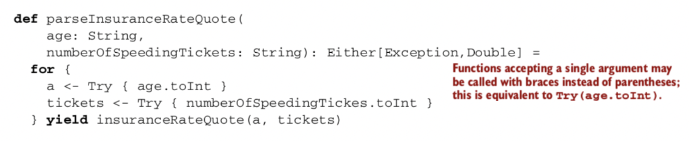
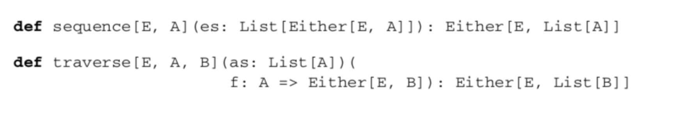

## Functional Language: 
### First-class Functions as values
Functions as values
Scala functions are values:
•	Can be assigned to variables
•	Can be stored in data structures
•	Can be passed as arguments to functions

1. Inner functions: 代表function可以像value一样定义，使用
	An inner function, or local definition.
2. Higher-order functions: function可以当参数一样传入方法
  
3. Polymorphic functions：代表function可以当作参数一样传入另一个function，从而实现了多态。是generic吧，泛型。
4. Anonymous Functions: 匿名函数，因为function可以像变量，structure一样，不用强定义一个名字。
  
https://medium.com/@ayanonagon/the-y-combinator-no-not-that-one-7268d8d9c46


### Singly Linked Lists
*	List[+A] not only A type inside. But also the subtype of A
*	Sealed : all implementations must be list in this file
*	List(“a”,”b”) ===Cons(“a”, cons(“b”,Nil))
* _:  is used instead of variable name to in
* List(1,2,3) match {case _=>42}无论什么，都返回42
* List(1,2,3) match {case Cons(h,_) =>h}这个是return head
### Pattern matching:
A pattern may contain:
*	Literals
*	Variables
*	Data constructors(may be nested)

A pattern matches the target if there exists an assignment of variables in the pattern to subexpressions of the target that make it structurally equivalent to the target.

The resulting expression for a matching case will then have access to these variable assignments in its local scope.

#### 伴生对象(companion object)
当单例对象与某个类共享同一个名称时，它就被称为是这个类的伴生对象(companion object)。类和它的伴生对象必须定义在同一个源文件中。类被称为是这个单例对象的伴生类(companion class)。类和它的伴生对象可以互相访问其私有成员。
```java
class Account {
    val id = Account.newUniqueNumber()
    private var balance = 0.0
    def deposit(amount: Double){ balance += amount }
    ...
}

object Account { //伴生对象
        private var lastNumber = 0
        def newUniqueNumber() = { lastNumber += 1; lastNumber}
    }
```
注意：
- 类的伴生对象可以被访问，但并不在作用域当中。Account类必须通过Account.newUniqueNumber()来调用伴生对象的方法。
- 在REPL中，要同时定义类和对象，必须用粘贴模式。键入:paste，然后键入或粘贴类和对象的定义，最后一Ctrl+D退出粘贴模式。

将伴生对象作为工厂使用
我们通常将伴生对象作为工厂使用。
下面是一个简单的例子，可以不需要使用’new’来创建一个实例了。
```java
class Bar(foo: String)

object Bar {
  def apply(foo: String) = new Bar(foo)
}
```

## Lecture Feb 3


### Basic 语法
```scala
//In Scala we don't use loops or Iteration, we use Recursion!
  val meaningOfLife: Int = 42 // const int meaningOfLife = 42
  //int
  val aBoolean = false //type is optional
  val aString = "I love Scala"
  val aComposeString = "Helen " + " Love " + "Scala"
  //expression = structures that can be reduced to a value
  val anExpression = 2 +3
  //if-expression
  val ifExpression = if (meaningOfLife > 43) 56 else 999
  val chinedIfExpression = {
    if (meaningOfLife > 43) 56
    else if (meaningOfLife <0) -2
    else if(meaningOfLife>999) 78
    else 0
  }

  //code blocks
  val aCodeBlock = {
    //definition
    val aLocalValue = 67

    // value of block is the value of the last expression
    aLocalValue + 3
  }

  //deine a function
  def myFunction(x:Int, y:String): String = y + "" + x
  def myFunction1(x:Int, y:String): String = {
    y + "" + x
  }

  //recursive functions
  def factorial(n:Int) : Int =
    if(n<=1) 1
    else n* factorial(n-1)

  //In Scala we don't use loops or Iteration, we use Recursion!

  // the Unit type = no meaningful value === "void" in other language
  //type of SIDE EFFECTS
  println("I love Scala")//===System.out.println,printf,print, console.log
  val myUnit = ()//this is Unit, is ()
```
### FUNCTIONAL DATASTRUCTURES 
* Operated on using only pure functions
* Recall: pure functions do not: 
  * change data in place
  * perform other side effects
* Functional data structures are immutable
  
 #### Lists
* An empty list — written List( ) or Nil — is as immutable as 
are integers 3 or 4 
* List concatenation — written a ++ b — creates a new list, 
without changing a or b
* just like 3 + 4 creates a new number 7 without modifying 3 or 4  
    
  
  

**Variadic functions** in Scala
The function apply in the object List is a variadic function, meaning it accepts zero or more arguments of type A:
```scala
def apply[A](as: A*): List[A] =
  if (as.isEmpty) Nil
  else Cons(as.head, apply(as.tail: _*))
```
  

#### DATA  SHARING 
* How do we add / remove elements from an immutable data 
structure?
    - We don’t
    - We construct a new data structure with the needed changes.
    - We reuse the parts which are not changing (data 
sharing)
    - Sharing is safe because the shared structure is immutable.
#### Improving type inference for higher-order functions
高阶函数，就能能把function赋值给一个变量，function能当参数
```scala
def dropWhile[A](as: List[A])(f: A => Boolean): List[A] =
  as match {
    case Cons(h,t) if f(h) => dropWhile(t)(f)
    case _ => as
  }
val xs: List[Int] = List(1,2,3,4,5)
val ex1 = dropWhile(xs)(x => x < 4)
```

Scala 编译器通常可以推断出表达式的类型，因此你不必明确地声明它。
  
上面和下面不一样的地方是，
  - 一个是dropWhile有两个参数，
  - 一个是dropWhile有一个参数，后面又跟了一个函数，一共两个argument list，但是实现起来，是先dropWhile(xs) return一个function，那个function 的参数是f。
    - 利用的是curring的原理。
  
image.png
  


### Recursion over lists and generalizing to higher-order functions
```scala
def sum(ints: List[Int]): Int = ints match {
  case Nil => 0
  case Cons(x,xs) => x + sum(xs)
}

def product(ds: List[Double]): Double = ds match {
  case Nil => 1.0
  case Cons(x, xs) => x * product(xs)
}
```

  
将f从foldRight的 参数放出来，是为了让f的输入列表不受foldRight的参数类型限制
1. In the standard library, map and flatMap are methods of List.
##Lists in the Standard Library
* def take(n: Int): List[A] —Returns a list consisting of the first n elements of this
* def takeWhile(f: A => Boolean): List[A] —Returns a list consisting of the longest valid prefix of this whose elements all pass the predicate f
* def forall(f: A => Boolean): Boolean —Returns true if and only if all elements of this pass the predicate f
* def exists(f: A => Boolean): Boolean —Returns true if any element of this passes the predicate f
* scanLeft and scanRight—Like foldLeft and foldRight, but they return the List of partial results rather than just the final accumulated value

### 4.3. The Option data type
```scala
sealed trait Option[+A]
case class Some[+A](get: A) extends Option[A]
case object None extends Option[Nothing]
```
Option是一个collection，最多只有一个element，要么是none，要么是里面的东西，这个东西可以是一个值类型，也可是是另一个collection
#### 4.3.1. Usage patterns for Option
Basic Functions on Option

Listing 4.2. The Option data type

Listing 4.3. Using Option


Option functions: Map, get orelse
```scala
def map2[A,B,C](a: Option[A], b: Option[B])(f: (A, B) => C): Option[C] = a flatMap (aa => b map (bb =>f(aa, bb)))
```
Option[T] 是一个类型为 T 的可选值的容器： 如果值存在， Option[T] 就是一个 Some[T] ，如果不存在， Option[T] 就是对象 None 
Option 有两个子类别，一个是 Some，一个是 None，
* getOrElse() 方法
你可以使用 getOrElse() 方法来获取元组中存在的元素或者使用其默认的值，实例如下：
  
option functinos: orelse
```scala
def map [B] (f: A => B): Option[B] = this match {
     case None => None
     case Some(a) => Some(f(a))
}
def getOrElse [B>:A] (default: => B): B = this match {
     case None => default
     case Some(a) => a
}

def flatMap [B] (f: A => Option[B]): Option[B] = this match {
     case None => None
     case Some(a) => f(a)
}

def flatMap [B] (f: A => Option[B]): Option[B] = 
     map(f) getOrElse None

def orElse[B>:A](ob:=>Option[B]:Option[B] = this match {
  case Node => ob
  case _=>this
})

def orElse [B>:A] (ob: => Option[B]): Option[B] = 
       this map (Some(_)) getOrElse ob

def filter (f: A => Boolean): Option[A] = this match {
     case Some(a) if f(a) => this
     case _ => None //这里一种可能是None，一种是f(a)==false
}
def filter (f: A => Boolean): Option[A] =
     flatMap(a => if (f(a)) Some(a) else None)
```
example:
Variance function: If mean of sequence is m, variance is mean of math.pow(x-m, 2).  
* Implement this using flatMap
```scala
def vaiance(xs:Seq[Doulb])): Option[Double]=
  mean(xs) flatMap(m=>man(xs.map(x=>math.pow(x-m, 2))))

``` 
* None.flatMap(f) immediately returns None
* Can construct a computation with multiple stages:
* Any stage may fail, and the computation will abort as 
soon as the first failure is encountered, without running f 
* Can use filter to convert successes into failures if the successful 
values don’t match the given predicate
* A common pattern is to transform an Option via calls to map, flatMap, and/or filter, and then use getOrElse to do error handling at the end
  
  

getOrElse converts from an Option[String] to a String, by 
providing a default department in case the key "Joe" didn’t exist in the Map or if Joe’s department was "Accounting"

4.4. The Either data type
```scala
sealed trait Either[+E, +A]
case class Left[+E](value: E) extends Either[E, Nothing]
case class Right[+A](value: A) extends Either[Nothing, A]
```

Usage Scenarios IV
* orElse is similar to getOrElse, except that: 
  - We return another Option if the first is undefined 
  - This is often useful when we need to chain together possibly failing computations, trying the second if the first hasn’t succeeded

我的问题： 为什么不把None做成Object的子类，像java一样，做一个check就可以了？？？
回答：为了去掉对于null的check，所以做了一个option，这样对于collection，null和没有数据是一样的处理

Can convert None to an exception
      - o.getOrElse(throw new Exception("FAIL")) 
* General rule of thumb: 
    - Use exceptions only if no reasonable program would ever catch the exception
    - If for some callers the exception might be a recoverable error, we use Option (or Either, discussed later) to give them flexibility 

我懂了，因为一连串的计算，有很多种可能出错，用这个能指定是哪一种error，哪儿出错了

• Returning errors as ordinary values can be convenient
• Use of higher-order functions lets us achieve the same sort of 
consolidation of error-handling logic as we would get from using 
exceptions 
• Note: We don’t have to check for None at each stage of the computation  
• We can apply several transformations and then check for and 
handle None when we’re ready 
• We get additional safety, because Option[A] is a different type 
from A, and the compiler won’t let us forget to explicitly defer or 
handle the possibility of None

#### L I F T I N G   F U N C T I O N S   T O   O P E R A T E   O N   O P T I O N 
• May seem like our entire code will be infected with Options
  - That every function will need to be modified to deal with Options
  - But not really: We can lift ordinary functions to become functions which 
deal with Options
• map lets us operate on values of type Option[A] using a function of type A => B, returning Option[B]
  - Turns a function f of type A => B into a function of type Option[A] => Option[B] 
  - Let’s make this explicit: 
```
def lift[A,B](f: A => B): Option[A] => Option[B] = _ map f
= ((o:Option[A]) => o.map(f)
= _ map f
```
• This tells us that any function can be transformed (via lift) to operate within the context 
of a single Option value 

example
```scala
val absO: Option[Double] => Option[Double] = lift(math.abs)
```
lift(f) returns a function which maps None to None and
applies f to the contents of Some.
  - f need not be aware of the Option type at all 

  

  

try[A]: evaluate lazy, so it will go to the runtime
Need to lift insuranceRateQuote
def map2[A,B,C](a: Option[A], b: Option[B])(f: (A, B) => C): Option[C] =
 a flatMap (aa => b map (bb => f(aa, bb)))
   
## Leture Feb10

#### GENERALIZING TO LISTS

change a List of Option, to Option of List, so inside the values are good values

• What if we have to map over a list using a function that might fail?
• May want to place the entire resulting list in an Option
```scala
 def sequence[A](a: List[Option[A]]): Option[List[A]] =
 a match {
  case Nil => Some(Nil)
  case h :: t => h flatMap (hh => sequence(t) map (hh :: _))
 }
 def parseInts(a: List[String]): Option[List[Int]] =
  sequence(a map (i => Try(i.toInt)))
 
 ```
 所以，map不是一个数据结构在FP种，是一个方法，因为List本身也是一个map
 not very effient: makes two passes of the list

• Often need to sequence results of a map
```scala
 def traverse[A, B](a: List[A])(f: A => Option[B]): Option[List[B]] = a match {
  case Nil => Some(Nil)
  case h::t => map2(f(h), traverse(t)(f))(_ :: _)
 }
 ```
 Scala provides a syntactic construct called **for-comprehension** that is automatically expanded to a series of flatMap and map calls
 ##### for-comprehension
* A for-comprehension consists of: 
  - A sequence of bindings — like aa <- a — inside a pair of braces
  - A yield after the closing brace, which may make use of values on the left hand side of  <- binding. 
  -  The compiler desugars the bindings to flatMap calls, with the final binding and **yield** being converted to a call to map. 
- Example: map2 can be implemented using for-comprehension as follows:

```scala
def map2[A,B,C](a: Option[A], b: Option[B])(f: (A, B) => C): Option[C] = 
     a flatMap (aa => 
              b map (bb => 
                            f(aa, bb)))

def map2 [A,B,C] (a: Option[A], b: Option[B]) (f: (A, B) => C): Option[C] =  
      for { 
                aa  <- a  
                bb <- b 
      } yield f(aa, bb) 
```
因为上面的，不用修改已经存在的function
Never have to modify an existing function

for-comprehensions are syntactic sugar for the latter kind of nested use of a number of flatMap applications followed by an application of map.

#### L I M I T A T I O N S   O F   O P T I O N S 

Option doesn’t tell us anything about what went wrong
• It just gives us None, indicating that there’s no value
•  Sometimes we want to know more 
• We might want a String that gives more information
• If an exception was raised, we might want to know what 
that error actually was 
option只能告诉出错了，得到了None，但是不能看到为什么，either就可以返回，left可以告诉出错了，同时，left的内容告诉了为什么出错

#### E I T H E R   D A T A   T Y P E 
A simple extension to **Option**, which lets us **track a reason for the failure**
``` scala
sealed trait Either[+E, +A]
case class Left[+E](value: E) extends Either[E, Nothing] 
case class Right[+A](value: A) extends Either[Nothing, A]
```
#### E I T H E R   D A T A   T Y P E 
• Either has only two constructors: each case carries a value
* It represents — in a very general way — values that can be one of two things (In other words, a disjoint union of two types)
* Right is reserved for the success (i.e., right / correct) case 
* Left is used for failure 
       [We’ve used a suggestive E (for error) as the parameter name for left type]

##### E X A M P L E :   M E A N 
• Can return a string when undefined
```
     def mean(xs: IndexedSeq[Double]): Either[String, Double] =    
        if (xs.isEmpty) 
            Left("mean of empty list!")
        else 
            Right(xs.sum / xs.length)
```
• May want to return stack trace showing location of error
  ```
     def safeDiv(x: Int, y: Int): Either[Exception, Int] = 
         try Right(x / y) 
         catch { case e: Exception => Left(e) } 
  ```
• Can write a function Try to factor out this pattern to convert thrown exceptions into values
```
     def Try[A](a: => A): Either[Exception, A] = 
          try Right(a) 
          catch { case e: Exception => Left(e) } 
```
 midterm room 105
我也是觉得奇怪，为什么会有either这个type
老师意思是另一个solution，先别dismiss
```scala
def map[B](f: A => B): Either[E, B] = 
  this match {
    case Right(a) => Right(f(a))
    case Left(e) => Left(e)
  }
def flatMap[EE >: E, B](f: A => Either[EE, B]): 
  Either[EE, B] = this match {
    case Left(e) => Left(e)
    case Right(a) => f(a)
  }
  ```
B A S I C   F U N C T I O N S   O N   E I T H E R
```scala
def orElse[EE >: E, AA >: A](b: => Either[EE, AA]): 
  Either[EE, AA] = this match {
    case Left(_) => b
    case Right(a) => Right(a)
  }
def map2[EE >: E, B, C](b: Either[EE, B])(f: (A, B) => C): 
  Either[EE, C] = for { a <- this; b1 <- b } yield f(a,b1)
  ```
For是干什么用的

Either can be used in for-comprehensions:
  

Can implement versions of sequence and traverse for Either:
  

  

```scala
class Person(name: String){
    def apply(age:Int) = println(s"I have aged $age years")
  }
  val bob = new Person("bob")
  bob.apply(43)
  bob (43) //invoking bob as a function === bob.apply(43)

  /*
  Scala runs on the JVM
  Functional programming:
  - compose functions
  - pass functions as args
  - return functions as results

  conclusion: FunctionX = Function1, Function2...Function 22
   */

  val simpleIncrementer = new Function1[Int, Int]{
    override def apply(arg: Int): Int = arg + 1
  }

  simpleIncrementer.apply(23) //24
  simpleIncrementer(23) // simpleIncrementer.apply(23)
  //defined a function!
  //All SCALA FUNCTIONS ARE INSTANCES OF these function_x types

  val stringConcatenator =  new Function2[String,String,String] {
    override def apply(v1: String, v2: String): String = v1+v2
  }

  //syntax sugars
  val doubler : Function1[Int,Int] = (x:Int)=>2 * x
  doubler(4)//8

  /*
  equivalent to the much longer:
  new Function[Int,Int] {
    override def apply(v1: Int): Int = 2 * x
  }
   */
//Higher-oirder functions: take functions as args / return functions as results

  val aMappedList = List(1,2,3).map(x=>x+1)
  println(aMappedList)
  val aFlatMappedList = List(1,2,3).flatMap(x=>List(x, 2*x))
  println(aFlatMappedList)
  val aFilterList = List(1,2,3,4,5).filter(_<=3) // equivalent to x => x <=3
  println(aFilterList)

  //all pairs between the numbers 1, 2, 3 antd the letters 'a','b','c'
  val allPairs = List(1,2,3).flatMap(number => List("a","b","c").map(letter=>s"$number-$letter"))
  println(allPairs)

  // for comprehensions
  val alternativePairs = for {
    number <- List(1,2,3)
    letter <- List('a','b,'c')
  }yield s"$number -$letter"

  /*
  Collections
   */
  //lists
  val aList = List(1,2,3,4,5)
  val firstElement = aList.head
  val rest = aList.tail
  val aPrependedList = 0 :: aList //List(0,1,2,3,4,5)
  val anExtendedList = 0+: aList :+ 6 //List(1,2,3,4,5,6)

  //sequences
  val aSequence: Seq[Int] = Seq(1,2,4) //Seq.apply(1,2,3)
  val accessedElement = aSequence(1) // the element at index 1 : 2

  //vectors: fast Seq implement
  val aVector = Vector(1,2,3,4,5)

  //sets = no duplicates
  val aSet = Set(1,2,3,4,5)//Set(1,2,3,4)
  val setHas5 = aSet.contains(5)// false
  val anAddedSet = aSet + 5 // Set(1,2,3,4)
  val aRemovedSet = aSet - 3 //Set(1,2,4)

  //ranges
  val aRange = 1 to 1000
  val twoByTwo = aRange.map(x=>2 * x).toList //List(2,4,6,8,...,2000)

  //tuples
  val aTuple = ("Bon Jovj","Helen",1982)

  //maps
  val aPhoneBook: Map[String,Int] = Map{
    ("Jack",23232323)
    ("Helen",22222)
    "Ryan" -> 384934
  }

```


