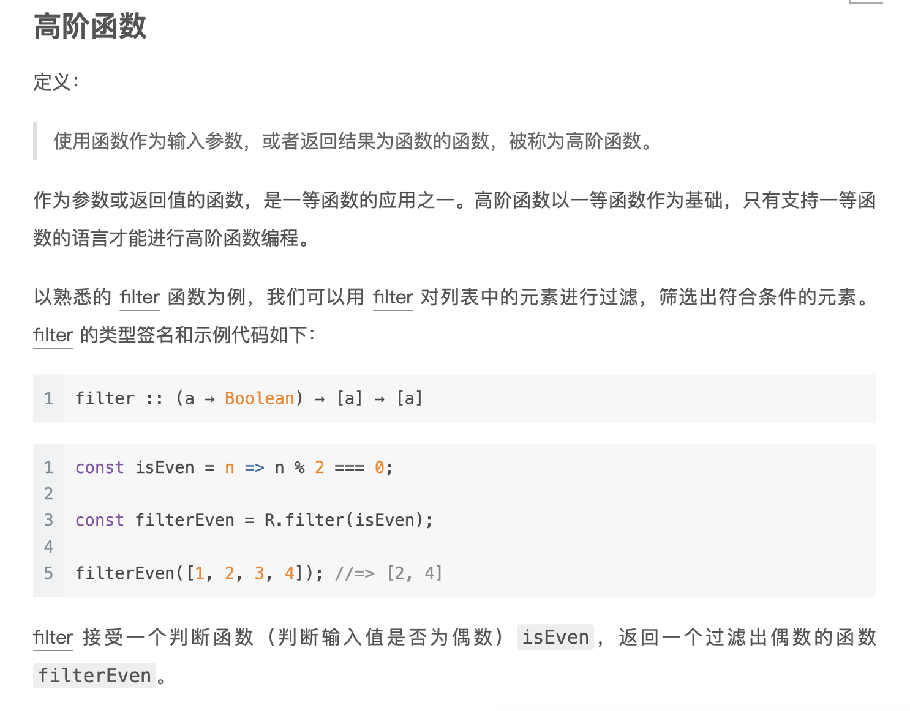

## Functional Language: 
### First-class Functions as values
Functions as values
Scala functions are values:
•	Can be assigned to variables
•	Can be stored in data structures
•	Can be passed as arguments to functions

1. Inner functions: 代表function可以像value一样定义，使用
	An inner function, or local definition.
2. Higher-order functions: function可以当参数一样传入方法
  
3. Polymorphic functions：代表function可以当作参数一样传入另一个function，从而实现了多态。是generic吧，泛型。
4. Anonymous Functions: 匿名函数，因为function可以像变量，structure一样，不用强定义一个名字。
  
https://medium.com/@ayanonagon/the-y-combinator-no-not-that-one-7268d8d9c46


### Singly Linked Lists
*	List[+A] not only A type inside. But also the subtype of A
*	Sealed : all implementations must be list in this file
*	List(“a”,”b”) ===Cons(“a”, cons(“b”,Nil))
* _:  is used instead of variable name to in
* List(1,2,3) match {case _=>42}无论什么，都返回42
* List(1,2,3) match {case Cons(h,_) =>h}这个是return head
### Pattern matching:
A pattern may contain:
*	Literals
*	Variables
*	Data constructors(may be nested)

A pattern matches the target if there exists an assignment of variables in the pattern to subexpressions of the target that make it structurally equivalent to the target.

The resulting expression for a matching case will then have access to these variable assignments in its local scope.

#### 伴生对象(companion object)
当单例对象与某个类共享同一个名称时，它就被称为是这个类的伴生对象(companion object)。类和它的伴生对象必须定义在同一个源文件中。类被称为是这个单例对象的伴生类(companion class)。类和它的伴生对象可以互相访问其私有成员。
```java
class Account {
    val id = Account.newUniqueNumber()
    private var balance = 0.0
    def deposit(amount: Double){ balance += amount }
    ...
}

object Account { //伴生对象
        private var lastNumber = 0
        def newUniqueNumber() = { lastNumber += 1; lastNumber}
    }
```
注意：
- 类的伴生对象可以被访问，但并不在作用域当中。Account类必须通过Account.newUniqueNumber()来调用伴生对象的方法。
- 在REPL中，要同时定义类和对象，必须用粘贴模式。键入:paste，然后键入或粘贴类和对象的定义，最后一Ctrl+D退出粘贴模式。

将伴生对象作为工厂使用
我们通常将伴生对象作为工厂使用。
下面是一个简单的例子，可以不需要使用’new’来创建一个实例了。
```java
class Bar(foo: String)

object Bar {
  def apply(foo: String) = new Bar(foo)
}
```

## Lecture Feb 3


### Basic 语法
```scala
//In Scala we don't use loops or Iteration, we use Recursion!
  val meaningOfLife: Int = 42 // const int meaningOfLife = 42
  //int
  val aBoolean = false //type is optional
  val aString = "I love Scala"
  val aComposeString = "Helen " + " Love " + "Scala"
  //expression = structures that can be reduced to a value
  val anExpression = 2 +3
  //if-expression
  val ifExpression = if (meaningOfLife > 43) 56 else 999
  val chinedIfExpression = {
    if (meaningOfLife > 43) 56
    else if (meaningOfLife <0) -2
    else if(meaningOfLife>999) 78
    else 0
  }

  //code blocks
  val aCodeBlock = {
    //definition
    val aLocalValue = 67

    // value of block is the value of the last expression
    aLocalValue + 3
  }

  //deine a function
  def myFunction(x:Int, y:String): String = y + "" + x
  def myFunction1(x:Int, y:String): String = {
    y + "" + x
  }

  //recursive functions
  def factorial(n:Int) : Int =
    if(n<=1) 1
    else n* factorial(n-1)

  //In Scala we don't use loops or Iteration, we use Recursion!

  // the Unit type = no meaningful value === "void" in other language
  //type of SIDE EFFECTS
  println("I love Scala")//===System.out.println,printf,print, console.log
  val myUnit = ()//this is Unit, is ()
```
### FUNCTIONAL DATASTRUCTURES 
* Operated on using only pure functions
* Recall: pure functions do not: 
  * change data in place
  * perform other side effects
* Functional data structures are immutable
  
 #### Lists
* An empty list — written List( ) or Nil — is as immutable as 
are integers 3 or 4 
* List concatenation — written a ++ b — creates a new list, 
without changing a or b
* just like 3 + 4 creates a new number 7 without modifying 3 or 4  
    
  
  

**Variadic functions** in Scala
The function apply in the object List is a variadic function, meaning it accepts zero or more arguments of type A:
```scala
def apply[A](as: A*): List[A] =
  if (as.isEmpty) Nil
  else Cons(as.head, apply(as.tail: _*))
```
  

#### DATA  SHARING 
* How do we add / remove elements from an immutable data 
structure?
    - We don’t
    - We construct a new data structure with the needed changes.
    - We reuse the parts which are not changing (data 
sharing)
    - Sharing is safe because the shared structure is immutable.
#### Improving type inference for higher-order functions
高阶函数，就能能把function赋值给一个变量，function能当参数
```scala
def dropWhile[A](as: List[A])(f: A => Boolean): List[A] =
  as match {
    case Cons(h,t) if f(h) => dropWhile(t)(f)
    case _ => as
  }
val xs: List[Int] = List(1,2,3,4,5)
val ex1 = dropWhile(xs)(x => x < 4)
```

Scala 编译器通常可以推断出表达式的类型，因此你不必明确地声明它。
  
上面和下面不一样的地方是，
  - 一个是dropWhile有两个参数，
  - 一个是dropWhile有一个参数，后面又跟了一个函数，一共两个argument list，但是实现起来，是先dropWhile(xs) return一个function，那个function 的参数是f。
    - 利用的是curring的原理。
  
image.png
  


### Recursion over lists and generalizing to higher-order functions
```scala
def sum(ints: List[Int]): Int = ints match {
  case Nil => 0
  case Cons(x,xs) => x + sum(xs)
}

def product(ds: List[Double]): Double = ds match {
  case Nil => 1.0
  case Cons(x, xs) => x * product(xs)
}
```

  
将f从foldRight的 参数放出来，是为了让f的输入列表不受foldRight的参数类型限制
1. In the standard library, map and flatMap are methods of List.
##Lists in the Standard Library
* def take(n: Int): List[A] —Returns a list consisting of the first n elements of this
* def takeWhile(f: A => Boolean): List[A] —Returns a list consisting of the longest valid prefix of this whose elements all pass the predicate f
* def forall(f: A => Boolean): Boolean —Returns true if and only if all elements of this pass the predicate f
* def exists(f: A => Boolean): Boolean —Returns true if any element of this passes the predicate f
* scanLeft and scanRight—Like foldLeft and foldRight, but they return the List of partial results rather than just the final accumulated value


