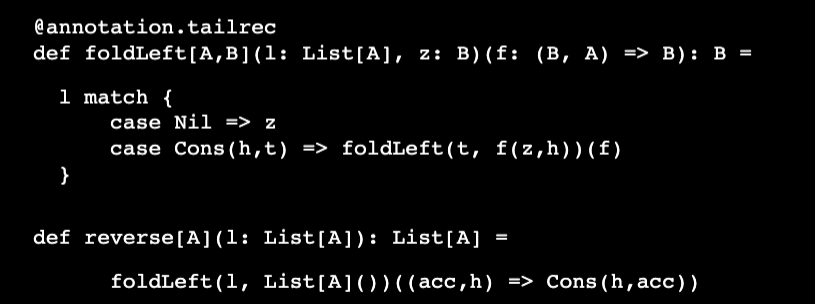
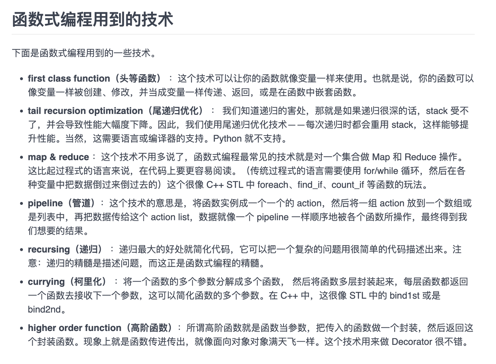

## Functional Language: 
Functional programs don’t update variables or modify 
mutable data structures
Questions:
• What types of data structures?
• How are they defined?
• How are they used?

Plan
• Learn about:
• Using functional data structures
• Defining data types
• Pattern Matching
• Writing and generalizing pure functions

### FUNCTIONAL DATASTRUCTURES 
* Operated on using only pure functions
* Recall: pure functions do not: 
  * change data in place
  * perform other side effects
* Functional data structures are immutable
  
 #### Lists
* An empty list — written List( ) or Nil — is as immutable as are integers 3 or 4 
* List concatenation — written a ++ b — creates a new list, without changing a or b
* just like 3 + 4 creates a new number 7 without modifying 3 or 4  
    
  
  

**Variadic functions** in Scala
The function apply in the object List is a variadic function, meaning it accepts zero or more arguments of type A:
```scala
def apply[A](as: A*): List[A] =
  if (as.isEmpty) Nil
  else Cons(as.head, apply(as.tail: _*))
```
  

#### DATA  SHARING 
* How do we add / remove elements from an immutable data 
structure?
    - We don’t
    - We **construct a new data structure with the needed changes.**
    - We **reuse the parts which are not changing** (**data sharing**)
    - Sharing is safe because the shared structure is immutable.
  
#### Improving type inference for higher-order functions
高阶函数(higher-order function)，就是能把function赋值给一个变量，function能当参数传递，能保存在data structure中，比如一个List of functions。
对于能传递function的function，可以把参数function放到外面，利用currying的原理，逐步展开，和直接放入参数里面是一样的效果。

```scala
def dropWhile[A](as: List[A])(f: A => Boolean): List[A] =
  as match {
    case Cons(h,t) if f(h) => dropWhile(t)(f)
    case _ => as
  }
val xs: List[Int] = List(1,2,3,4,5)
val ex1 = dropWhile(xs)(x => x < 4)
```

Scala 编译器通常可以推断出表达式的类型，因此你不必明确地声明它。

省略类型
`val businessName = "Montreux Jazz Café"`
编译器可以检测到 businessName 是一个 String。它的工作原理与方法类似：

`def squareOf(x: Int) = x * x`
编译器可以推断返回类型是一个 Int，所以不需要显式的返回类型。

对于递归方法，编译器不能推断出结果类型。由于这个原因，下面的程序会使编译器失败：

`def fac(n: Int) = if (n == 0) 1 else n * fac(n - 1)`
当多态方法被调用或者泛型类被实例化时，也不用强制地指定类型参数。Scala 编译器会从上下文和实际方法/构造函数参数的类型中推断出这些缺失的类型参数。

这里有两个例子：
```scala
case class MyPair[A, B](x: A, y: B);
val p = MyPair(1, "scala") // type: MyPair[Int, String]

def id[T](x: T) = x
val q = id(1)              // type: Int
//编译器使用 MyPair 的参数类型来确定 A 和 B 的类型。类似于 x 的类型。
```
如果把function当成参数穿进去，需要在函数的括号中写明x:Int=>x<4，需要明确写明输入的Type和输出的type，但是如果放在外面，只需要写操作就行了？？？
  
上面和下面不一样的地方是，
  - 一个是dropWhile有两个参数，
  - 一个是dropWhile有一个参数，后面又跟了一个函数，一共两个argument list，但是实现起来，是先dropWhile(xs) return一个function，那个function 的参数是f。
    - 利用的是curring的原理。
  
image.png
  

遍历List，两种方式
1. recursion
2. generalizing
### Recursion over lists and generalizing to higher-order functions
* 在List里面recursion 来遍历，利用foldRight,foldLeft,map等
* 下面是generalizing
```scala
def sum(ints: List[Int]): Int = ints match {
  case Nil => 0
  case Cons(x,xs) => x + sum(xs)
}

def product(ds: List[Double]): Double = ds match {
  case Nil => 1.0
  case Cons(x, xs) => x * product(xs)
}
```
下面图片是两种，
第一个是generalizing list，利用pattern match，组成generalizing 一个新的list来遍历。
- Opportunity to generalize: 
  - Pull out subexpressions into function arguments 
  - If subexpression refers to local variables, turn subexpression into function that takes these variables as arguments
  
**将f从foldRight的 参数放出来，是为了让f的输入列表不受foldRight的参数类型限制**
  

第二个是recursion list，比如在foldLeft中，就是通过recursion来遍历
  

```scala
def append[A](l: List[A], r: List[A]): List[A] = 
                                foldRight(l, r)(Cons(_,_))
def concat[A](l: List[List[A]]): List[A] = 
                               foldRight(l, Nil:List[A])(append)
```
We're simply referencing the append function, without writing 
something like `(x,y) => append(x,y) or append(_,_)`
In Scala there is a distinction between functions defined as methods, 
which are introduced with the def keyword, and function values, which 
are the first-class objects we can pass to other functions, put in 
collections, and so on.  
There’s a way to convert a def into a function value — by writing 
**append** _ or even `(x: List[A], y: List[A]) => append(x,y) `
if the function is polymorphic and the type arguments aren't known — 
but there are cases — like here — where Scala lets us pretend that the 
distinction doesn’t exist

1. In the standard library, map and flatMap are methods of List.
##Lists in the Standard Library
```scala
def take(n: Int): List[A] —Returns a list consisting of the first n elements of this
def takeWhile(f: A => Boolean): List[A] —Returns a list consisting of the longest valid prefix of this whose elements all pass the predicate f
def forall(f: A => Boolean): Boolean —Returns true if and only if all elements of this pass the predicate f
def exists(f: A => Boolean): Boolean —Returns true if any element of this passes the predicate f
scanLeft and scanRight—Like foldLeft and foldRight, but they return the List of partial results rather than just the final accumulated value

```
1. One difference: Cons is called ::
* :: associates right
* Example: 
  - 1 :: 2 :: Nil is equal to 1 :: (2 :: Nil)
  - Can also be written as List (1, 2)
  - In pattern matching, case Cons (h, t) becomes case h :: t
2.  An Algebraic Data Type (ADT) is a data type defined by one or 
more data constructors, each of which may contain zero or more 
arguments 
  - We say that: 
  - the data type is the sum or union of its data constructors 
  - each data constructor is the product of its arguments
  - Hence the name algebraic data type 
  - Algebraic data types can be used to define other data structures
3. A D T S   A N D   E N C A P S U L A T I O N 
- Make type’s internal representation public 
- Appears to violate encapsulation
- FP approaches encapsulation differently:
- Don’t have mutable state, which if exposed, could lead to bugs violations of invariants
- Exposing data structures of types is often fine
- Decide based on what the public API should be
- Use ADTs where set of cases is closed (i.e., known to be fixed)
### First-class Functions as values
Functions as values
Scala functions are values:
-	Can be assigned to variables
-	Can be stored in data structures
-	Can be passed as arguments to functions

1. Inner functions: 代表function可以像value一样定义，使用An inner function, or local definition.
2. Higher-order functions: function可以当参数一样传入方法
  
3. Polymorphic functions：代表function可以当作参数一样传入另一个function，从而实现了多态。是generic吧，泛型。
4. Anonymous Functions: 匿名函数，因为function可以像变量，structure一样，不用强定义一个名字。
  
https://medium.com/@ayanonagon/the-y-combinator-no-not-that-one-7268d8d9c46


### Singly Linked Lists
*	List[+A] not only A type inside. But also the subtype of A
*	Sealed : all implementations must be list in this file
*	List(“a”,”b”) ===Cons(“a”, cons(“b”,Nil))
* _:  is used instead of variable name to in
* List(1,2,3) match {case _=>42}无论什么，都返回42
* List(1,2,3) match {case Cons(h,_) =>h}这个是return head
### Pattern matching:
A pattern may contain:
*	Literals
*	Variables
*	Data constructors(may be nested)

A pattern matches the target if there exists an assignment of variables in the pattern to subexpressions of the target that make it structurally equivalent to the target.

The resulting expression for a matching case will then have access to these variable assignments in its local scope.

#### 伴生对象(companion object)
当单例对象与某个类共享同一个名称时，它就被称为是这个类的伴生对象(companion object)。类和它的伴生对象必须定义在同一个源文件中。类被称为是这个单例对象的伴生类(companion class)。类和它的伴生对象可以互相访问其私有成员。
```java
class Account {
    val id = Account.newUniqueNumber()
    private var balance = 0.0
    def deposit(amount: Double){ balance += amount }
    ...
}

object Account { //伴生对象
        private var lastNumber = 0
        def newUniqueNumber() = { lastNumber += 1; lastNumber}
    }
```
注意：
- 类的伴生对象可以被访问，但并不在作用域当中。Account类必须通过Account.newUniqueNumber()来调用伴生对象的方法。
- 在REPL中，要同时定义类和对象，必须用粘贴模式。键入:paste，然后键入或粘贴类和对象的定义，最后一Ctrl+D退出粘贴模式。

将伴生对象作为工厂使用
我们通常将伴生对象作为工厂使用。
下面是一个简单的例子，可以不需要使用’new’来创建一个实例了。
```java
class Bar(foo: String)

object Bar {
  def apply(foo: String) = new Bar(foo)
}
```

## Lecture Feb 3


### Basic 语法
```scala
//In Scala we don't use loops or Iteration, we use Recursion!
  val meaningOfLife: Int = 42 // const int meaningOfLife = 42
  //int
  val aBoolean = false //type is optional
  val aString = "I love Scala"
  val aComposeString = "Helen " + " Love " + "Scala"
  //expression = structures that can be reduced to a value
  val anExpression = 2 +3
  //if-expression
  val ifExpression = if (meaningOfLife > 43) 56 else 999
  val chinedIfExpression = {
    if (meaningOfLife > 43) 56
    else if (meaningOfLife <0) -2
    else if(meaningOfLife>999) 78
    else 0
  }

  //code blocks
  val aCodeBlock = {
    //definition
    val aLocalValue = 67

    // value of block is the value of the last expression
    aLocalValue + 3
  }

  //deine a function
  def myFunction(x:Int, y:String): String = y + "" + x
  def myFunction1(x:Int, y:String): String = {
    y + "" + x
  }

  //recursive functions
  def factorial(n:Int) : Int =
    if(n<=1) 1
    else n* factorial(n-1)

  //In Scala we don't use loops or Iteration, we use Recursion!

  // the Unit type = no meaningful value === "void" in other language
  //type of SIDE EFFECTS
  println("I love Scala")//===System.out.println,printf,print, console.log
  val myUnit = ()//this is Unit, is ()
```
尾递归 annotation.tailrec
递归算法需要保持调用堆栈，效率较低，如果调用次数较多，会耗尽内存或栈溢出。然而，尾递归可以克服这一缺点。
尾递归是指递归调用是函数的最后一个语句，而且其结果被直接返回，这是一类特殊的递归调用。由于递归结果总是直接返回，尾递归比较方便转换为循环，因此编译器容易对它进行优化。
递归求阶乘的经典例子
普通递归求解的代码如下：
```scala
def factorial(n: BigInt): BigInt = {
  if (n <= 1)
    1
  else
    n * factorial(n-1)
}
```
上面的代码，由于每次递归调用n-1的阶乘时，都有一次额外的乘法计算，这使得堆栈中的数据都需要保留。在新的递归中要分配新的函数栈。
运行过程就像这样：
```
factorial(4)
--------------
4 * factorial(3)
4 * (3 * factorial(2))
4 * (3 * (2 * factorial(1)))
4 * (3 * (2 * 1))
```

而下面是一个尾递归版本，在效率上，和循环是等价的：
```scala
import scala.annotation.tailrec

def factorialTailRecursive(n: BigInt): BigInt = {
  @tailrec
  def _loop(acc: BigInt, n: BigInt): BigInt =
    if(n <= 1) acc else _loop(acc*n, n-1)

  _loop(1, n)
}
```
这里的运行过程如下：
```
factorialTailRecursive(4)
--------------------------
_loop(1, 4)
_loop(4, 3)
_loop(12, 2)
_loop(24, 1)
```
该函数中的_loop在最后一步，要么**返回递归边界条件的值**，要么**调用递归函数本身。**
改写成尾递归版本的关键：
尾递归版本最重要的就是找到合适的**累加器**，该累加器可以保留最后一次递归调用留在堆栈中的数据，积累之前调用的结果，这样堆栈数据就可以被丢弃，当前的函数栈可以被重复利用。
在这个例子中，变量acc就是累加器，每次递归调用都会更新该变量，直到递归边界条件满足时返回该值。
对于尾递归，Scala语言特别增加了一个注释@tailrec，该注释可以确保程序员写出的程序是正确的尾递归程序，如果由于疏忽大意，写出的不是一个尾递归程序，则编译器会报告一个编译错误，提醒程序员修改自己的代码。

菲波那切数列的例子
原始的代码很简单：
```scala
def fibonacci(n: Int): Int =
  if (n <= 2)
    1
  else
    fibonacci(n-1) + fibonacci(n-2)
```

尾递归版本用了两个累加器，一个保存较小的项acc1，另一个保存较大项acc2

```scala
def fibonacciTailRecursive(n: Int): Int = {
  @tailrec
  def _loop(n: Int, acc1: Int, acc2: Int): Int =
    if(n <= 2)
      acc2
    else
      _loop(n-1, acc2, acc1+acc2)

  _loop(n, 1, 1)
}
```
————————————————
版权声明：本文为CSDN博主「JasonDing1354」的原创文章，遵循CC 4.0 BY-SA版权协议，转载请附上原文出处链接及本声明。
原文链接：https://blog.csdn.net/JasonDing1354/article/details/50525735