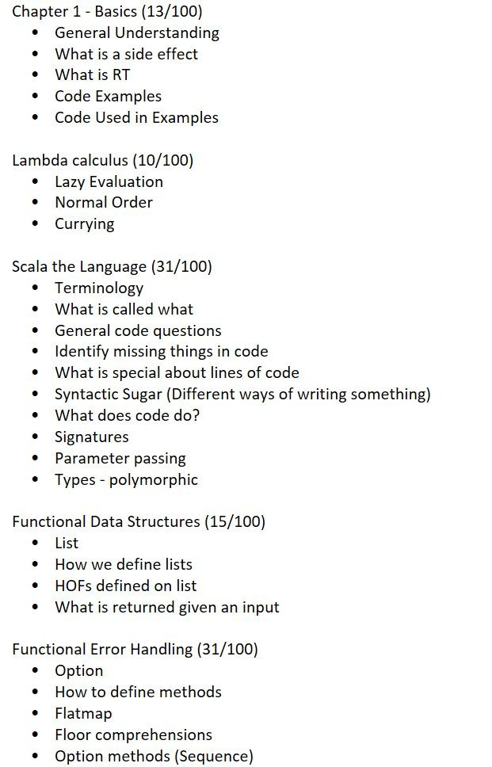

#### Midterm
Thorvalson 105, 7pm, Wed
60minutes
22 problems for 100 points
4 points--> 144 seconds
5 points -> 180 senconds

expect to 3 minutes for every 5 points worth of work.

you need to work quickly through problems.
Not everyone will be able to answer all problems.
Don't leave blank
First: put your name ->answer sheet
Second: put your name -> draft paper

30/100 **functional language**
* what FP is, 
  * the function without side effect.
* Side effect, 
  * change value in place
* Reference Parancy, 
  * the effect can by replaced by the last statement in function
  * some call example

10/100 **lambda express**, 
* lazy evaluation,
* currying,

30/100 **scala language**
  - termnolegy, should call  generic code, missing code???
  - short peice of code
  - 2 line of code
  - missing code
  - experssion about this code
**syntax sugar**
- differently writing or sonething
- signature
- parameter passing
- types, ty impiltation, **polymorphic** type, **signture**
 
 15/100 **data structure**
  - define **List**, diff **HOF**, how HOF works
  - 2 line missing code

 30/100 **error handling**
  - how to do with the **error handling**
  - what's the problems
  - try out **options**
  - what thsese code do
  - which is true, which is false

 **flatMap**,**comprehension**, either(no) 
 3 problem, one function, cases, dea with different sequenci hapeen, result
  


1. evaluate:
   1.  `Com incr incr  `
2. lazy evaluation and strict evaluation
3. Incr=
4. Blam=
5. Com=
6. There are three kinds of reduction:
  - α-conversion: changing bound variables;
  - β-reduction: applying functions to their arguments;
  - η-reduction: which captures a notion of extensionality.
1. 
```
def drop(l)
```
implement foldRight or foldLeft
`def foldLeft`
`def foldRight`

remove option
option
review lecture and note
quiz on note
foldLeft
HOF
Why isn't functional
non-functional

textbook for exercise

有一道题：
function()f:A,B,C=A=>B=>C=f(a)=>f(c)，问这是什么
我答了decompose

$x^2$ + $y^2$ -$z^2$
用lambda表示
$\lambda x$$\lambda y$$\lambda z$=(-(+($x^2$ $y^2$) $z^2$)

flapmap.map
(4,4),(3,3),(2,2)(1,1)(0,0)

map的argument必须不是option什么的