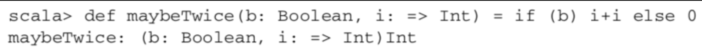
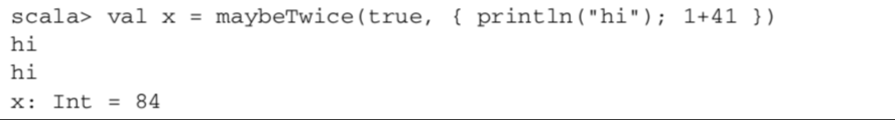
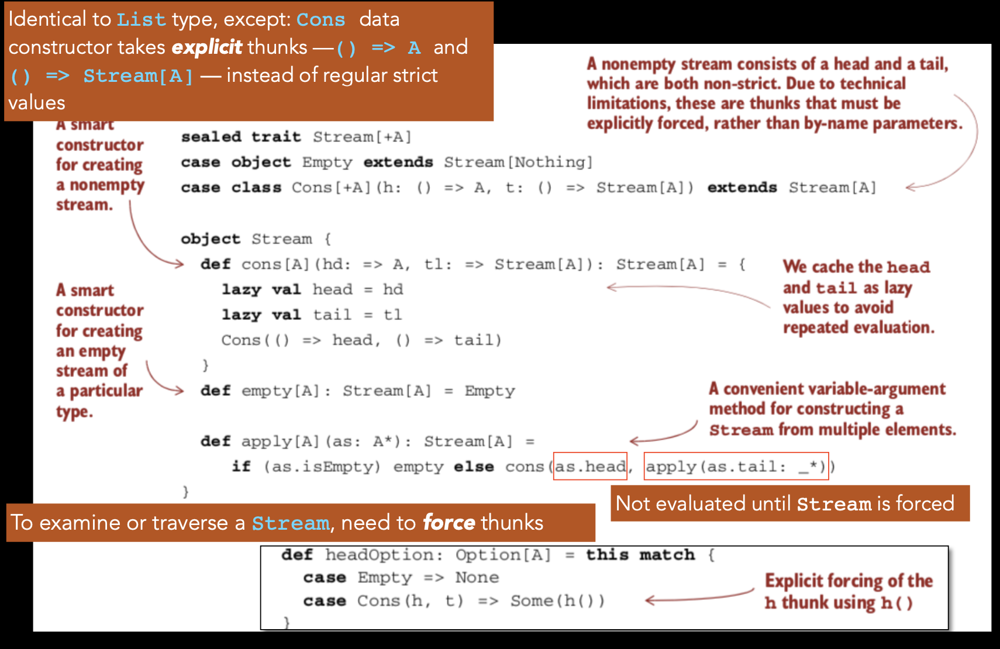
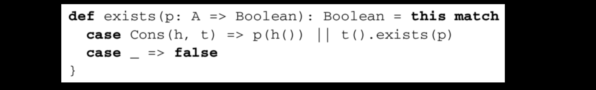
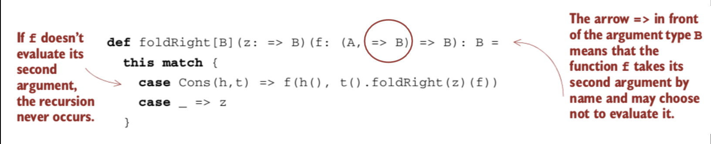
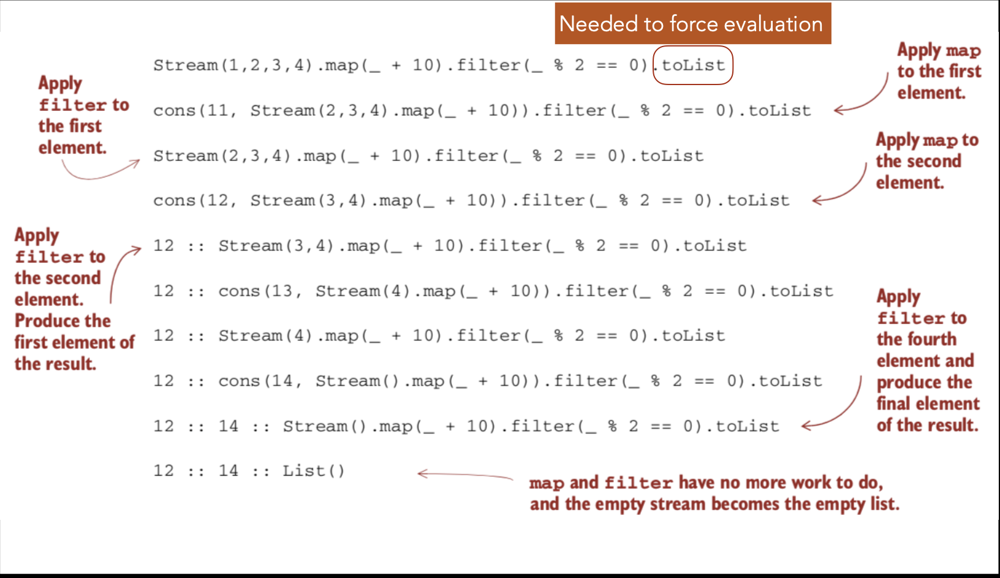
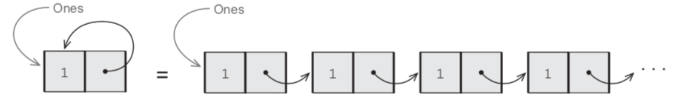

### StrictNess And Laziness

#### EXAMPLE
* Consider this code
`scala> List(1,2,3,4).map(_ + 10).filter(_ % 2 == 0).map(_ * 3)
List(36,42)`
Makes multiple passes, creating temporary lists
* Let’s trace

```scala
List(1,2,3,4).map(_ + 10).filter(_ % 2 == 0).map(_ * 3)
List(11,12,13,14).filter(_ % 2 == 0).map(_ * 3)
List(12,14).map(_ * 3)
List(36,42)
```
Would be nice to: fuse into single pass, avoid creating multiple data structures

#### POSSIBLE SOLUTIONS
* Can rewrite code using a while loop
* Lose the benefits of using higher-order functions and composition
* Alternative: Use laziness (formally non-strictness)
* Build a lazy list type which fuses sequences of
transformations
* Benefits of laziness extend beyond lists, to give better efficiency and modularity

#### NON-STRICTNESS 
* A property of a function:
  * Function may choose not to evaluate one or more of its arguments
* Strictness is the norm for most languages:
  * Most only support functions which expect all arguments to be fully evaluated

#### EXAMPLE
* Consider function square:
`def square(x: Double): Double = x * x`
* If you invoke square(41.0 + 1.0):
* square will receive the evaluated value 42.0 because it is strict
* If you invoke square(sys.error(“failure")):
* you’ll get an exception before square has a chance to do anything
* because sys.error (“failure") will be evaluated before entering the body of square

#### FAMILIAR EXAMPLES OF NON-STRICT 
* Short-circuiting Boolean functions && and || are **non-strict**
```scala
    scala> false && { println("!!"); true }
    res0: Boolean = false     does not print anything
    scala> true || { println("!!"); false }
    res1: Boolean = true      doesn't print anything either
```
* **if** control construct in Scala
`val result = if (input.isEmpty) sys.error("empty input") else input`
  * if can be thought of as a function accepting 3 parameters: a Boolean, an expression of some type A, and another expression of the same type A
    * Non-strict because it won’t evaluate all of its arguments
      * More precisely: if is strict in condition parameter, but non- strict in the two branches

* Consider this signature for a non-strict if function
```scala
def if2[A](cond:Boolean, onTrue:()=>A, onFalse:()=>A):A=
    if (cond) onTrue()
    else onFalse()

if2 (a<22, ()=>println("a"), ()=>println("b"))
// We’re passing a thunk — a function with no arguments — 
//for each  Arguments which we want to pass unevaluated have a () => immediately non-strict parameter
//
```
* Arguments which we want to pass **unevaluated** have a () => immediately before their type
  * () => A is a function which takes zero arguments, and returns an A
* Unevaluated form of an expression is called a **thunk**
  * We can **force** a thunk to evaluate the expression and get a result:
    * by invoking the function, by passing an empty argument list, as in onTrue() or onFalse()
    * Callers too have to explicitly create thunks

Thankfully, Scala also allows nicer syntax:
```scala
def if2[A](cond:Boolean, onTrue: =>A, onFalse: =>A):A=
    if (cond) onTrue  else onFalse
```
Arguments passed unevaluated simply have => before their type
    - Nothing special needed in the body at all
    - caller also simply passes arguments
  ```scala
  scala> if2 (false, sys.error("fail"), 3)
  res2: Int=3
  ```
  

* i is evaluated once for every reference 
* Scala does not (by default) cache the value
    

 * { println(“hi”); 1+41 } is evaluated twice 
 * Printing side-effect happens twice
 * Keyword **lazy** can be used to make Scala cache the value after it is first computed
* Adding keyword **lazy** to a **val** declaration causes Scala to delay evaluation of the right-hand side of that until it is first referenced
  * It also caches the result so that subsequent references don’t trigger repeated evaluation
```scala
def maybeTwice(b:Boolean, i:=>Int):Int={
    lazy val j = i
    if (b) j+j else 0
}

scala> val x = maybeTwice(true, println("hi"), 1+41)
hi
x: Int = 84
```

#### STRICTNESS

Formal Definition:
* If the evaluation of an expression runs forever or throws an error instead of returning a definite value, we say that the expression **doesn’t terminate**, or that it evaluates to **bottom**
* A function **f** is strict if the expression **f(x)** evaluates to bottom for all **x** that evaluate to bottom

#### FUSING TRANSFORMATIONS
 Recall this code:
`   scala> List(1,2,3,4).map(_ + 10).filter(_ % 2 == 0).map(_ * 3)`
* Will see how to fuse multiple transformations into a single pass
```scala
sealed trait Stream[+A]
case object Empty extends Stream[Nothing]
case object Cons[+A](h: () => A, t: () => Stream[A]) extends Stream[A]
object Stream{
    def cons[A](hd:=>A, tl:=>Stream[A]):Stream[A]={
        lazy val head = hd
        lazy val tail = tl
        Cons(()=>hd,()=>tl)
    }
    def empty[A]:Stream[A]=Empty
}
def headOption: Option[A] = this match {
    case empty=>None
    case Cons(h,t)=>Some(h())//explicit forcing of the h thunk using h()
}
def apply[]A(as:A*):Stream[A]={
    if (as.isEmpty) empty else cons(as.head, apply(as.tail:_*))
}
def toListRecursive: List[A] = this match { 
    case Cons(h,t) => h() :: t().toListRecursive case _ => List()
}
def toList: List[A] = {
    @annotation.tailrec
    def go(s: Stream[A], acc: List[A]): List[A] = s match {
        case Cons(h,t) => go(t(), h() :: acc)
        case _ => acc }
    go(this, List()).reverse 
}
def take(n: Int): Stream[A] = this match {
    case Cons(h, t) if n > 1 => cons(h( ), t( ).take(n - 1)) 
    case Cons(h, _) if n == 1 => cons(h(), empty)
    case _ => empty
}
@annotation.tailrec
def drop(n: Int): Stream[A] = this match {
    case Cons(_, t) if n > 0 => t().drop(n - 1)
    case _ => this 
}
def takeWhile(f: A => Boolean): Stream[A] = this match { 
    case Cons(h,t) if f(h()) => cons(h(), t() takeWhile f)
    case _ => empty 
}
```
Identical to List type, except: Cons data constructor takes explicit thunks —() => A and () => Stream[A] — instead of regular strict values
To examine or traverse a Stream, need to **force** thunks
  
We typically want to cache the values of **Cons** nodes (aka memoize them), once they are forced. If we use the **Cons** data constructor directly, this code will actually **computeexpensive(x)** twice:
```scala
val x = Cons(()=>expensive(x), t1)
val h1 = x.headOption
val h2 = x.headOption
```
Smart constructors use a slightly different signature than the “real” constructors; the real constructors are still used for pattern matching.
By convention, their names begin with lowercase characters 
  

Useful for type inference. We want the type to be inferred as Stream, not Cons or Empty
To examine or traverse a Stream, need to force thunks
#### HELPER FUNCTIONS: TOLIST
#### HELPER FUNCTIONS: TAKE, DROP,TAKEWHILE
#### SEPARATING PROGRAM DESCRIPTION FROM EVALUATION
* A major theme in functional programming is **separation of concerns** 
  * Separate description of computation from actually running it
  * Examples:
    * **First-class** functions capture some computation in their bodies but only execute it once they receive their arguments
    * **Option** captures the fact that an error occurred, where the decision of what to do about it became a separate concern
    * With **Stream**, we’re able to build up a computation that produces a sequence of elements without running the steps of that computation until we actually need those elements
Laziness lets us separate the description of an expression from the evaluation of the expression

#### A POWERFUL ABILITY
 To describe a “larger” expression than we need, and then evaluate only a portion of it
* Example: Function **exists** to check if a predicate **p** is true for an element in a **Stream**
  
* || is non-strict in its second argument: if **p(h())** returns **true**, then **exists** terminates the traversal early and returns **true**
The tail of the stream is a lazy val: Not only does the traversal terminate early, the tail of the stream is never evaluated
  * The code that would have generated the tail is never executed

#### EXISTS FUNCTION
* exists is a general recursion
* Recall that a general recursion on a list could be implemented using foldRight
* The same can be done for Stream but lazily
  
* 
* Looks similar to foldRight for List; however: f is non-strict in second parameter
* If f chooses not to evaluate second parameter, traversal ends early
```scala
def exist(p:A=>Boolean):Boolean={
    foldRight(false)(a,b)=>p(a) || b
}
```
If p(a) is true, b is not evaluated
This works — allowing early termination — because this foldRight is non-strict
Non-strictness makes foldRight reusable
?????

#### INCREMENTAL IMPLEMENTATIONS
* This implementation is incremental
  * The computation to generate a Stream takes place only when another computation looks at the elements of the Stream
    * Then, only just enough work is done to generate the requested elements
  * We can call these functions one after another without fully instantiating the results
  
#### REVISITING EXAMPLE
  

 * We don’t fully instantiate the intermediate stream that results from the map
* It’s exactly as if we had interleaved the logic using a special-purpose loop.
  * Streams sometimes described as “first-class loops” whose logic can be combined using higher-order functions like map and filter.
* Intermediate streams aren’t instantiated
* Easy to compose higher-order functions in novel ways
* No need to worry about unnecessary
* Can reuse **filter** to define **find** to find first element that matches
 ```scala
   def find(p: A => Boolean): Option[A] = filter(p).headOption
```
* Even though filter transforms the whole stream, that transformation is done lazily, so find terminates as soon as a match is found
* Implications for memory usage
* only enough working memory needed to store and transform the current element.
* For the example the gabage collector can relaim space allocated   for values 11 and 13 as soon as filter rejects them

#### infinite streams and corecursion
Functions on streams also work for infinite streams
Example:
```
val ones: Stream[Int]=Stream.cons(1,ones)
```
“Ones” is a stream that refers to itself; it generates an infinite series of 1‘s

  

```scala
val ones: Stream[Int] = Stream.cons(1, ones)
   scala> ones.take(5).toList
   res0: List[Int] = List(1, 1, 1, 1, 1)
   scala> ones.exists(_ % 2 != 0)
   res1: Boolean = true
More Examples:
   ones.map(_ + 1).exists(_ % 2 == 0)
   ones.takeWhile(_ == 1)
   ones.forAll(_ != 1)
   //In each case get back a result immediately
What about:
   ones.forAll(_ == 1)
   //Forever need to inspect more of the series because it will never encounter an element that allows it to terminate: stack overflow
```

Need to watch out for expressions that:
ones.exists(_ % 2 != 0)
olean = true
es:
* don’t terminate
* are not stack-safe
```
def constant[A](a: A): Stream[A] = {
  lazy val tail: Stream[A] = Cons(() => a, () => tail)
  //this is big Cons
  tail
}
def from(n: Int): Stream[Int] =
  cons(n, from(n+1))

val fibs = {
  def go(f0: Int, f1: Int): Stream[Int] =
    cons(f0, go(f1, f0+f1))//small cons
  go(0, 1)
}

```


#### Corecursive functions
```scala
def unfold[A, S](z: S)(f: S => Option[(A, S)]): Stream[A] =
     f(z) match {
      case Some((h,s)) => cons(h, unfold(s)(f))
      case None => empty
    }
}
```
Option is used to indicate when the Stream should be terminated, if at all
如果是空，就是一个empty
否则，生成了一个无限的

Option is used to indicate when the Stream should be terminated, if at all A corecursive function:
* Where a recursive function consumes data, a corecursive function produces data
* Where recursive functions terminate by recursing on ever smaller inputs,
corecursive functions need not terminate so long as they remain productive
* i.e., we can always evaluate more of the result in a finite amount of time
* Example: unfold is productive so long as f terminates

corecursive 不需要停止自己，但是recursive需要停止自己
 to indicate when the Stream should be terminate Terminology:
unction:
* Corecursion also called “guarded recursion”
recursive function consumes data, a corecursive functi * Productivity also called cotermination
```scala
val fibsViaUnfold =
  unfold((0,1)) { case (f0,f1) => Some((f0,(f1,f0+f1))) }

val fibsViaUnfold =
  unfold((0,1)) { case (f0,f1) => Some((f0,(f1,f0+f1))) }
def fromViaUnfold(n: Int) =
  unfold(n)(n => Some((n,n+1)))
def constantViaUnfold[A](a: A) = unfold(a)(_ => Some((a,a)))
val onesViaUnfold = unfold(1)(_ => Some((1,1)))

 
def mapViaUnfold[B](f: A => B): Stream[B] =
  unfold(this) {
    case Cons(h,t) => Some((f(h()), t()))
    case _ => None
  }
  //{}是一整个argument, only apply to the head???
def takeViaUnfold(n: Int): Stream[A] =
  unfold((this,n)) {
    case (Cons(h,t), 1) => Some((h(), (empty, 0)))
    case (Cons(h,t), n) if n > 1 => Some((h(), (t(), n-1)))
    case _ => None
}
def takeWhileViaUnfold(f: A => Boolean): Stream[A] =
  unfold(this) {
    case Cons(h,t) if f(h()) => Some((h(), t()))
    case _ => None
  }

  def zipWith[B,C](s2: Stream[B])(f: (A,B) => C): Stream[C] =
  unfold((this, s2)) {
    case (Cons(h1,t1), Cons(h2,t2)) =>
      Some((f(h1(), h2()), (t1(), t2())))
    case _ => None
  }
// special case of `zipWith`
def zip[B](s2: Stream[B]): Stream[(A,B)] =
  zipWith(s2)((_,_))
def zipAll[B](s2: Stream[B]): Stream[(Option[A],Option[B])] =
  zipWithAll(s2)((_,_))

  def zipWithAll[B, C](s2: Stream[B])(f: (Option[A], Option[B]) => C): Stream[C] =
  Stream.unfold((this, s2)) {
    case (Empty, Empty) => None
    case (Cons(h, t), Empty) => Some(f(Some(h()), Option.empty[B]) -> (t(), empty[B]))
    case (Empty, Cons(h, t)) => Some(f(Option.empty[A], Some(h())) -> (empty[A] -> t()))
    case (Cons(h1, t1), Cons(h2, t2)) => Some(f(Some(h1()), Some(h2())) -> (t1() -> t2()))
}
//-> instead of comma
//Option.empty[B] means None
 
```
example: HAS SUB SEQUENCE
```scala
@annotation.tailrec
def startsWith[A](l: List[A], prefix: List[A]): Boolean = (l,prefix) match {
  case (_,Nil) => true
  case (Cons(h,t),Cons(h2,t2)) if h == h2 => startsWith(t, t2)
  case _ => false
}
@annotation.tailrec
def hasSubsequence[A](sup: List[A], sub: List[A]): Boolean = sup match {
  case Nil => sub == Nil
  case _ if startsWith(sup, sub) => true
  case Cons(_,t) => hasSubsequence(t, sub)
}

def startsWith[A](s: Stream[A]): Boolean = zipAll(s).takeWhile(!_._2.isEmpty) forAll {
    case (h,h2) => h == h2
  }
 def hasSubsequence[A](s: Stream[A]): Boolean = tails exists (_ startsWith s)
 ```

 #### Generalize tails to scanRight, which is like a foldRight which returns a stream of the intermediate results
scala> Stream(1,2,3).scanRight(0)(_ + _).toList res0: List[Int] = List(6,5,3,0)
```scala
 def scanRight[B](z: B)(f: (A, => B) => B): Stream[B] =
    foldRight((z, Stream(z)))((a, p0) => {
      // p0 is passed by-name and used in by-name args in
         f and cons. So use lazy val to ensure only one
         evaluation...
      lazy val p1 = p0
      val b2 = f(a, p1._1)
      (b2, cons(b2, p1._2))
})._2

//这个期末final exam会考