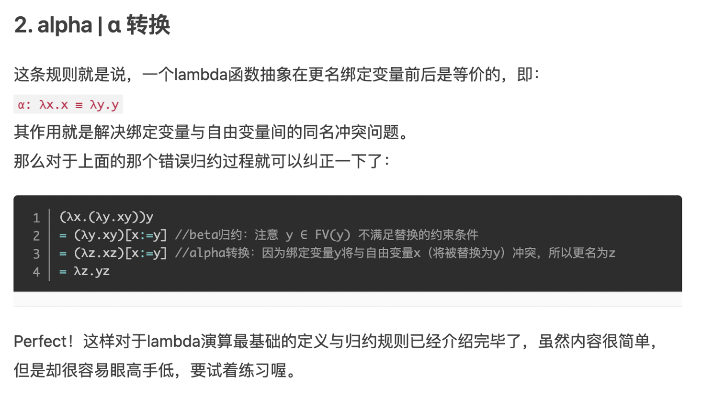
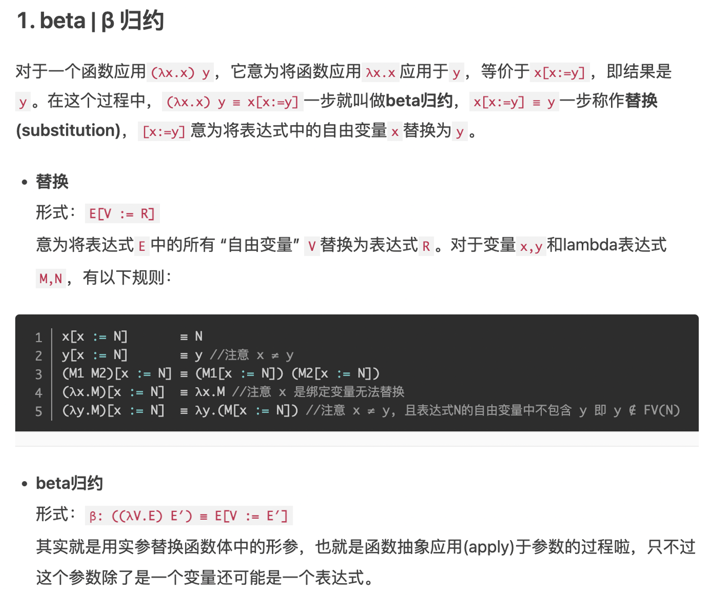
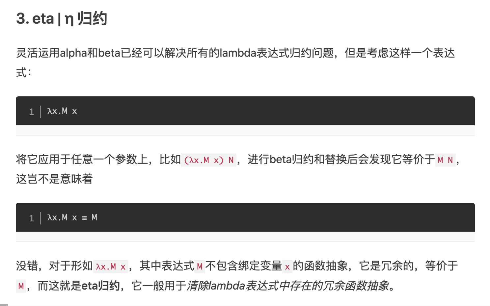
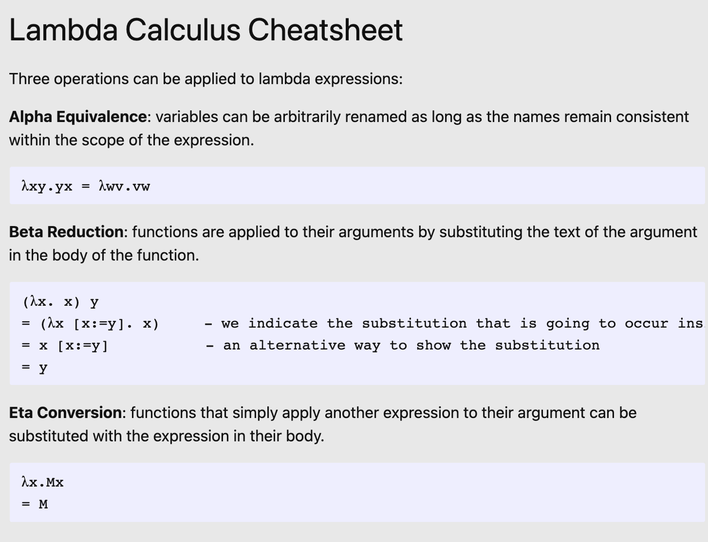
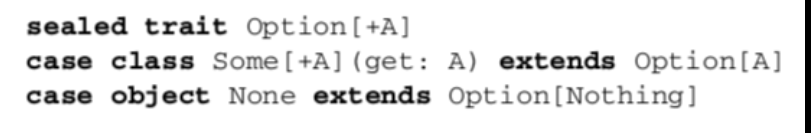

引用申明： 关于Lambda的知识，从以下网站借鉴
https://liujiacai.net/blog/2014/10/12/lambda-calculus-introduction/#%CE%BB%E6%BC%94%E7%AE%97%E7%9A%84%E8%AF%AD%E6%B3%95%E4%B8%8E%E6%B1%82%E5%80%BC
#### Lambda calculus
Lambda calculus我们一般称为λ演算，最早是由邱奇（Alonzo Church，图灵的博导）在20世纪30年代引入，当时的背景是解决函数可计算的本质性问题，初期λ演算成功的解决了在可计算理论中的判定性问题，后来根据Church–Turing thesis，证明了**λ演算与图灵机是等价**的。

### λ演算的语法与求值
**语法(syntax)**
因为λ演算研究的是函数的本质性问题，所以形式极其简单：
```
    E = x           variables
      | λx. E       function creation(abstraction)
      | E1 E2       function application
```
上面的E称为λ-表达式(expressions)或λ-terms，它的值有三种形式：

1. 变量(variables)。
2. 函数声明或抽象(function creation/abstraction)。需要注意是的，函数中有且仅有一个参数。在λx. E中，x是参数，E是函数体
3. 函数应用(function application)。也就是我们理解的函数调用，但官方术语就叫函数应用，本文后面也会采用“应用”的叫法。

**在使用λ演算时，有一些惯例需要说一下：**

1.  函数**声明**时，函数体尽可能的向右扩展。什么意思呢，举个例子大家就明白了
```
λx.x λy.x y z 应该理解为 λ x. (x (λy. ((x y) z)))
```
2. 函数**应用**时，遵循左结合。在举个例子： x y z 应该解释为 (x y) z
Simplify:
*	Lazy evaluation, non-strict evaluation： application first, 
  1.  The send way is to use the application rule first, as follow
  2.  ($\lambda$ x.($x^2$ +3))(3 + 4) ~~((3+4)2+3)
  3.  When the application rule is always 
* Eager evaluation, strict evaluation: Argument first. This is referred to as the “applicative order” of evaluation.
  * 	($\lambda$x.($x^2$ +3))(3 + 4) =(7^2+3)
  
Currying带有多个参数的函数

从上面我们知道，λ演算中函数只有一个参数，那两个参数的函数的是不是就没法表示了呢，那λ演算的功能也太弱了吧，这就是λ的神奇之处，函数在本质上只需要一个参数即可。如果想要声明多个参数的函数，通过currying技术即可。下面来说说currying。 λx y. (+ x y)---->λx. (λ y. + x y) 上面这个转化就叫currying，它展示了，我们如何实现加法（这里假设+这个符号已经具有相加的功能，后面我们会讲到如何用λ表达式来实现这个+的功能）。 其实就是我们现在意义上的**闭包——你调用一个函数，这个函数返回另一个函数**，返回的函数中存储保留了调用函数的变量。currying是闭包的鼻祖。 如果用Python来表示就是这样的东西：
```python
def add(x):
    return lambda y: x+y
add(4)(3) //return 7
```
o	Incr = $\lambda$ x.(x +1)
o	Blam = $\lambda$ x.$\lambda$ y.((x+y)*x)
o	Com = $\lambda$ u.$\lambda$ v.$\lambda$ w.(u(v w))

Lazy evaluation？？
延后计算（lazy evaluation）是指将一个表达式的值计算向后拖延直到这个表达式真正被使用的时候。在讨论lazy-evaluation之前，先对泛函编程中比较特别的一个语言属性”计算时机“(strict-ness)做些介绍。strict-ness是指系统对一个表达式计算值的时间点模式：即时计算的（strict)，或者延后计算的（non-strict or lazy）。non-strict或者lazy的意思是在使用一个表达式时才对它进行计值。用个简单直观的例子说明吧：

Example:
```
	    Com incr incr  
      =( λu.λv.λw.(u(v w)))incr incr
      = (λv.λw.(incr(v w)))incr
      = (λv.λw.(1+(v w)))incr
      = (λw.(incr(incr w)))
      = (λw.(1+(1+x) w)))
```
####Reduction
The meaning of lambda expressions is defined by how expressions can be reduced.[22]
There are three kinds of reduction:
  - α-conversion: changing bound variables;
  - β-reduction: applying functions to their arguments;
  - η-reduction: which captures a notion of extensionality.
  

**β-reduction**
β-reduction captures the idea of function application. β-reduction is defined in terms of substitution: the β-reduction of (λx.M) N is M[x := N].[b]

- For example, assuming some encoding of 2, 7, ×, we have the following β-reduction: (λn.n × 2) 7 → 7 × 2.

- β-reduction can be seen to be the same as the concept of local reducibility in natural deduction, via the Curry–Howard isomorphism.
  

**η-reduction**
- η-reduction (eta reduction) expresses the idea of extensionality,[24] which in this context is that two functions are the same if and only if they give the same result for all arguments. η-reduction converts between λx.f x and f whenever x does not appear free in f.

- η-reduction can be seen to be the same as the concept of local completeness in natural deduction, via the Curry–Howard isomorphism.
    
  

**Arithmetic in lambda calculus**
There are several possible ways to define the natural numbers in lambda calculus, but by far the most common are the Church numerals, which can be defined as follows:
```
0 := λf.λx.x
1 := λf.λx.f x
2 := λf.λx.f (f x)
3 := λf.λx.f (f (f x))
and so on. Or using the alternative syntax presented above in Notation:
0 := λfx.x
1 := λfx.f x
2 := λfx.f (f x)
3 := λfx.f (f (f x))

Boolean logic in Lambda Calculus
True = λx. λy.(x)
False = λx. λy.(y)
Not = λv. λw. λx.(v x w)
Or = λv. λw. (v v w)
And = λv. λw. (v w v)

```
**Function application**
Okay, awesome. We have functions. But how do you do stuff with them? That’s where rule #3 comes into play.

**If t and s are both valid λ-terms, then t s is a valid λ-term.**

(λx. x) y is an example of a function application. More concretely, it represents the act of calling the function λx. x with y as an input.


The Y combinator, at last
Here it is again:
`λf. (λx. f (x x))(λx. f (x x))`
Hopefully it looks a little more familiar to you now.
In other words, we want to find a fixed-point of F. A fixed-point of a function in mathematics is an input that is unchanged by that function. For example, for f(x) = x * x, there are two fixed-points: 0 and 1.
If we can find a **fixed-point** p of F such that Fp is equivalent to p, we can use Fp or p (they are the same thing) as the “recursive” function without direct self-reference.

It turns out that for any λ-expression f, 
(λx. f (x x))(λx. f (x x)) is a fixed-point of f.
Let’s see that in action:
X = (λx. f (x x))(λx. f (x x))
X = f (x x) [x := λx. f (x x)]
X = f ((λx. f (x x)) (λx. f (x x)))
X = f X
**Y combinator is the fixed-point combinator for this reason**.
####Y combinator
What is Y combinator?
**Y Combinator，在计算机语言中，Y Combinator是启动别的程序的程序。**
Loop =  (λx. x x)( λx. x x)
Rec f = f(rec f) = f(f(f(f(rec..))))
Loop = rec (?)
rec = λf. (λx. f(x x))( λx. f(x x))) 这就是Y-combinator！没有get 到
fac = rec(λf. λn. ? )

## Functional Language: 
### First-class Functions as values
Functions as values
Scala functions are values:
•	Can be assigned to variables
•	Can be stored in data structures
•	Can be passed as arguments to functions

1. Inner functions: 代表function可以像value一样定义，使用
	An inner function, or local definition.
2. Higher-order functions: function可以当参数一样传入方法
  
3. Polymorphic functions：代表function可以当作参数一样传入另一个function，从而实现了多态。是generic吧，泛型。
4. Anonymous Functions: 匿名函数，因为function可以像变量，structure一样，不用强定义一个名字。
  
https://medium.com/@ayanonagon/the-y-combinator-no-not-that-one-7268d8d9c46


###Singly Linked Lists
*	List[+A] not only A type inside. But also the subtype of A
*	Sealed : all implementations must be list in this file
*	List(“a”,”b”) ===Cons(“a”, cons(“b”,Nil))
* _:  is used instead of variable name to in
* List(1,2,3) match {case _=>42}无论什么，都返回42
* List(1,2,3) match {case Cons(h,_) =>h}这个是return head
**Pattern matching**:
A pattern may contain:
*	Literals
*	Variables
*	Data constructors(may be nested)

A pattern matches the target if there exists an assignment of variables in the pattern to subexpressions of the target that make it structurally equivalent to the target.

The resulting expression for a matching case will then have access to these variable assignments in its local scope.

####伴生对象(companion object)
当单例对象与某个类共享同一个名称时，它就被称为是这个类的伴生对象(companion object)。类和它的伴生对象必须定义在同一个源文件中。类被称为是这个单例对象的伴生类(companion class)。类和它的伴生对象可以互相访问其私有成员。
```java
class Account {
    val id = Account.newUniqueNumber()
    private var balance = 0.0
    def deposit(amount: Double){ balance += amount }
    ...
}

object Account { //伴生对象
        private var lastNumber = 0
        def newUniqueNumber() = { lastNumber += 1; lastNumber}
    }
```
注意：
- 类的伴生对象可以被访问，但并不在作用域当中。Account类必须通过Account.newUniqueNumber()来调用伴生对象的方法。
- 在REPL中，要同时定义类和对象，必须用粘贴模式。键入:paste，然后键入或粘贴类和对象的定义，最后一Ctrl+D退出粘贴模式。

将伴生对象作为工厂使用
我们通常将伴生对象作为工厂使用。
下面是一个简单的例子，可以不需要使用’new’来创建一个实例了。
```java
class Bar(foo: String)

object Bar {
  def apply(foo: String) = new Bar(foo)
}
```

## Lecture Feb 3
Error and exception
Basic idea:
•	Can represent failures and exceptions with ordinary values
•	Can write higher-order functions that abstract out common patterns of error handiling and recovery
•	Advantages
    o	Safer and retains referential 
Plan
•	Recreate option and either type
•	Exception break RT and introduce context dependence.
•	They don’t work for higher-order functions
    o	HOF cannot be avare of exceptions that could be raised by their arguments

Benefit of exeption

* They allow us to :
    - paritial function
    - posibility 1
      - return a bogus value of type Double
        - always return xs.sum / xs.length, which becomess 0.0 / 0 (i.e., Double.NaN) when iinput is empty
        - return some sentinel value
      - problems with this
    - posibility 2
      - force cller to supply argument that tells function what to do when it can't handle input
      - This turns mean into a toal function, but
        - mmediate callers need direct knowlege of handling underd case
          - limits caller to returning Double
          - what if the larger computation should be aborting instead? or doing something else?
          - caller把如果是exception要做什么的function也传进来

###solution: option data type
  

- represent-explicitly- in return type that function may not always have an answer: Defer to the caller for error-handling
- has tow cases: some, for when it is definded; None, for when it is underind
- can be used for mean as follows
### sentinel vs. option type
### usage patterns for option
- can factor out common patterns of error handling via higher-order functions
  - frees us from writing boiler-plate that comes with exception-handling code
### basic functions on option
- many List functions have their analogs for option:
  -   
**？？？**
default means lazy evaluate

# Lab Feb
polymorphism Primer
Polynro : the logiic of a method stays the same for different types
```
def drop(l)
```
implement foldRight or foldLeft
def foldLeft
def foldRight
val 