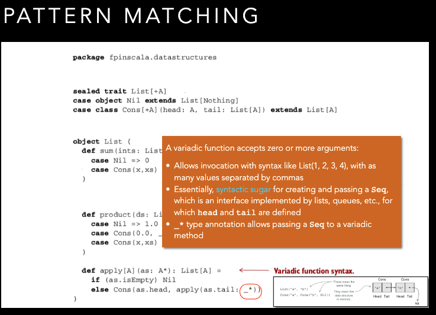
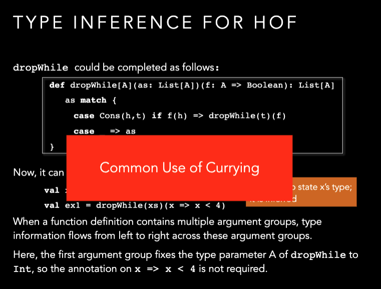
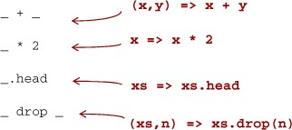
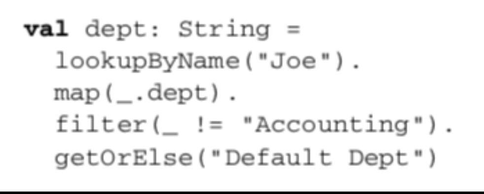

#FUNCTIONAL DATASTRUCTURES 

* Operated on using only pure functions
* Recall: pure functions do not: 
  * change data in place
  * perform other side effects
* Functional data structures are immutable
  
 Lists
* An empty list — written List( ) or Nil — is as immutable as 
are integers 3 or 4 
* List concatenation — written a ++ b — creates a new list, 
without changing a or b
* just like 3 + 4 creates a new number 7 without modifying 3 or 4  
    
  
  

Variadic functions in Scala
The function apply in the object List is a variadic function, meaning it accepts zero or more arguments of type A:
```scala
def apply[A](as: A*): List[A] =
  if (as.isEmpty) Nil
  else Cons(as.head, apply(as.tail: _*))
```
  

### DATA  SHARING 
* How do we add / remove elements from an immutable data 
structure?
    - We don’t
    - We construct a new data structure with the needed changes.
    - We reuse the parts which are not changing (data 
sharing)
    - Sharing is safe because the shared structure is immutable.
### Improving type inference for higher-order functions
高阶函数，就能能把function赋值给一个变量，function能当参数
```scala
def dropWhile[A](as: List[A])(f: A => Boolean): List[A] =
  as match {
    case Cons(h,t) if f(h) => dropWhile(t)(f)
    case _ => as
  }
val xs: List[Int] = List(1,2,3,4,5)
val ex1 = dropWhile(xs)(x => x < 4)
```
  
上面和下面不一样的地方是，一个是dropWhile有两个参数，一个是dropWhile有一个参数，后面又跟了一个函数，一共两个argument list，但是实现起来，是先dropWhile(xs) return一个function，那个function 的参数是f。利用的是curring的原理。
  
image.png
  


### Recursion over lists and generalizing to higher-order functions
```scala
def sum(ints: List[Int]): Int = ints match {
  case Nil => 0
  case Cons(x,xs) => x + sum(xs)
}

def product(ds: List[Double]): Double = ds match {
  case Nil => 1.0
  case Cons(x, xs) => x * product(xs)
}
```

  
将f从foldRight的 参数放出来，是为了让f的输入列表不受foldRight的参数类型限制

##Lists in the Standard Library
* def take(n: Int): List[A] —Returns a list consisting of the first n elements of this
* def takeWhile(f: A => Boolean): List[A] —Returns a list consisting of the longest valid prefix of this whose elements all pass the predicate f
* def forall(f: A => Boolean): Boolean —Returns true if and only if all elements of this pass the predicate f
* def exists(f: A => Boolean): Boolean —Returns true if any element of this passes the predicate f
* scanLeft and scanRight—Like foldLeft and foldRight, but they return the List of partial results rather than just the final accumulated value

###4.3. The Option data type
```scala
sealed trait Option[+A]
case class Some[+A](get: A) extends Option[A]
case object None extends Option[Nothing]
```

4.3.1. Usage patterns for Option
Basic Functions on Option

Listing 4.2. The Option data type

Listing 4.3. Using Option


Option functions: Map, get orelse
```scala
def map2[A,B,C](a: Option[A], b: Option[B])(f: (A, B) => C): Option[C] = a flatMap (aa => b map (bb =>f(aa, bb)))
```
**option到底是个什么
为什么不把None做成一个object of any type？**
Option[T] 是一个类型为 T 的可选值的容器： 如果值存在， Option[T] 就是一个 Some[T] ，如果不存在， Option[T] 就是对象 None 
Option 有两个子类别，一个是 Some，一个是 None，
* getOrElse() 方法
你可以使用 getOrElse() 方法来获取元组中存在的元素或者使用其默认的值，实例如下：
  
option functinos: orelse
```scala
def map [B] (f: A => B): Option[B] = this match {
     case None => None
     case Some(a) => Some(f(a))
}
def getOrElse [B>:A] (default: => B): B = this match {
     case None => default
     case Some(a) => a
}

def flatMap [B] (f: A => Option[B]): Option[B] = this match {
     case None => None
     case Some(a) => f(a)
}

def flatMap [B] (f: A => Option[B]): Option[B] = 
     map(f) getOrElse None

def orElse[B>:A](ob:=>Option[B]:Option[B] = this match {
  case Node => ob
  case _=>this
})

def orElse [B>:A] (ob: => Option[B]): Option[B] = 
       this map (Some(_)) getOrElse ob

def filter (f: A => Boolean): Option[A] = this match {
     case Some(a) if f(a) => this
     case _ => None //这里一种可能是None，一种是f(a)==false
}
def filter (f: A => Boolean): Option[A] =
     flatMap(a => if (f(a)) Some(a) else None)
```
example:
Variance function: If mean of sequence is m, variance is mean of 
math.pow(x-m, 2).  
* Implement this using flatMap
```scala
def vaiance(xs:Seq[Doulb])): Option[Double]=
  mean(xs) flatMap(m=>man(xs.map(x=>math.pow(x-m, 2))))

``` 
* None.flatMap(f) immediately returns None
* Can construct a computation with multiple stages:
* Any stage may fail, and the computation will abort as 
soon as the first failure is encountered, without running f 

* Can use filter to convert successes into failures if the successful 
values don’t match the given predicate
* A common pattern is to transform an Option via calls to map, flatMap, and/or filter, and then use getOrElse to do error handling at the end
  
getOrElse converts from an Option[String] to a String, by 
providing a default department in case the key "Joe" didn’t exist in 
the Map or if Joe’s department was "Accounting"

4.4. The Either data type
```scala
sealed trait Either[+E, +A]
case class Left[+E](value: E) extends Either[E, Nothing]
case class Right[+A](value: A) extends Either[Nothing, A]
```